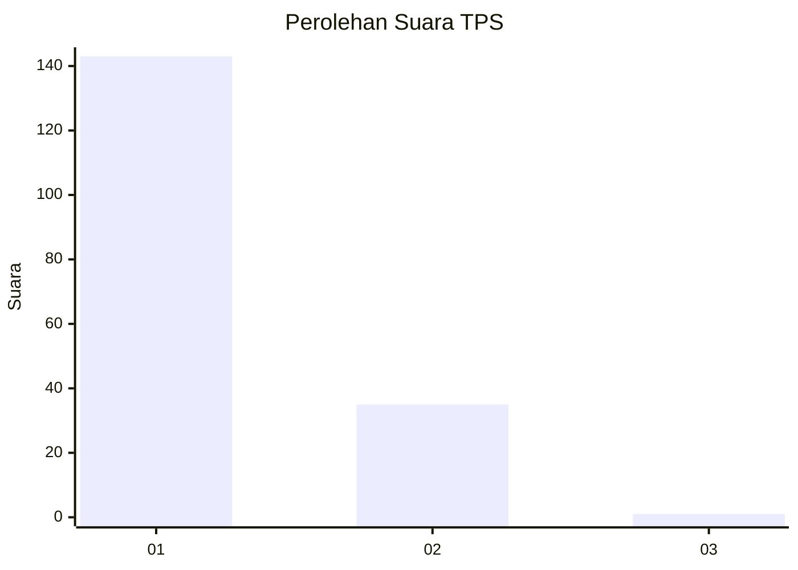
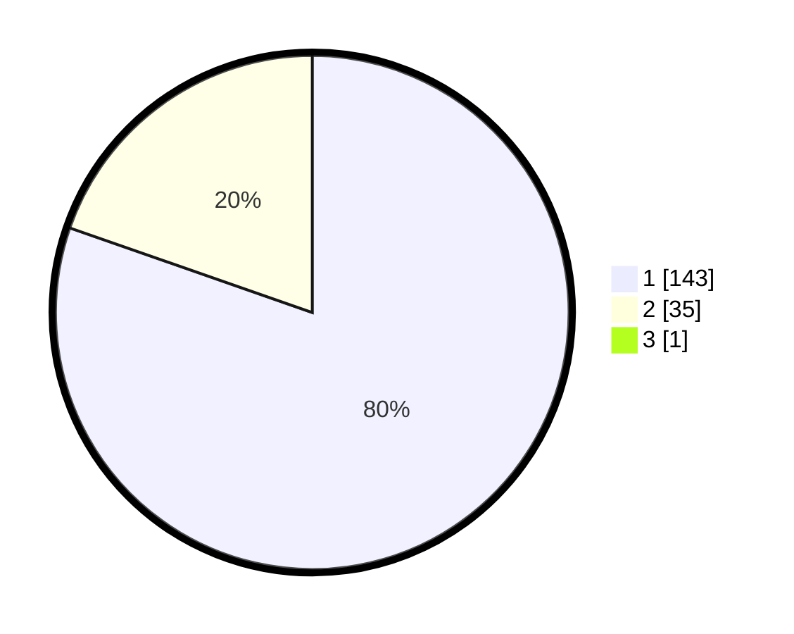

# Hasil

## Grafik

## Tabel

| No. | Nama Paslon    | Suara | Suara (raw) | Persentase |
|:--- |:-------------- | -----:| -----------:| ----------:|
| 1   | ANIES MUHAIMIN | 143   | [143][p-1]  | 79,89      |
| 2   | PRABOWO GIBRAN | 35    | [35][p-2]   | 19,55      |
| 3   | GANJAR MAHFUD  | 1     | [1][p-3]    | 0,56       |

[p-1]: https://github.com/gigit-pemilu/pemilu-2024/blob/main/pilpres/hitung-suara/sub/12-sumatera-utara/sub/01-tapanuli-tengah/sub/01-barus/sub/1001-pasar-batu-gerigis/sub/001-tps/sub/paslon-1.txt
[p-2]: https://github.com/gigit-pemilu/pemilu-2024/blob/main/pilpres/hitung-suara/sub/12-sumatera-utara/sub/01-tapanuli-tengah/sub/01-barus/sub/1001-pasar-batu-gerigis/sub/001-tps/sub/paslon-2.txt
[p-3]: https://github.com/gigit-pemilu/pemilu-2024/blob/main/pilpres/hitung-suara/sub/12-sumatera-utara/sub/01-tapanuli-tengah/sub/01-barus/sub/1001-pasar-batu-gerigis/sub/001-tps/sub/paslon-3.txt

## Foto C Plano

https://sirekap-obj-formc.kpu.go.id/cab9/pemilu/ppwp/12/01/01/10/01/1201011001001-20240216-221430--f2c63574-cf10-4630-a0da-e2fe91c87ae1.jpg

https://sirekap-obj-formc.kpu.go.id/cab9/pemilu/ppwp/12/01/01/10/01/1201011001001-20240216-221431--bc6a710d-3e69-4adf-a185-02d84f4dfa07.jpg

https://sirekap-obj-formc.kpu.go.id/cab9/pemilu/ppwp/12/01/01/10/01/1201011001001-20240216-221431--5e1ee312-d6f2-471b-82b4-24b8f654927f.jpg

## Metadata

| Key        | Value               |
| ---------- | ------------------- |
| Time Stamp | 2024-02-17 13:37:34 |

## DATA PEMILIH TETAP

Jumlah pemilih dalam DPT: **222**.
 * L: **112**.
 * P: **110**.

## DATA PENGGUNA HAK PILIH

Jumlah pengguna hak pilih dalam DPT: **178**.
 * L: **83**.
 * P: **95**.

Jumlah pengguna hak pilih dalam DPTb: **0**.
 * L: **0**.
 * P: **0**.

Jumlah pengguna hak pilih dalam DPK: **3**.
 * L: **2**.
 * P: **1**.

Jumlah pengguna hak pilih: **181**.
 * L: **85**.
 * P: **96**.

## JUMLAH SUARA SAH DAN TIDAK SAH

JUMLAH SELURUH SUARA SAH: **179**.

JUMLAH SUARA TIDAK SAH: **2**.

JUMLAH SELURUH SUARA SAH DAN SUARA TIDAK SAH: **181**.

