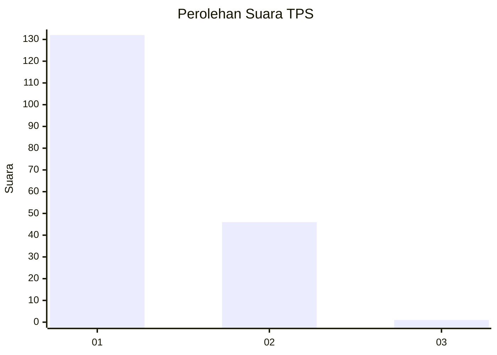
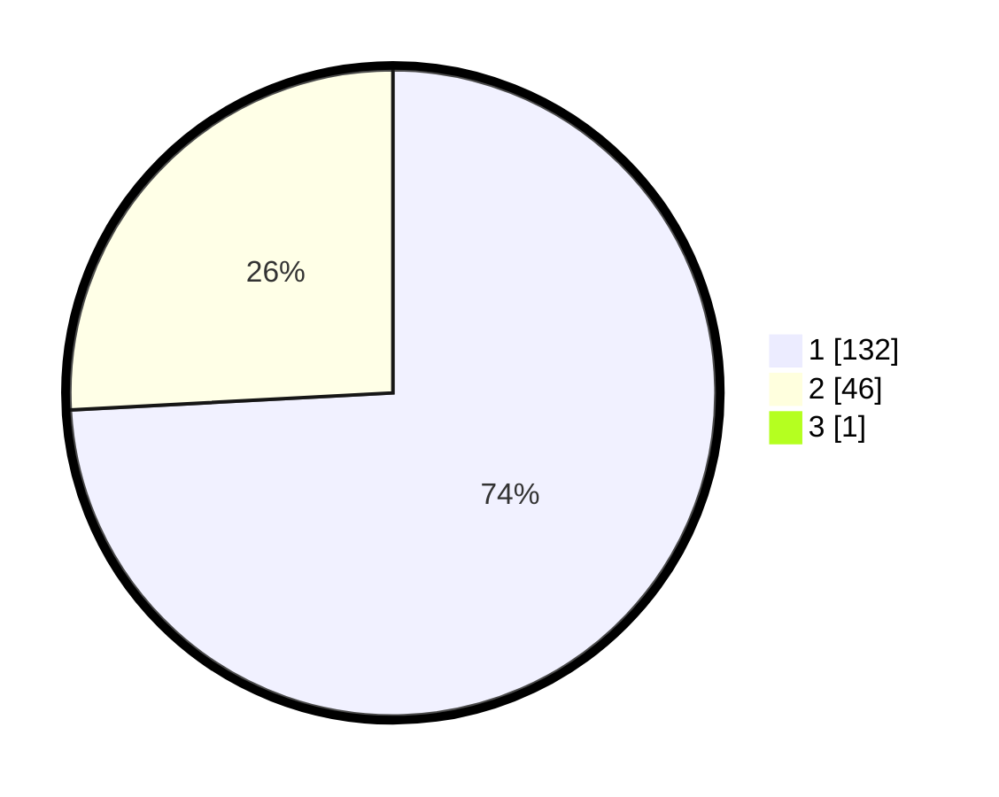

# Hasil

## Grafik

## Tabel

| No. | Nama Paslon    | Suara | Suara (raw) | Persentase |
|:--- |:-------------- | -----:| -----------:| ----------:|
| 1   | ANIES MUHAIMIN | 132   | [132][p-1]  | 73,74      |
| 2   | PRABOWO GIBRAN | 46    | [46][p-2]   | 25,70      |
| 3   | GANJAR MAHFUD  | 1     | [1][p-3]    | 0,56       |

[p-1]: https://github.com/gigit-pemilu/pemilu-2024-12-sumatera-utara/blob/main/pilpres/hitung-suara/sub/12-sumatera-utara/sub/01-tapanuli-tengah/sub/01-barus/sub/1001-pasar-batu-gerigis/sub/002-tps/sub/paslon-1.txt
[p-2]: https://github.com/gigit-pemilu/pemilu-2024-12-sumatera-utara/blob/main/pilpres/hitung-suara/sub/12-sumatera-utara/sub/01-tapanuli-tengah/sub/01-barus/sub/1001-pasar-batu-gerigis/sub/002-tps/sub/paslon-2.txt
[p-3]: https://github.com/gigit-pemilu/pemilu-2024-12-sumatera-utara/blob/main/pilpres/hitung-suara/sub/12-sumatera-utara/sub/01-tapanuli-tengah/sub/01-barus/sub/1001-pasar-batu-gerigis/sub/002-tps/sub/paslon-3.txt

## Foto C Plano

https://sirekap-obj-formc.kpu.go.id/9129/pemilu/ppwp/12/01/01/10/01/1201011001002-20240215-074420--62080e89-fac9-4b4e-ba9d-5fb56c871449.jpg

https://sirekap-obj-formc.kpu.go.id/9129/pemilu/ppwp/12/01/01/10/01/1201011001002-20240215-074541--ce0db0a7-5689-452f-b86d-4ba524595193.jpg

https://sirekap-obj-formc.kpu.go.id/9129/pemilu/ppwp/12/01/01/10/01/1201011001002-20240215-074729--cdfae734-2201-4fd1-bf5c-4a88cfb9aca9.jpg

## Metadata

| Key        | Value               |
| ---------- | ------------------- |
| Time Stamp | 2024-02-15 20:00:44 |

## DATA PEMILIH TETAP

Jumlah pemilih dalam DPT: **227**.
 * L: **118**.
 * P: **109**.

## DATA PENGGUNA HAK PILIH

Jumlah pengguna hak pilih dalam DPT: **180**.
 * L: **89**.
 * P: **91**.

Jumlah pengguna hak pilih dalam DPTb: **0**.
 * L: **0**.
 * P: **0**.

Jumlah pengguna hak pilih dalam DPK: **2**.
 * L: **2**.
 * P: **0**.

Jumlah pengguna hak pilih: **182**.
 * L: **89**.
 * P: **93**.

## JUMLAH SUARA SAH DAN TIDAK SAH

JUMLAH SELURUH SUARA SAH: **179**.

JUMLAH SUARA TIDAK SAH: **3**.

JUMLAH SELURUH SUARA SAH DAN SUARA TIDAK SAH: **182**.

