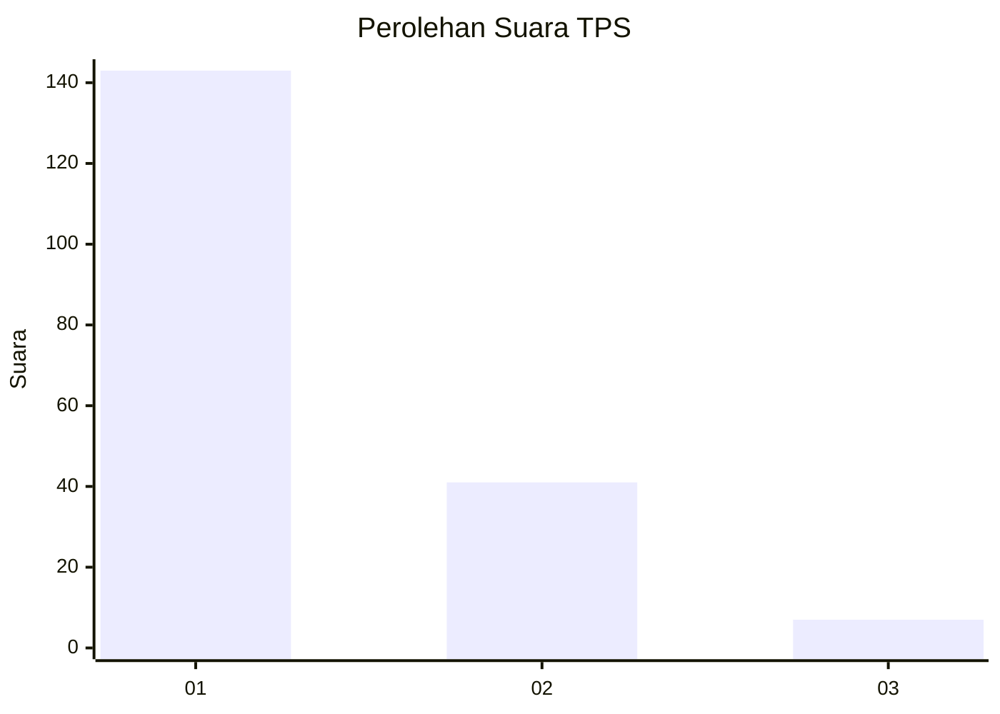
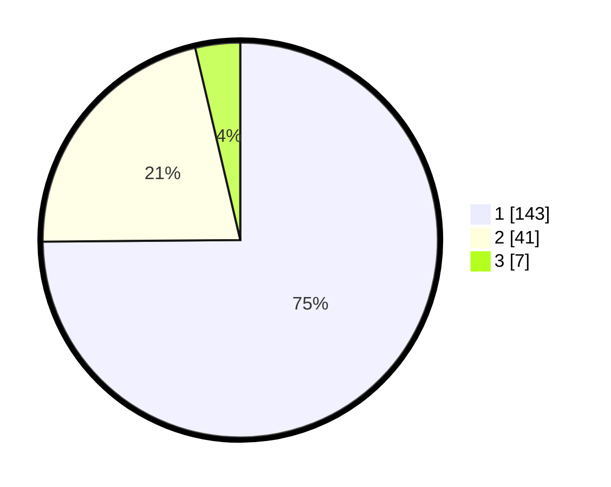

# Hasil

## Grafik

## Tabel

| No. | Nama Paslon    | Suara | Suara (raw) | Persentase |
|:--- |:-------------- | -----:| -----------:| ----------:|
| 1   | ANIES MUHAIMIN | 143   | [143][p-1]  | 74,87      |
| 2   | PRABOWO GIBRAN | 41    | [41][p-2]   | 21,47      |
| 3   | GANJAR MAHFUD  | 7     | [7][p-3]    | 3,66       |

[p-1]: https://github.com/gigit-pemilu/pemilu-2024/blob/main/pilpres/hitung-suara/sub/12-sumatera-utara/sub/01-tapanuli-tengah/sub/01-barus/sub/1001-pasar-batu-gerigis/sub/003-tps/sub/paslon-1.txt
[p-2]: https://github.com/gigit-pemilu/pemilu-2024/blob/main/pilpres/hitung-suara/sub/12-sumatera-utara/sub/01-tapanuli-tengah/sub/01-barus/sub/1001-pasar-batu-gerigis/sub/003-tps/sub/paslon-2.txt
[p-3]: https://github.com/gigit-pemilu/pemilu-2024/blob/main/pilpres/hitung-suara/sub/12-sumatera-utara/sub/01-tapanuli-tengah/sub/01-barus/sub/1001-pasar-batu-gerigis/sub/003-tps/sub/paslon-3.txt

## Foto C Plano

https://sirekap-obj-formc.kpu.go.id/28a2/pemilu/ppwp/12/01/01/10/01/1201011001003-20240216-045031--d3458412-3004-4867-b370-43c9d3f1eeb2.jpg

https://sirekap-obj-formc.kpu.go.id/28a2/pemilu/ppwp/12/01/01/10/01/1201011001003-20240216-045047--b76c5bd2-39e7-4496-8001-34c8477ea507.jpg

https://sirekap-obj-formc.kpu.go.id/28a2/pemilu/ppwp/12/01/01/10/01/1201011001003-20240216-045058--390e438e-19d8-4b4e-8099-69cd95d20cf1.jpg

## Metadata

| Key        | Value               |
| ---------- | ------------------- |
| Time Stamp | 2024-02-16 11:00:29 |

## DATA PEMILIH TETAP

Jumlah pemilih dalam DPT: **239**.
 * L: **116**.
 * P: **123**.

## DATA PENGGUNA HAK PILIH

Jumlah pengguna hak pilih dalam DPT: **189**.
 * L: **84**.
 * P: **105**.

Jumlah pengguna hak pilih dalam DPTb: **1**.
 * L: **0**.
 * P: **1**.

Jumlah pengguna hak pilih dalam DPK: **3**.
 * L: **1**.
 * P: **2**.

Jumlah pengguna hak pilih: **193**.
 * L: **85**.
 * P: **108**.

## JUMLAH SUARA SAH DAN TIDAK SAH

JUMLAH SELURUH SUARA SAH: **191**.

JUMLAH SUARA TIDAK SAH: **2**.

JUMLAH SELURUH SUARA SAH DAN SUARA TIDAK SAH: **193**.

