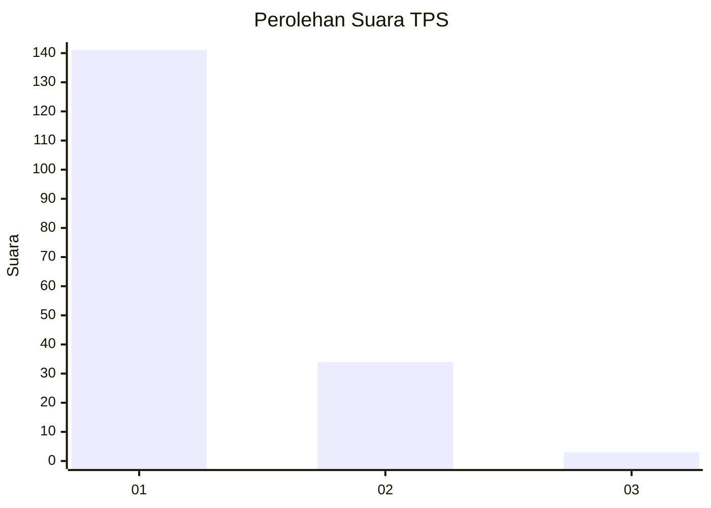
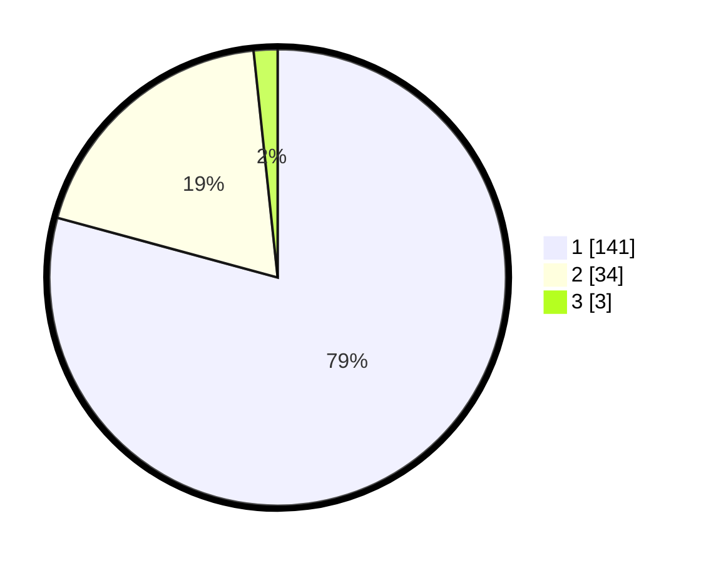

# Hasil

## Grafik

## Tabel

| No. | Nama Paslon    | Suara | Suara (raw) | Persentase |
|:--- |:-------------- | -----:| -----------:| ----------:|
| 1   | ANIES MUHAIMIN | 141   | [141][p-1]  | 79,21      |
| 2   | PRABOWO GIBRAN | 34    | [34][p-2]   | 19,10      |
| 3   | GANJAR MAHFUD  | 3     | [3][p-3]    | 1,69       |

[p-1]: https://github.com/gigit-pemilu/pemilu-2024-12-sumatera-utara/blob/main/pilpres/hitung-suara/sub/12-sumatera-utara/sub/01-tapanuli-tengah/sub/01-barus/sub/1001-pasar-batu-gerigis/sub/004-tps/sub/paslon-1.txt
[p-2]: https://github.com/gigit-pemilu/pemilu-2024-12-sumatera-utara/blob/main/pilpres/hitung-suara/sub/12-sumatera-utara/sub/01-tapanuli-tengah/sub/01-barus/sub/1001-pasar-batu-gerigis/sub/004-tps/sub/paslon-2.txt
[p-3]: https://github.com/gigit-pemilu/pemilu-2024-12-sumatera-utara/blob/main/pilpres/hitung-suara/sub/12-sumatera-utara/sub/01-tapanuli-tengah/sub/01-barus/sub/1001-pasar-batu-gerigis/sub/004-tps/sub/paslon-3.txt

## Foto C Plano

https://sirekap-obj-formc.kpu.go.id/615e/pemilu/ppwp/12/01/01/10/01/1201011001004-20240216-144058--fc5cbd4d-e485-4d38-abe0-a07899427a58.jpg

https://sirekap-obj-formc.kpu.go.id/615e/pemilu/ppwp/12/01/01/10/01/1201011001004-20240214-210708--3711616d-d6a1-48b3-a79c-f5b7155fe5a3.jpg

https://sirekap-obj-formc.kpu.go.id/615e/pemilu/ppwp/12/01/01/10/01/1201011001004-20240216-144059--6c6a8745-e6d2-4406-b110-8e2366e1d30b.jpg

## Metadata

| Key        | Value               |
| ---------- | ------------------- |
| Time Stamp | 2024-02-16 16:25:10 |

## DATA PEMILIH TETAP

Jumlah pemilih dalam DPT: **230**.
 * L: **113**.
 * P: **117**.

## DATA PENGGUNA HAK PILIH

Jumlah pengguna hak pilih dalam DPT: **178**.
 * L: **89**.
 * P: **89**.

Jumlah pengguna hak pilih dalam DPTb: **0**.
 * L: **0**.
 * P: **0**.

Jumlah pengguna hak pilih dalam DPK: **0**.
 * L: **0**.
 * P: **0**.

Jumlah pengguna hak pilih: **178**.
 * L: **89**.
 * P: **89**.

## JUMLAH SUARA SAH DAN TIDAK SAH

JUMLAH SELURUH SUARA SAH: **178**.

JUMLAH SUARA TIDAK SAH: **0**.

JUMLAH SELURUH SUARA SAH DAN SUARA TIDAK SAH: **178**.

