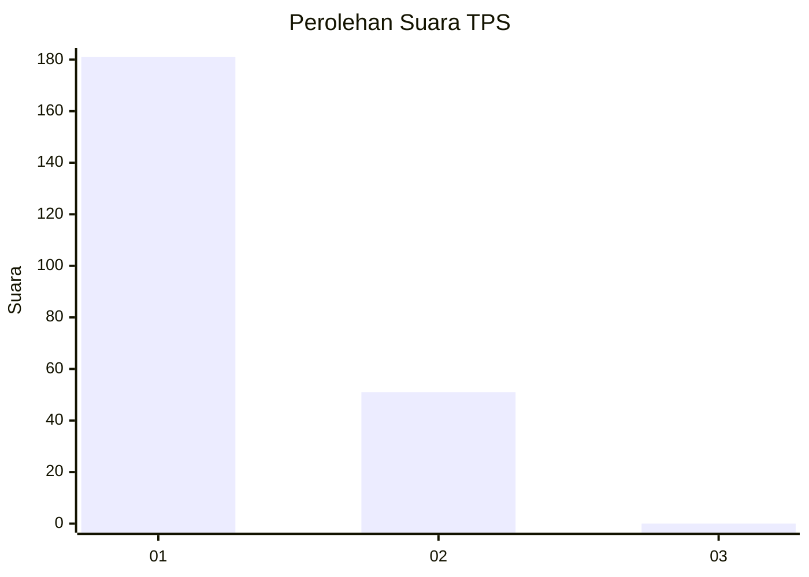
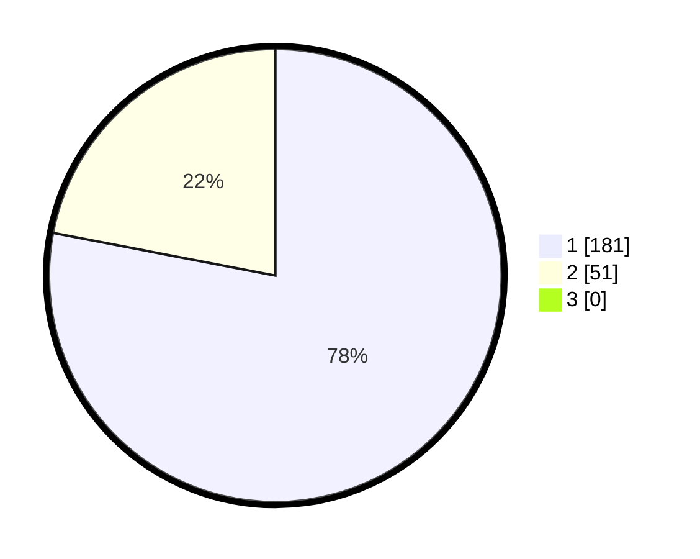

# Hasil

## Grafik

## Tabel

| No. | Nama Paslon    | Suara | Suara (raw) | Persentase |
|:--- |:-------------- | -----:| -----------:| ----------:|
| 1   | ANIES MUHAIMIN | 181   | [181][p-1]  | 78,02      |
| 2   | PRABOWO GIBRAN | 51    | [51][p-2]   | 21,98      |
| 3   | GANJAR MAHFUD  | 0     | [0][p-3]    | 0,00       |

[p-1]: https://github.com/gigit-pemilu/pemilu-2024/blob/main/pilpres/hitung-suara/sub/12-sumatera-utara/sub/01-tapanuli-tengah/sub/01-barus/sub/2004-pasar-terandam/sub/002-tps/sub/paslon-1.txt
[p-2]: https://github.com/gigit-pemilu/pemilu-2024/blob/main/pilpres/hitung-suara/sub/12-sumatera-utara/sub/01-tapanuli-tengah/sub/01-barus/sub/2004-pasar-terandam/sub/002-tps/sub/paslon-2.txt
[p-3]: https://github.com/gigit-pemilu/pemilu-2024/blob/main/pilpres/hitung-suara/sub/12-sumatera-utara/sub/01-tapanuli-tengah/sub/01-barus/sub/2004-pasar-terandam/sub/002-tps/sub/paslon-3.txt

## Foto C Plano

https://sirekap-obj-formc.kpu.go.id/ceca/pemilu/ppwp/12/01/01/20/04/1201012004002-20240214-215528--e877dbae-c166-4315-8a78-3525a65a2b1f.jpg

https://sirekap-obj-formc.kpu.go.id/ceca/pemilu/ppwp/12/01/01/20/04/1201012004002-20240214-215615--aa29c357-60f4-4465-9645-d5150afc0242.jpg

https://sirekap-obj-formc.kpu.go.id/ceca/pemilu/ppwp/12/01/01/20/04/1201012004002-20240214-215658--9abca003-96c6-463b-bd96-476363b9527e.jpg

## Metadata

| Key        | Value               |
| ---------- | ------------------- |
| Time Stamp | 2024-02-15 21:30:27 |

