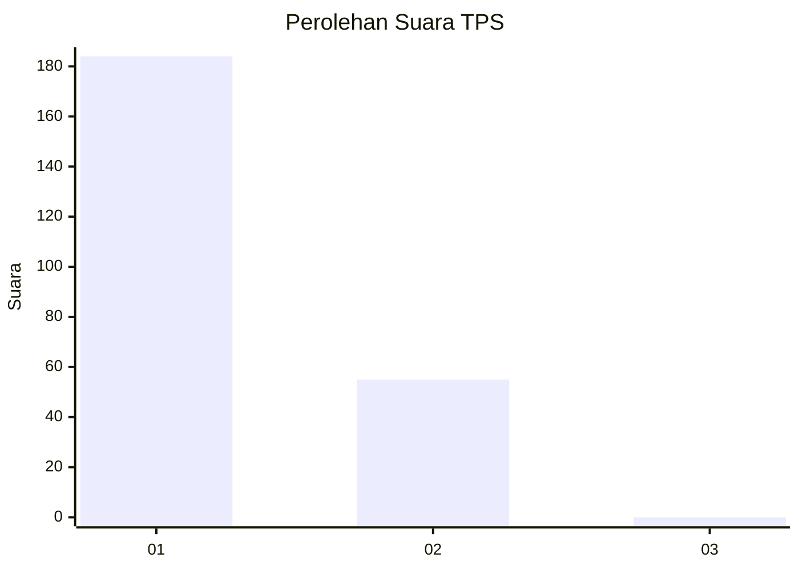
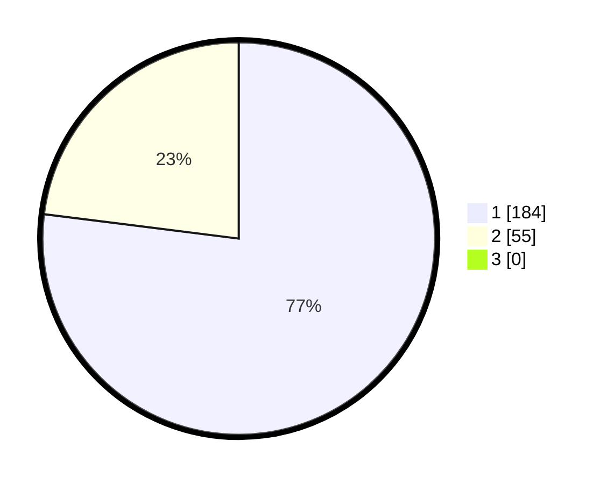

# Hasil

## Grafik

## Tabel

| No. | Nama Paslon    | Suara | Suara (raw) | Persentase |
|:--- |:-------------- | -----:| -----------:| ----------:|
| 1   | ANIES MUHAIMIN | 184   | [184][p-1]  | 76,99      |
| 2   | PRABOWO GIBRAN | 55    | [55][p-2]   | 23,01      |
| 3   | GANJAR MAHFUD  | 0     | [0][p-3]    | 0,00       |

[p-1]: https://github.com/gigit-pemilu/pemilu-2024/blob/main/pilpres/hitung-suara/sub/12-sumatera-utara/sub/01-tapanuli-tengah/sub/01-barus/sub/2004-pasar-terandam/sub/008-tps/sub/paslon-1.txt
[p-2]: https://github.com/gigit-pemilu/pemilu-2024/blob/main/pilpres/hitung-suara/sub/12-sumatera-utara/sub/01-tapanuli-tengah/sub/01-barus/sub/2004-pasar-terandam/sub/008-tps/sub/paslon-2.txt
[p-3]: https://github.com/gigit-pemilu/pemilu-2024/blob/main/pilpres/hitung-suara/sub/12-sumatera-utara/sub/01-tapanuli-tengah/sub/01-barus/sub/2004-pasar-terandam/sub/008-tps/sub/paslon-3.txt

## Foto C Plano

https://sirekap-obj-formc.kpu.go.id/5e9d/pemilu/ppwp/12/01/01/20/04/1201012004008-20240215-034655--a654b539-0498-4c09-835a-9effd80a926c.jpg

https://sirekap-obj-formc.kpu.go.id/5e9d/pemilu/ppwp/12/01/01/20/04/1201012004008-20240215-034746--3c499de6-4752-4d8e-96e3-0636883b84c7.jpg

https://sirekap-obj-formc.kpu.go.id/5e9d/pemilu/ppwp/12/01/01/20/04/1201012004008-20240215-034907--b5cc1860-8d36-4511-8f28-f9acf547f321.jpg

## Metadata

| Key        | Value               |
| ---------- | ------------------- |
| Time Stamp | 2024-02-15 22:40:13 |

