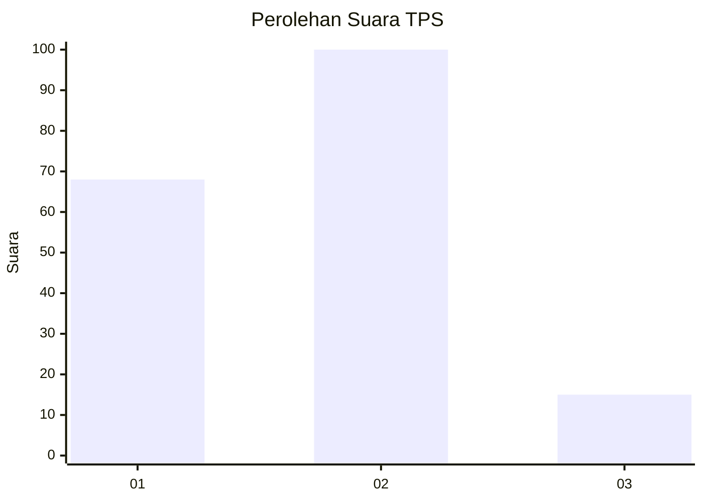

# Hasil

## Grafik

## Tabel

| No. | Nama Paslon    | Suara | Suara (raw) | Persentase |
|:--- |:-------------- | -----:| -----------:| ----------:|
| 1   | ANIES MUHAIMIN | 68    | [68][p-1]   | 37,16      |
| 2   | PRABOWO GIBRAN | 100   | [100][p-2]  | 54,64      |
| 3   | GANJAR MAHFUD  | 15    | [15][p-3]   | 8,20       |

[p-1]: https://github.com/gigit-pemilu/pemilu-2024-12-sumatera-utara/blob/main/pilpres/hitung-suara/sub/12-sumatera-utara/sub/01-tapanuli-tengah/sub/03-pandan/sub/1001-pandan/sub/009-tps/sub/paslon-1.txt
[p-2]: https://github.com/gigit-pemilu/pemilu-2024-12-sumatera-utara/blob/main/pilpres/hitung-suara/sub/12-sumatera-utara/sub/01-tapanuli-tengah/sub/03-pandan/sub/1001-pandan/sub/009-tps/sub/paslon-2.txt
[p-3]: https://github.com/gigit-pemilu/pemilu-2024-12-sumatera-utara/blob/main/pilpres/hitung-suara/sub/12-sumatera-utara/sub/01-tapanuli-tengah/sub/03-pandan/sub/1001-pandan/sub/009-tps/sub/paslon-3.txt

## Foto C Plano

https://sirekap-obj-formc.kpu.go.id/700f/pemilu/ppwp/12/01/03/10/01/1201031001009-20240214-210317--cf4ea47e-f321-4df9-88ab-8ce04dd8cf6f.jpg

https://sirekap-obj-formc.kpu.go.id/700f/pemilu/ppwp/12/01/03/10/01/1201031001009-20240214-202219--c1820187-16c3-44f3-9593-51f00394b156.jpg

https://sirekap-obj-formc.kpu.go.id/700f/pemilu/ppwp/12/01/03/10/01/1201031001009-20240214-202414--e4b7563a-c13d-4d35-b3ad-72a94bd8b41e.jpg

## Metadata

| Key        | Value               |
| ---------- | ------------------- |
| Time Stamp | 2024-02-17 12:00:00 |

