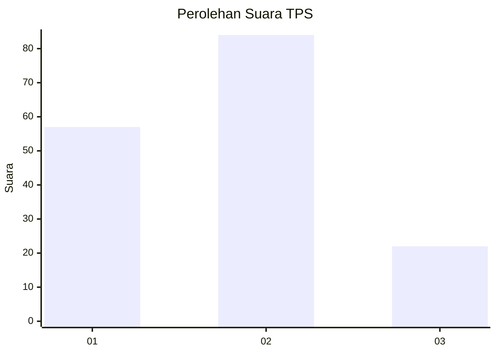
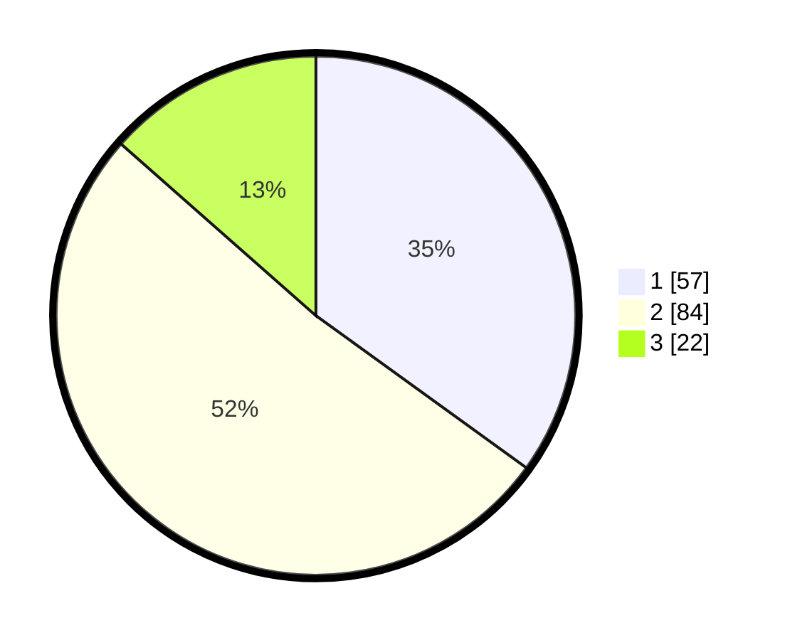

# Hasil

## Grafik

## Tabel

| No. | Nama Paslon    | Suara | Suara (raw) | Persentase |
|:--- |:-------------- | -----:| -----------:| ----------:|
| 1   | ANIES MUHAIMIN | 57    | [57][p-1]   | 34,97      |
| 2   | PRABOWO GIBRAN | 84    | [84][p-2]   | 51,53      |
| 3   | GANJAR MAHFUD  | 22    | [22][p-3]   | 13,50      |

[p-1]: https://github.com/gigit-pemilu/pemilu-2024/blob/main/pilpres/hitung-suara/sub/12-sumatera-utara/sub/01-tapanuli-tengah/sub/03-pandan/sub/1001-pandan/sub/016-tps/sub/paslon-1.txt
[p-2]: https://github.com/gigit-pemilu/pemilu-2024/blob/main/pilpres/hitung-suara/sub/12-sumatera-utara/sub/01-tapanuli-tengah/sub/03-pandan/sub/1001-pandan/sub/016-tps/sub/paslon-2.txt
[p-3]: https://github.com/gigit-pemilu/pemilu-2024/blob/main/pilpres/hitung-suara/sub/12-sumatera-utara/sub/01-tapanuli-tengah/sub/03-pandan/sub/1001-pandan/sub/016-tps/sub/paslon-3.txt

## Foto C Plano

https://sirekap-obj-formc.kpu.go.id/cea0/pemilu/ppwp/12/01/03/10/01/1201031001016-20240215-043400--ac08ad91-156f-4e80-8418-48ab282ce0a4.jpg

https://sirekap-obj-formc.kpu.go.id/cea0/pemilu/ppwp/12/01/03/10/01/1201031001016-20240215-043516--ff68abcb-a558-4612-ab1b-3a1b9f725715.jpg

https://sirekap-obj-formc.kpu.go.id/cea0/pemilu/ppwp/12/01/03/10/01/1201031001016-20240215-043627--7c1980ab-4ed6-4f4f-bd34-ce836a8468bb.jpg

## Metadata

| Key        | Value               |
| ---------- | ------------------- |
| Time Stamp | 2024-02-16 00:30:27 |

