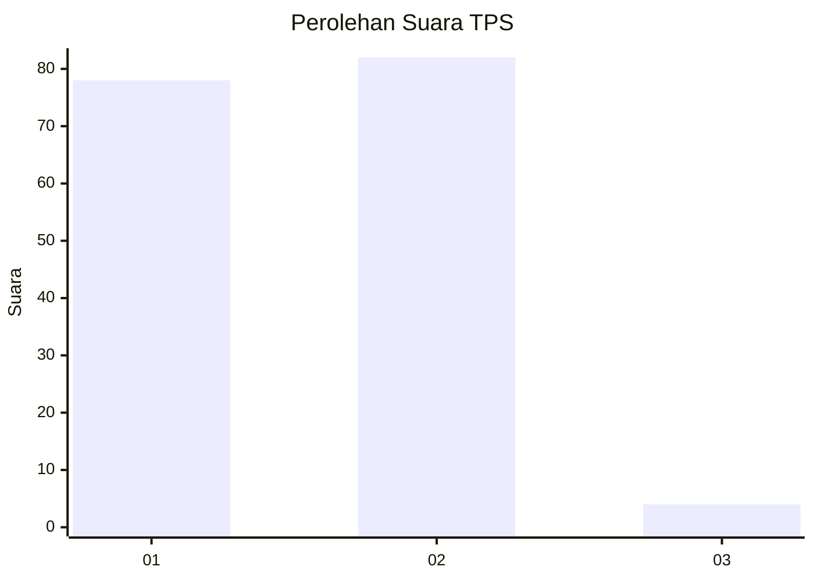
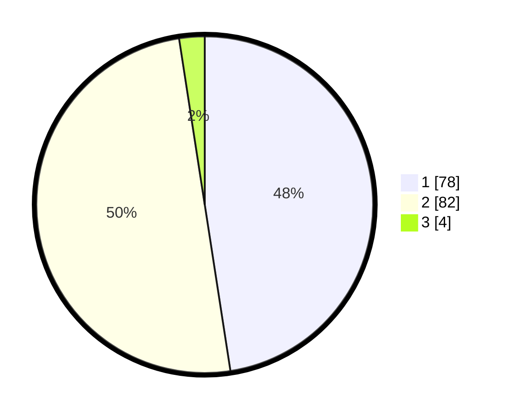

# Hasil

## Grafik

## Tabel

| No. | Nama Paslon    | Suara | Suara (raw) | Persentase |
|:--- |:-------------- | -----:| -----------:| ----------:|
| 1   | ANIES MUHAIMIN | 78    | [78][p-1]   | 47,56      |
| 2   | PRABOWO GIBRAN | 82    | [82][p-2]   | 50,00      |
| 3   | GANJAR MAHFUD  | 4     | [4][p-3]    | 2,44       |

[p-1]: https://github.com/gigit-pemilu/pemilu-2024/blob/main/pilpres/hitung-suara/sub/12-sumatera-utara/sub/01-tapanuli-tengah/sub/03-pandan/sub/1002-hajoran/sub/002-tps/sub/paslon-1.txt
[p-2]: https://github.com/gigit-pemilu/pemilu-2024/blob/main/pilpres/hitung-suara/sub/12-sumatera-utara/sub/01-tapanuli-tengah/sub/03-pandan/sub/1002-hajoran/sub/002-tps/sub/paslon-2.txt
[p-3]: https://github.com/gigit-pemilu/pemilu-2024/blob/main/pilpres/hitung-suara/sub/12-sumatera-utara/sub/01-tapanuli-tengah/sub/03-pandan/sub/1002-hajoran/sub/002-tps/sub/paslon-3.txt

## Foto C Plano

https://sirekap-obj-formc.kpu.go.id/5544/pemilu/ppwp/12/01/03/10/02/1201031002002-20240215-013419--51c31291-9705-403e-aaae-032a646ac249.jpg

https://sirekap-obj-formc.kpu.go.id/5544/pemilu/ppwp/12/01/03/10/02/1201031002002-20240215-013054--b3ea682f-549a-43f6-930a-0ef8d269f7c0.jpg

https://sirekap-obj-formc.kpu.go.id/5544/pemilu/ppwp/12/01/03/10/02/1201031002002-20240215-013249--dc25444b-7b67-487e-8003-2eb9d7d4739d.jpg

## Metadata

| Key        | Value               |
| ---------- | ------------------- |
| Time Stamp | 2024-02-16 00:30:27 |

