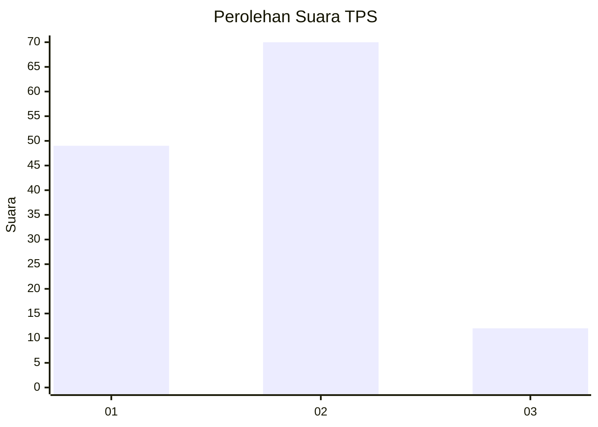

# Hasil

## Grafik

## Tabel

| No. | Nama Paslon    | Suara | Suara (raw) | Persentase |
|:--- |:-------------- | -----:| -----------:| ----------:|
| 1   | ANIES MUHAIMIN | 49    | [49][p-1]   | 37,40      |
| 2   | PRABOWO GIBRAN | 70    | [70][p-2]   | 53,44      |
| 3   | GANJAR MAHFUD  | 12    | [12][p-3]   | 9,16       |

[p-1]: https://github.com/gigit-pemilu/pemilu-2024-12-sumatera-utara/blob/main/pilpres/hitung-suara/sub/12-sumatera-utara/sub/01-tapanuli-tengah/sub/03-pandan/sub/1011-aek-sitio-tio/sub/009-tps/sub/paslon-1.txt
[p-2]: https://github.com/gigit-pemilu/pemilu-2024-12-sumatera-utara/blob/main/pilpres/hitung-suara/sub/12-sumatera-utara/sub/01-tapanuli-tengah/sub/03-pandan/sub/1011-aek-sitio-tio/sub/009-tps/sub/paslon-2.txt
[p-3]: https://github.com/gigit-pemilu/pemilu-2024-12-sumatera-utara/blob/main/pilpres/hitung-suara/sub/12-sumatera-utara/sub/01-tapanuli-tengah/sub/03-pandan/sub/1011-aek-sitio-tio/sub/009-tps/sub/paslon-3.txt

## Foto C Plano

https://sirekap-obj-formc.kpu.go.id/03bf/pemilu/ppwp/12/01/03/10/11/1201031011009-20240215-001549--2886d782-7c9b-4bf8-9590-c663fb2ad073.jpg

https://sirekap-obj-formc.kpu.go.id/03bf/pemilu/ppwp/12/01/03/10/11/1201031011009-20240215-001945--a89d01b0-4371-4fab-afcd-7c11ab31ccaf.jpg

https://sirekap-obj-formc.kpu.go.id/03bf/pemilu/ppwp/12/01/03/10/11/1201031011009-20240215-002513--60d5aa7d-d283-422d-b8df-ded37beb1fe5.jpg

## Metadata

| Key        | Value               |
| ---------- | ------------------- |
| Time Stamp | 2024-02-24 22:31:28 |

