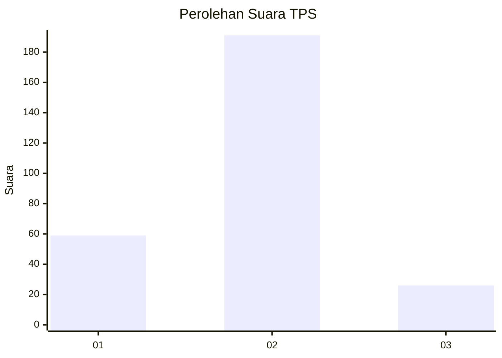

# Hasil

## Grafik

## Tabel

| No. | Nama Paslon    | Suara | Suara (raw) | Persentase |
|:--- |:-------------- | -----:| -----------:| ----------:|
| 1   | ANIES MUHAIMIN | 59    | [59][p-1]   | 21,38      |
| 2   | PRABOWO GIBRAN | 191   | [191][p-2]  | 69,20      |
| 3   | GANJAR MAHFUD  | 26    | [26][p-3]   | 9,42       |

[p-1]: https://github.com/gigit-pemilu/pemilu-2024/blob/main/pilpres/hitung-suara/sub/12-sumatera-utara/sub/01-tapanuli-tengah/sub/03-pandan/sub/1012-sibuluan-raya/sub/902-tps/sub/paslon-1.txt
[p-2]: https://github.com/gigit-pemilu/pemilu-2024/blob/main/pilpres/hitung-suara/sub/12-sumatera-utara/sub/01-tapanuli-tengah/sub/03-pandan/sub/1012-sibuluan-raya/sub/902-tps/sub/paslon-2.txt
[p-3]: https://github.com/gigit-pemilu/pemilu-2024/blob/main/pilpres/hitung-suara/sub/12-sumatera-utara/sub/01-tapanuli-tengah/sub/03-pandan/sub/1012-sibuluan-raya/sub/902-tps/sub/paslon-3.txt

## Foto C Plano

https://sirekap-obj-formc.kpu.go.id/e7b4/pemilu/ppwp/12/01/03/10/12/1201031012902-20240216-134408--a2ec64a9-753a-4540-ab53-5767078846d3.jpg

https://sirekap-obj-formc.kpu.go.id/e7b4/pemilu/ppwp/12/01/03/10/12/1201031012902-20240216-134410--64f9513c-e919-49f3-a6c4-b2cef4e9cf5b.jpg

https://sirekap-obj-formc.kpu.go.id/e7b4/pemilu/ppwp/12/01/03/10/12/1201031012902-20240216-134409--b4578a00-d25a-459c-903c-60464a6058d7.jpg

## Metadata

| Key        | Value               |
| ---------- | ------------------- |
| Time Stamp | 2024-02-16 16:25:10 |

## DATA PEMILIH TETAP

Jumlah pemilih dalam DPT: **296**.
 * L: **289**.
 * P: **7**.

## DATA PENGGUNA HAK PILIH

Jumlah pengguna hak pilih dalam DPT: **194**.
 * L: **188**.
 * P: **6**.

Jumlah pengguna hak pilih dalam DPTb: **91**.
 * L: **84**.
 * P: **7**.

Jumlah pengguna hak pilih dalam DPK: **0**.
 * L: **0**.
 * P: **0**.

Jumlah pengguna hak pilih: **285**.
 * L: **272**.
 * P: **13**.

## JUMLAH SUARA SAH DAN TIDAK SAH

JUMLAH SELURUH SUARA SAH: **276**.

JUMLAH SUARA TIDAK SAH: **9**.

JUMLAH SELURUH SUARA SAH DAN SUARA TIDAK SAH: **285**.

