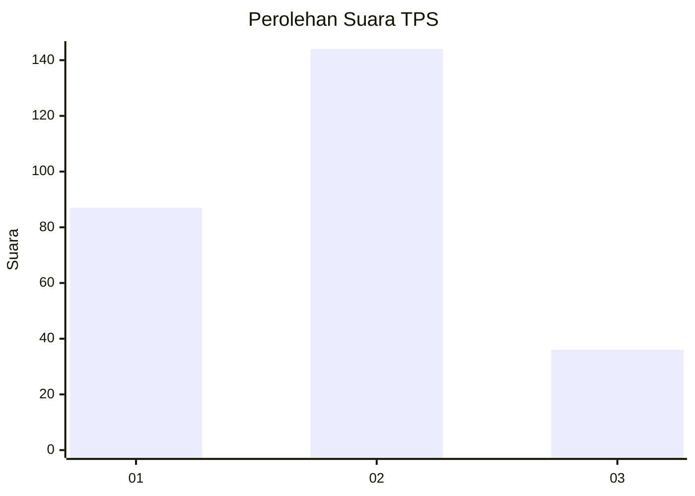
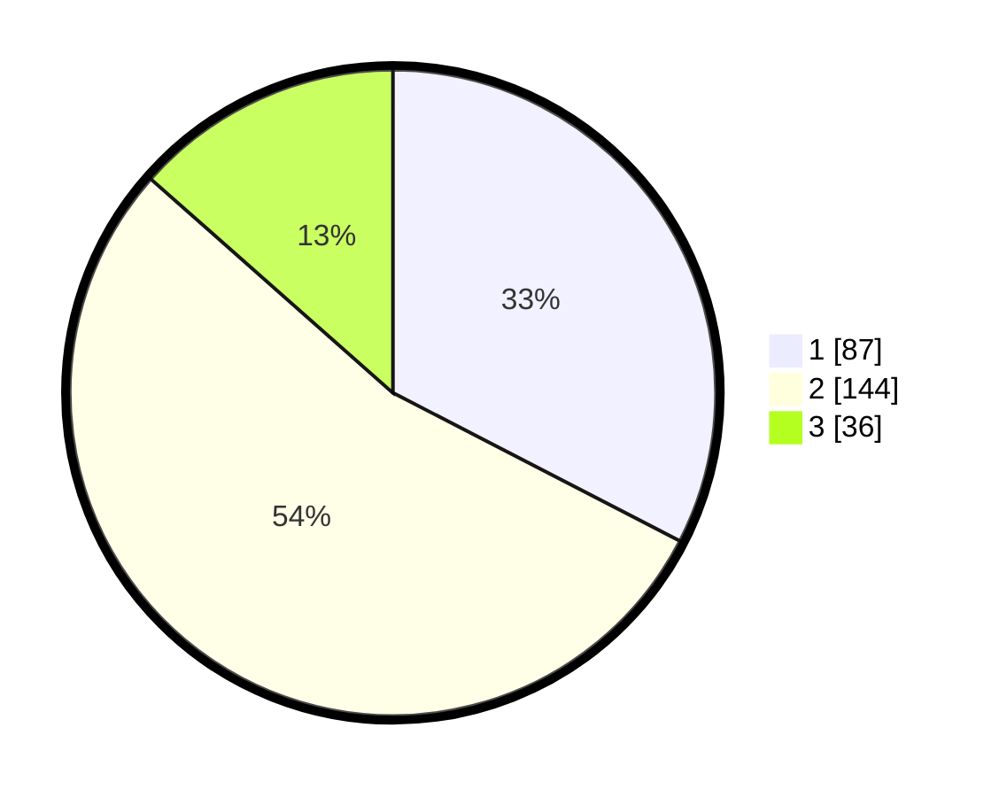

# Hasil

## Grafik

## Tabel

| No. | Nama Paslon    | Suara | Suara (raw) | Persentase |
|:--- |:-------------- | -----:| -----------:| ----------:|
| 1   | ANIES MUHAIMIN | 87    | [87][p-1]   | 32,58      |
| 2   | PRABOWO GIBRAN | 144   | [144][p-2]  | 53,93      |
| 3   | GANJAR MAHFUD  | 36    | [36][p-3]   | 13,48      |

[p-1]: https://github.com/gigit-pemilu/pemilu-2024/blob/main/pilpres/hitung-suara/sub/12-sumatera-utara/sub/01-tapanuli-tengah/sub/03-pandan/sub/1019-sibuluan-terpadu/sub/001-tps/sub/paslon-1.txt
[p-2]: https://github.com/gigit-pemilu/pemilu-2024/blob/main/pilpres/hitung-suara/sub/12-sumatera-utara/sub/01-tapanuli-tengah/sub/03-pandan/sub/1019-sibuluan-terpadu/sub/001-tps/sub/paslon-2.txt
[p-3]: https://github.com/gigit-pemilu/pemilu-2024/blob/main/pilpres/hitung-suara/sub/12-sumatera-utara/sub/01-tapanuli-tengah/sub/03-pandan/sub/1019-sibuluan-terpadu/sub/001-tps/sub/paslon-3.txt

## Foto C Plano

https://sirekap-obj-formc.kpu.go.id/1b77/pemilu/ppwp/12/01/03/10/19/1201031019001-20240214-202245--d847a730-f6c3-4cac-a121-2585a0431a44.jpg

https://sirekap-obj-formc.kpu.go.id/1b77/pemilu/ppwp/12/01/03/10/19/1201031019001-20240214-202455--3d64cab1-3cf2-42fe-8568-21422e7a0164.jpg

https://sirekap-obj-formc.kpu.go.id/1b77/pemilu/ppwp/12/01/03/10/19/1201031019001-20240215-084343--f8a0f022-fd6a-444c-a74a-72d952f93c85.jpg

## Metadata

| Key        | Value               |
| ---------- | ------------------- |
| Time Stamp | 2024-02-16 00:30:27 |

