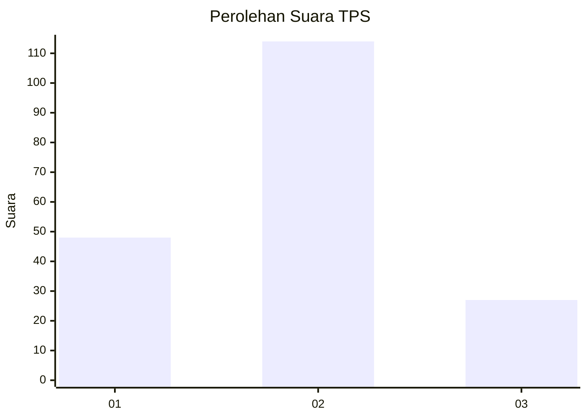
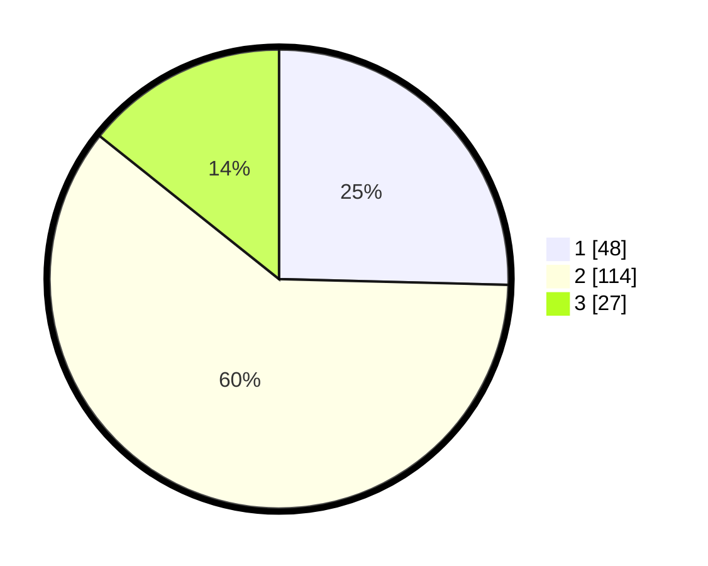

# Hasil

## Grafik

## Tabel

| No. | Nama Paslon    | Suara | Suara (raw) | Persentase |
|:--- |:-------------- | -----:| -----------:| ----------:|
| 1   | ANIES MUHAIMIN | 48    | [48][p-1]   | 25,40      |
| 2   | PRABOWO GIBRAN | 114   | [114][p-2]  | 60,32      |
| 3   | GANJAR MAHFUD  | 27    | [27][p-3]   | 14,29      |

[p-1]: https://github.com/gigit-pemilu/pemilu-2024-12-sumatera-utara/blob/main/pilpres/hitung-suara/sub/12-sumatera-utara/sub/01-tapanuli-tengah/sub/04-pinangsori/sub/1009-albion-prancis/sub/006-tps/sub/paslon-1.txt
[p-2]: https://github.com/gigit-pemilu/pemilu-2024-12-sumatera-utara/blob/main/pilpres/hitung-suara/sub/12-sumatera-utara/sub/01-tapanuli-tengah/sub/04-pinangsori/sub/1009-albion-prancis/sub/006-tps/sub/paslon-2.txt
[p-3]: https://github.com/gigit-pemilu/pemilu-2024-12-sumatera-utara/blob/main/pilpres/hitung-suara/sub/12-sumatera-utara/sub/01-tapanuli-tengah/sub/04-pinangsori/sub/1009-albion-prancis/sub/006-tps/sub/paslon-3.txt

## Foto C Plano

https://sirekap-obj-formc.kpu.go.id/0a63/pemilu/ppwp/12/01/04/10/09/1201041009006-20240215-034530--a539e49e-7b1b-40b7-bfd5-ea77a52e9318.jpg

https://sirekap-obj-formc.kpu.go.id/0a63/pemilu/ppwp/12/01/04/10/09/1201041009006-20240214-155516--3ea47c6e-75d5-4700-9718-9d7f9d060e8b.jpg

https://sirekap-obj-formc.kpu.go.id/0a63/pemilu/ppwp/12/01/04/10/09/1201041009006-20240214-155719--67ea5cdf-d6d9-4f5b-babd-bbad18a621c8.jpg

## Metadata

| Key        | Value               |
| ---------- | ------------------- |
| Time Stamp | 2024-02-16 00:30:27 |

