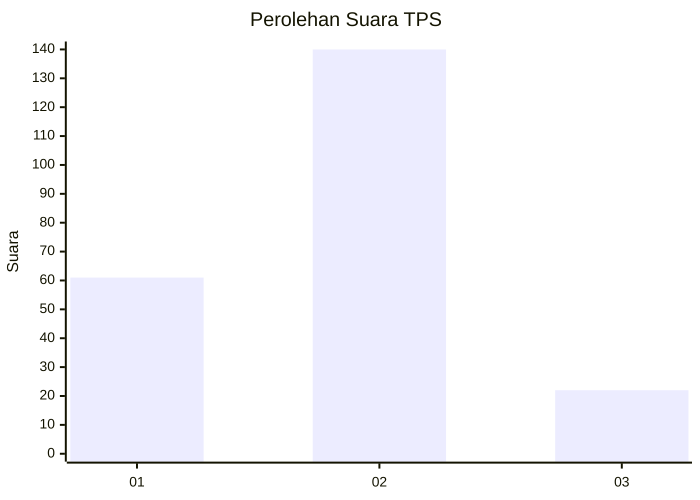
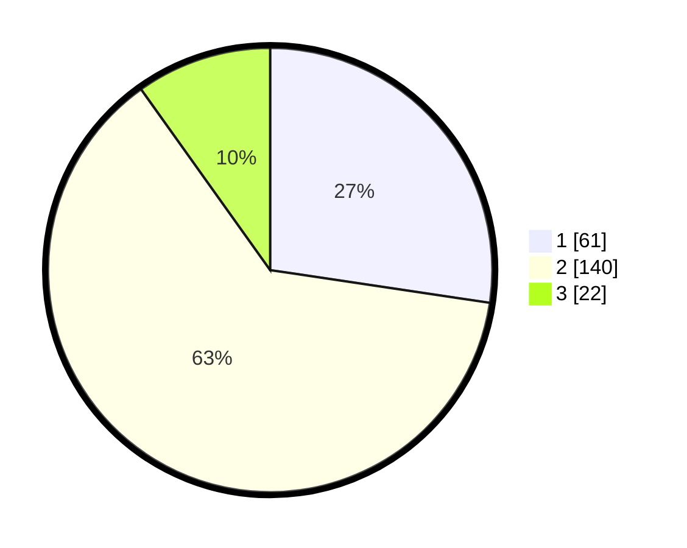

# Hasil

## Grafik

## Tabel

| No. | Nama Paslon    | Suara | Suara (raw) | Persentase |
|:--- |:-------------- | -----:| -----------:| ----------:|
| 1   | ANIES MUHAIMIN | 61    | [61][p-1]   | 27,35      |
| 2   | PRABOWO GIBRAN | 140   | [140][p-2]  | 62,78      |
| 3   | GANJAR MAHFUD  | 22    | [22][p-3]   | 9,87       |

[p-1]: https://github.com/gigit-pemilu/pemilu-2024/blob/main/pilpres/hitung-suara/sub/12-sumatera-utara/sub/01-tapanuli-tengah/sub/04-pinangsori/sub/2002-gunung-marijo/sub/006-tps/sub/paslon-1.txt
[p-2]: https://github.com/gigit-pemilu/pemilu-2024/blob/main/pilpres/hitung-suara/sub/12-sumatera-utara/sub/01-tapanuli-tengah/sub/04-pinangsori/sub/2002-gunung-marijo/sub/006-tps/sub/paslon-2.txt
[p-3]: https://github.com/gigit-pemilu/pemilu-2024/blob/main/pilpres/hitung-suara/sub/12-sumatera-utara/sub/01-tapanuli-tengah/sub/04-pinangsori/sub/2002-gunung-marijo/sub/006-tps/sub/paslon-3.txt

## Foto C Plano

https://sirekap-obj-formc.kpu.go.id/29ca/pemilu/ppwp/12/01/04/20/02/1201042002006-20240214-155317--a445ed41-e229-4f8c-bcb7-d184e1679a86.jpg

https://sirekap-obj-formc.kpu.go.id/29ca/pemilu/ppwp/12/01/04/20/02/1201042002006-20240214-155436--6aefa2d0-435f-447d-a041-5efae953258f.jpg

https://sirekap-obj-formc.kpu.go.id/29ca/pemilu/ppwp/12/01/04/20/02/1201042002006-20240214-155551--d8783d3e-10a1-41b1-8575-b0c679467da3.jpg

## Metadata

| Key        | Value               |
| ---------- | ------------------- |
| Time Stamp | 2024-02-16 00:30:27 |

