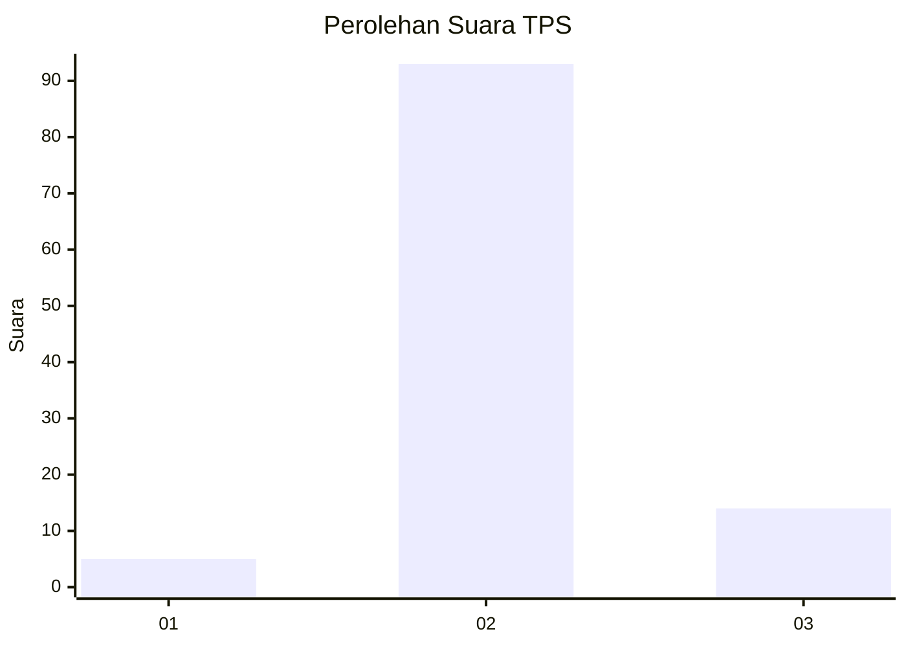
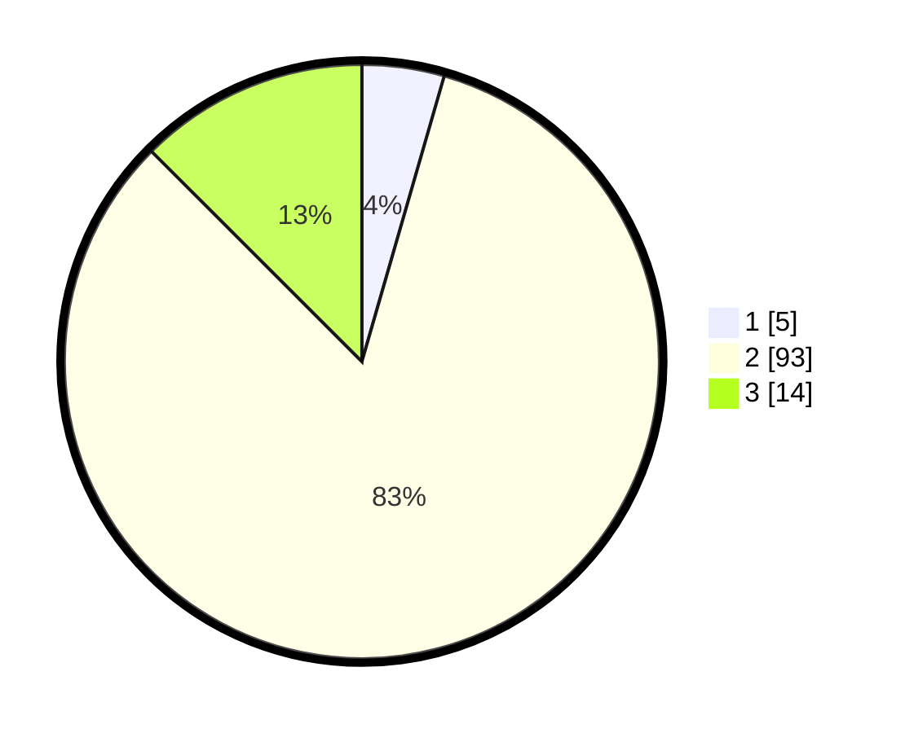

# Hasil

## Grafik

## Tabel

| No. | Nama Paslon    | Suara | Suara (raw) | Persentase |
|:--- |:-------------- | -----:| -----------:| ----------:|
| 1   | ANIES MUHAIMIN | 5     | [5][p-1]    | 4,46       |
| 2   | PRABOWO GIBRAN | 93    | [93][p-2]   | 83,04      |
| 3   | GANJAR MAHFUD  | 14    | [14][p-3]   | 12,50      |

[p-1]: https://github.com/gigit-pemilu/pemilu-2024/blob/main/pilpres/hitung-suara/sub/12-sumatera-utara/sub/01-tapanuli-tengah/sub/05-manduamas/sub/2004-pagaran-nauli/sub/001-tps/sub/paslon-1.txt
[p-2]: https://github.com/gigit-pemilu/pemilu-2024/blob/main/pilpres/hitung-suara/sub/12-sumatera-utara/sub/01-tapanuli-tengah/sub/05-manduamas/sub/2004-pagaran-nauli/sub/001-tps/sub/paslon-2.txt
[p-3]: https://github.com/gigit-pemilu/pemilu-2024/blob/main/pilpres/hitung-suara/sub/12-sumatera-utara/sub/01-tapanuli-tengah/sub/05-manduamas/sub/2004-pagaran-nauli/sub/001-tps/sub/paslon-3.txt

## Foto C Plano

https://sirekap-obj-formc.kpu.go.id/78d9/pemilu/ppwp/12/01/05/20/04/1201052004001-20240214-221323--457907db-a04a-4ec3-93b3-1b89f4418c54.jpg

https://sirekap-obj-formc.kpu.go.id/78d9/pemilu/ppwp/12/01/05/20/04/1201052004001-20240214-221404--f248331a-8dba-4b58-aa97-a4dbd1c4a705.jpg

https://sirekap-obj-formc.kpu.go.id/78d9/pemilu/ppwp/12/01/05/20/04/1201052004001-20240214-221421--5818bfed-480e-41b3-bfda-74dd96f09bc3.jpg

## Metadata

| Key        | Value               |
| ---------- | ------------------- |
| Time Stamp | 2024-02-16 00:30:27 |

