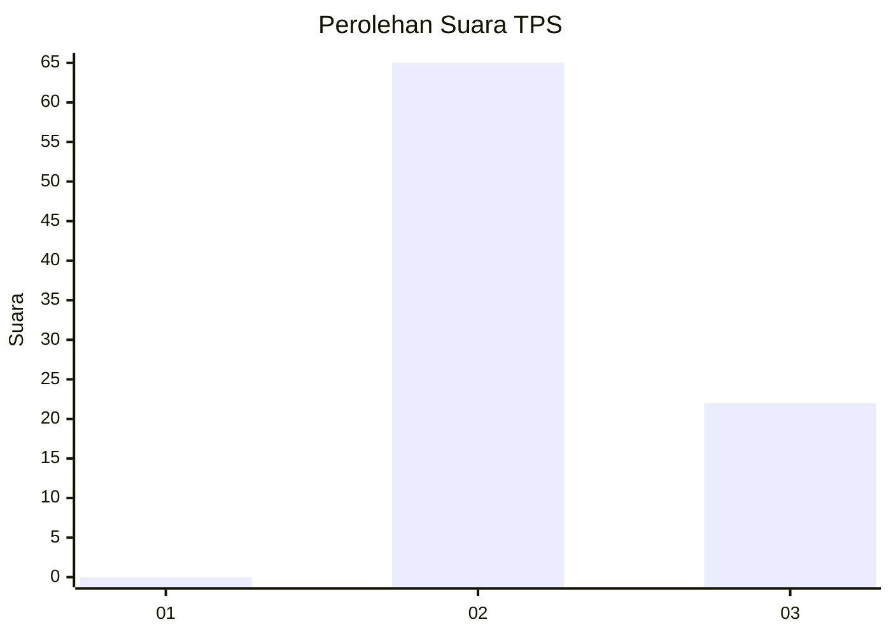
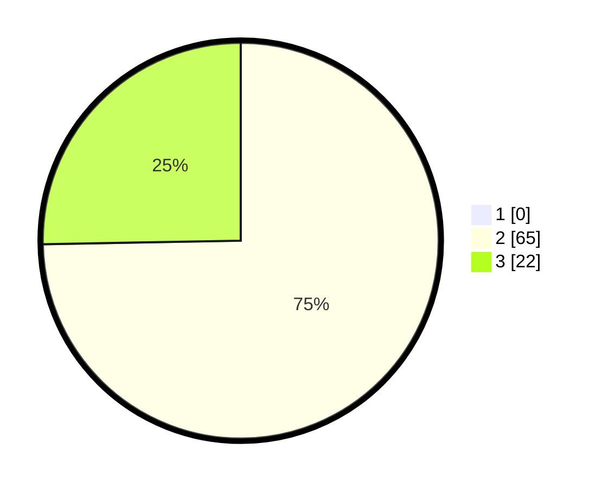

# Hasil

## Grafik

## Tabel

| No. | Nama Paslon    | Suara | Suara (raw) | Persentase |
|:--- |:-------------- | -----:| -----------:| ----------:|
| 1   | ANIES MUHAIMIN | 0     | [0][p-1]    | 0,00       |
| 2   | PRABOWO GIBRAN | 65    | [65][p-2]   | 74,71      |
| 3   | GANJAR MAHFUD  | 22    | [22][p-3]   | 25,29      |

[p-1]: https://github.com/gigit-pemilu/pemilu-2024/blob/main/pilpres/hitung-suara/sub/12-sumatera-utara/sub/01-tapanuli-tengah/sub/05-manduamas/sub/2018-parsihotangan/sub/002-tps/sub/paslon-1.txt
[p-2]: https://github.com/gigit-pemilu/pemilu-2024/blob/main/pilpres/hitung-suara/sub/12-sumatera-utara/sub/01-tapanuli-tengah/sub/05-manduamas/sub/2018-parsihotangan/sub/002-tps/sub/paslon-2.txt
[p-3]: https://github.com/gigit-pemilu/pemilu-2024/blob/main/pilpres/hitung-suara/sub/12-sumatera-utara/sub/01-tapanuli-tengah/sub/05-manduamas/sub/2018-parsihotangan/sub/002-tps/sub/paslon-3.txt

## Foto C Plano

https://sirekap-obj-formc.kpu.go.id/fb1f/pemilu/ppwp/12/01/05/20/18/1201052018002-20240215-014912--84b7233e-a3af-439c-aff9-c79270615538.jpg

https://sirekap-obj-formc.kpu.go.id/fb1f/pemilu/ppwp/12/01/05/20/18/1201052018002-20240214-224749--2ea52549-2dd4-45fd-93c7-4c5218e446da.jpg

https://sirekap-obj-formc.kpu.go.id/fb1f/pemilu/ppwp/12/01/05/20/18/1201052018002-20240215-015355--8dc9e57c-b20e-4570-a183-7cfb55e34999.jpg

## Metadata

| Key        | Value               |
| ---------- | ------------------- |
| Time Stamp | 2024-02-16 00:30:27 |

