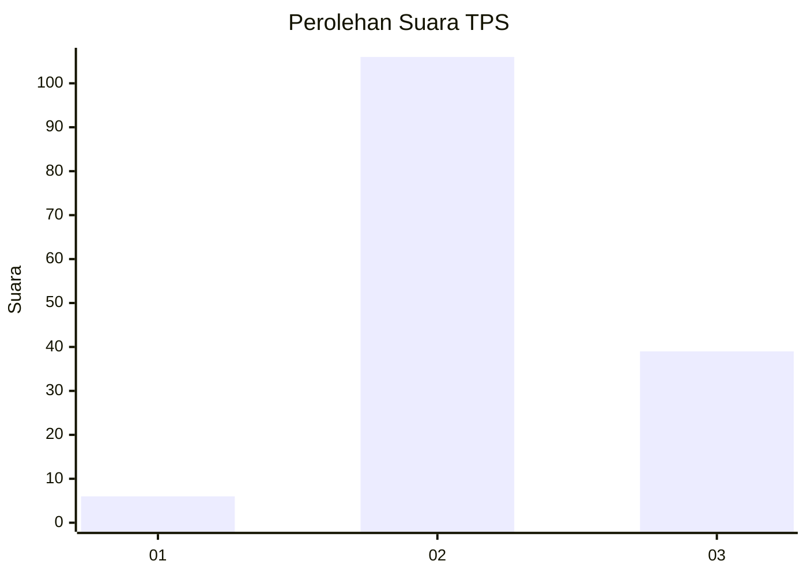
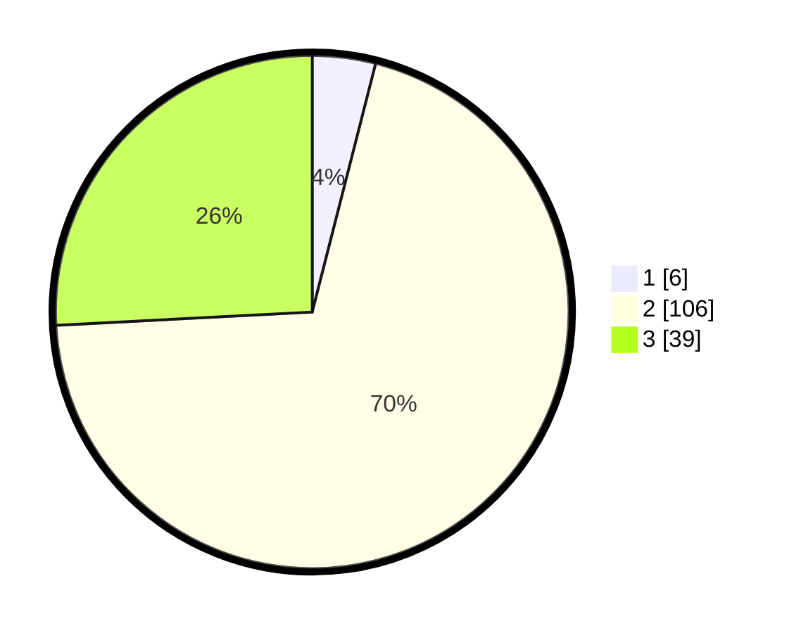

# Hasil

## Grafik

## Tabel

| No. | Nama Paslon    | Suara | Suara (raw) | Persentase |
|:--- |:-------------- | -----:| -----------:| ----------:|
| 1   | ANIES MUHAIMIN | 6     | [6][p-1]    | 3,97       |
| 2   | PRABOWO GIBRAN | 106   | [106][p-2]  | 70,20      |
| 3   | GANJAR MAHFUD  | 39    | [39][p-3]   | 25,83      |

[p-1]: https://github.com/gigit-pemilu/pemilu-2024-12-sumatera-utara/blob/main/pilpres/hitung-suara/sub/12-sumatera-utara/sub/01-tapanuli-tengah/sub/06-kolang/sub/1006-p-o-hurlang/sub/004-tps/sub/paslon-1.txt
[p-2]: https://github.com/gigit-pemilu/pemilu-2024-12-sumatera-utara/blob/main/pilpres/hitung-suara/sub/12-sumatera-utara/sub/01-tapanuli-tengah/sub/06-kolang/sub/1006-p-o-hurlang/sub/004-tps/sub/paslon-2.txt
[p-3]: https://github.com/gigit-pemilu/pemilu-2024-12-sumatera-utara/blob/main/pilpres/hitung-suara/sub/12-sumatera-utara/sub/01-tapanuli-tengah/sub/06-kolang/sub/1006-p-o-hurlang/sub/004-tps/sub/paslon-3.txt

## Foto C Plano

https://sirekap-obj-formc.kpu.go.id/ee9b/pemilu/ppwp/12/01/06/10/06/1201061006004-20240214-155030--4b0d3e72-0f45-43fc-a114-ce63e5daca9a.jpg

https://sirekap-obj-formc.kpu.go.id/ee9b/pemilu/ppwp/12/01/06/10/06/1201061006004-20240214-155155--1ae565fb-5f62-4307-a61c-97881516b005.jpg

https://sirekap-obj-formc.kpu.go.id/ee9b/pemilu/ppwp/12/01/06/10/06/1201061006004-20240214-155318--6b6e6efc-e51d-4ac8-bdfc-a7cf151cbc0e.jpg

## Metadata

| Key        | Value               |
| ---------- | ------------------- |
| Time Stamp | 2024-02-16 00:30:27 |

