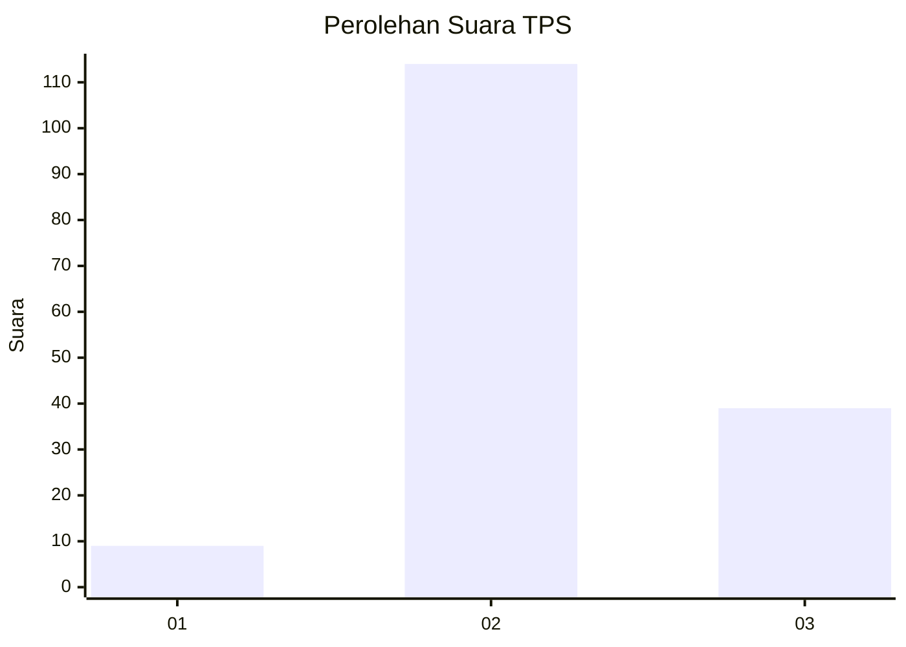
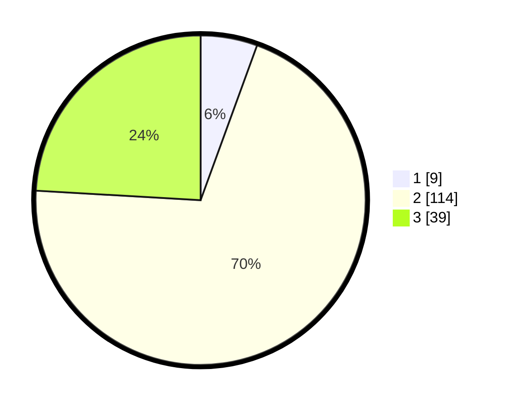

# Hasil

## Grafik

## Tabel

| No. | Nama Paslon    | Suara | Suara (raw) | Persentase |
|:--- |:-------------- | -----:| -----------:| ----------:|
| 1   | ANIES MUHAIMIN | 9     | [9][p-1]    | 5,56       |
| 2   | PRABOWO GIBRAN | 114   | [114][p-2]  | 70,37      |
| 3   | GANJAR MAHFUD  | 39    | [39][p-3]   | 24,07      |

[p-1]: https://github.com/gigit-pemilu/pemilu-2024/blob/main/pilpres/hitung-suara/sub/12-sumatera-utara/sub/01-tapanuli-tengah/sub/06-kolang/sub/1006-p-o-hurlang/sub/005-tps/sub/paslon-1.txt
[p-2]: https://github.com/gigit-pemilu/pemilu-2024/blob/main/pilpres/hitung-suara/sub/12-sumatera-utara/sub/01-tapanuli-tengah/sub/06-kolang/sub/1006-p-o-hurlang/sub/005-tps/sub/paslon-2.txt
[p-3]: https://github.com/gigit-pemilu/pemilu-2024/blob/main/pilpres/hitung-suara/sub/12-sumatera-utara/sub/01-tapanuli-tengah/sub/06-kolang/sub/1006-p-o-hurlang/sub/005-tps/sub/paslon-3.txt

## Foto C Plano

https://sirekap-obj-formc.kpu.go.id/2c91/pemilu/ppwp/12/01/06/10/06/1201061006005-20240214-210239--aa53aca5-c3f4-4b1e-9b8c-79e28eee59de.jpg

https://sirekap-obj-formc.kpu.go.id/2c91/pemilu/ppwp/12/01/06/10/06/1201061006005-20240214-210549--c434974f-d0f4-4322-bb01-ab492aeea725.jpg

https://sirekap-obj-formc.kpu.go.id/2c91/pemilu/ppwp/12/01/06/10/06/1201061006005-20240214-210711--136bd602-003f-4c04-9040-36c9be975363.jpg

## Metadata

| Key        | Value               |
| ---------- | ------------------- |
| Time Stamp | 2024-02-15 15:00:29 |

