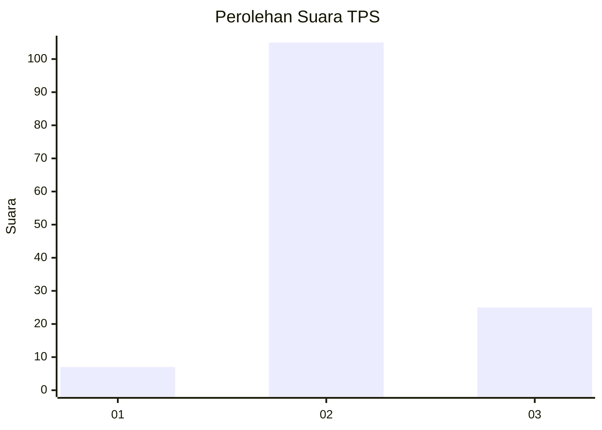
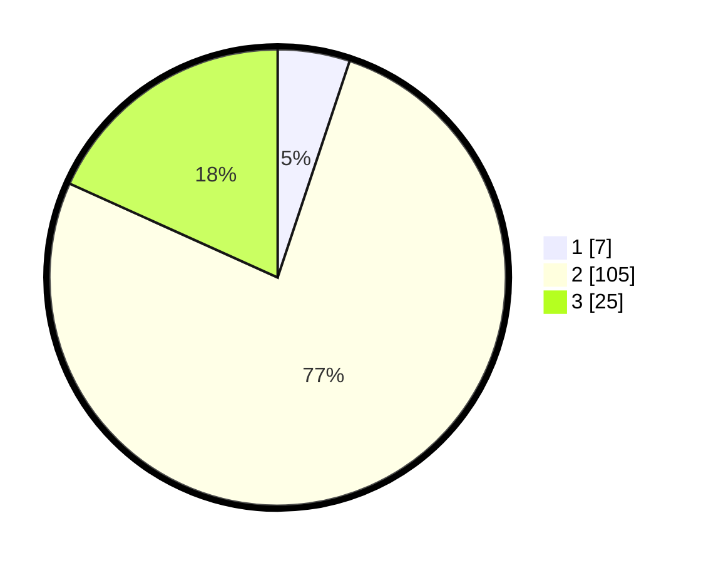

# Hasil

## Grafik

## Tabel

| No. | Nama Paslon    | Suara | Suara (raw) | Persentase |
|:--- |:-------------- | -----:| -----------:| ----------:|
| 1   | ANIES MUHAIMIN | 7     | [7][p-1]    | 5,11       |
| 2   | PRABOWO GIBRAN | 105   | [105][p-2]  | 76,64      |
| 3   | GANJAR MAHFUD  | 25    | [25][p-3]   | 18,25      |

[p-1]: https://github.com/gigit-pemilu/pemilu-2024/blob/main/pilpres/hitung-suara/sub/12-sumatera-utara/sub/01-tapanuli-tengah/sub/06-kolang/sub/2005-satahi-nauli/sub/004-tps/sub/paslon-1.txt
[p-2]: https://github.com/gigit-pemilu/pemilu-2024/blob/main/pilpres/hitung-suara/sub/12-sumatera-utara/sub/01-tapanuli-tengah/sub/06-kolang/sub/2005-satahi-nauli/sub/004-tps/sub/paslon-2.txt
[p-3]: https://github.com/gigit-pemilu/pemilu-2024/blob/main/pilpres/hitung-suara/sub/12-sumatera-utara/sub/01-tapanuli-tengah/sub/06-kolang/sub/2005-satahi-nauli/sub/004-tps/sub/paslon-3.txt

## Foto C Plano

https://sirekap-obj-formc.kpu.go.id/c46c/pemilu/ppwp/12/01/06/20/05/1201062005004-20240214-184936--4548aaf4-2aff-4c3f-9a47-3b6f68b309cb.jpg

https://sirekap-obj-formc.kpu.go.id/c46c/pemilu/ppwp/12/01/06/20/05/1201062005004-20240214-184714--fbafa178-a2b4-4af1-bbba-4f76b269dc04.jpg

https://sirekap-obj-formc.kpu.go.id/c46c/pemilu/ppwp/12/01/06/20/05/1201062005004-20240214-185243--cc75bfa9-2df5-4831-bcb5-f7b34fa551ac.jpg

## Metadata

| Key        | Value               |
| ---------- | ------------------- |
| Time Stamp | 2024-02-16 00:30:27 |

