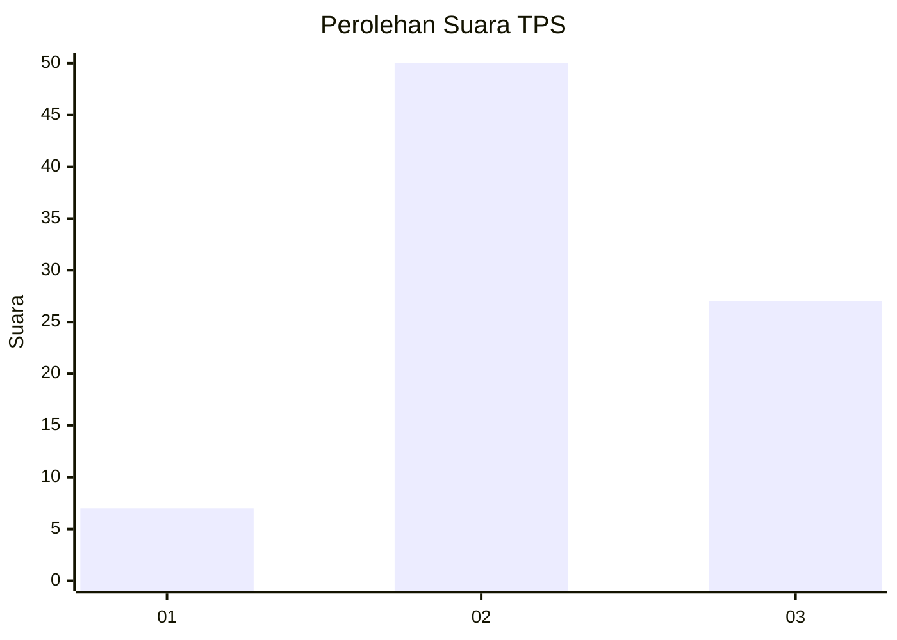
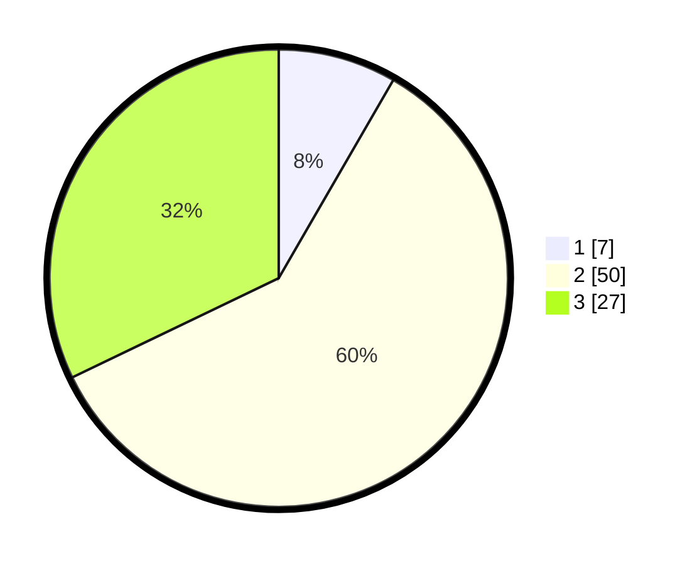

# Hasil

## Grafik

## Tabel

| No. | Nama Paslon    | Suara | Suara (raw) | Persentase |
|:--- |:-------------- | -----:| -----------:| ----------:|
| 1   | ANIES MUHAIMIN | 7     | [7][p-1]    | 8,33       |
| 2   | PRABOWO GIBRAN | 50    | [50][p-2]   | 59,52      |
| 3   | GANJAR MAHFUD  | 27    | [27][p-3]   | 32,14      |

[p-1]: https://github.com/gigit-pemilu/pemilu-2024/blob/main/pilpres/hitung-suara/sub/12-sumatera-utara/sub/01-tapanuli-tengah/sub/06-kolang/sub/2005-satahi-nauli/sub/007-tps/sub/paslon-1.txt
[p-2]: https://github.com/gigit-pemilu/pemilu-2024/blob/main/pilpres/hitung-suara/sub/12-sumatera-utara/sub/01-tapanuli-tengah/sub/06-kolang/sub/2005-satahi-nauli/sub/007-tps/sub/paslon-2.txt
[p-3]: https://github.com/gigit-pemilu/pemilu-2024/blob/main/pilpres/hitung-suara/sub/12-sumatera-utara/sub/01-tapanuli-tengah/sub/06-kolang/sub/2005-satahi-nauli/sub/007-tps/sub/paslon-3.txt

## Foto C Plano

https://sirekap-obj-formc.kpu.go.id/171c/pemilu/ppwp/12/01/06/20/05/1201062005007-20240215-025147--e3be3401-42ad-4a2f-8355-bcd006d3b5fd.jpg

https://sirekap-obj-formc.kpu.go.id/171c/pemilu/ppwp/12/01/06/20/05/1201062005007-20240215-024844--74115ff3-ff48-47a3-895f-db9a02e0abd0.jpg

https://sirekap-obj-formc.kpu.go.id/171c/pemilu/ppwp/12/01/06/20/05/1201062005007-20240215-025317--dfeacdef-6a69-4f43-91f2-1cfa5d8d6cab.jpg

## Metadata

| Key        | Value               |
| ---------- | ------------------- |
| Time Stamp | 2024-02-17 12:00:00 |

