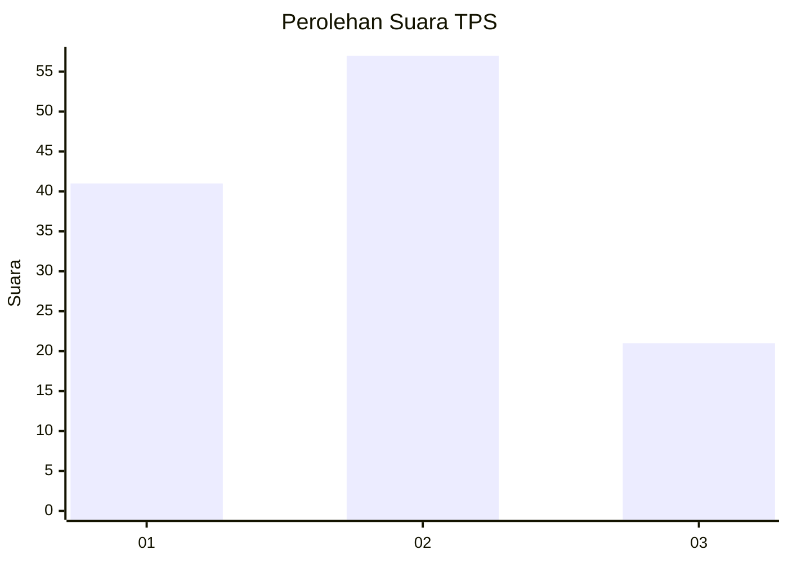
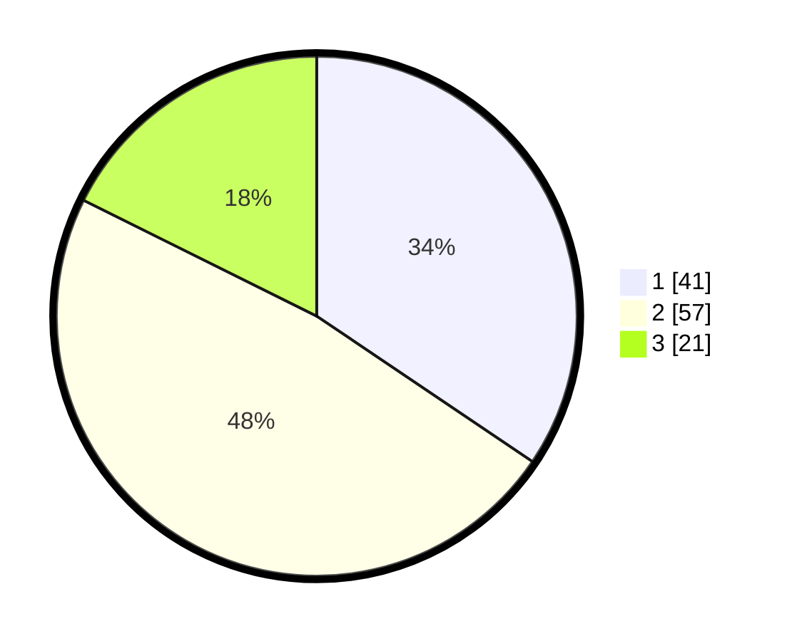

# Hasil

## Grafik

## Tabel

| No. | Nama Paslon    | Suara | Suara (raw) | Persentase |
|:--- |:-------------- | -----:| -----------:| ----------:|
| 1   | ANIES MUHAIMIN | 41    | [41][p-1]   | 34,45      |
| 2   | PRABOWO GIBRAN | 57    | [57][p-2]   | 47,90      |
| 3   | GANJAR MAHFUD  | 21    | [21][p-3]   | 17,65      |

[p-1]: https://github.com/gigit-pemilu/pemilu-2024/blob/main/pilpres/hitung-suara/sub/12-sumatera-utara/sub/01-tapanuli-tengah/sub/06-kolang/sub/2014-pargaringan/sub/002-tps/sub/paslon-1.txt
[p-2]: https://github.com/gigit-pemilu/pemilu-2024/blob/main/pilpres/hitung-suara/sub/12-sumatera-utara/sub/01-tapanuli-tengah/sub/06-kolang/sub/2014-pargaringan/sub/002-tps/sub/paslon-2.txt
[p-3]: https://github.com/gigit-pemilu/pemilu-2024/blob/main/pilpres/hitung-suara/sub/12-sumatera-utara/sub/01-tapanuli-tengah/sub/06-kolang/sub/2014-pargaringan/sub/002-tps/sub/paslon-3.txt

## Foto C Plano

https://sirekap-obj-formc.kpu.go.id/fb76/pemilu/ppwp/12/01/06/20/14/1201062014002-20240215-011003--5b76128c-f0fc-4e49-b493-8a0b28863672.jpg

https://sirekap-obj-formc.kpu.go.id/fb76/pemilu/ppwp/12/01/06/20/14/1201062014002-20240215-011057--3ee50961-7c62-4d91-b3bc-a117edfd7072.jpg

https://sirekap-obj-formc.kpu.go.id/fb76/pemilu/ppwp/12/01/06/20/14/1201062014002-20240215-011157--c09c5d2c-d2f7-4ba7-907f-9e6044b54018.jpg

## Metadata

| Key        | Value               |
| ---------- | ------------------- |
| Time Stamp | 2024-02-17 11:30:03 |

