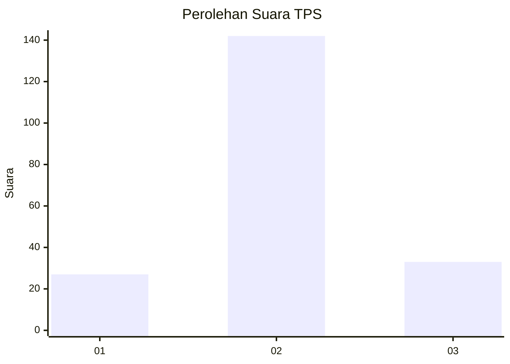
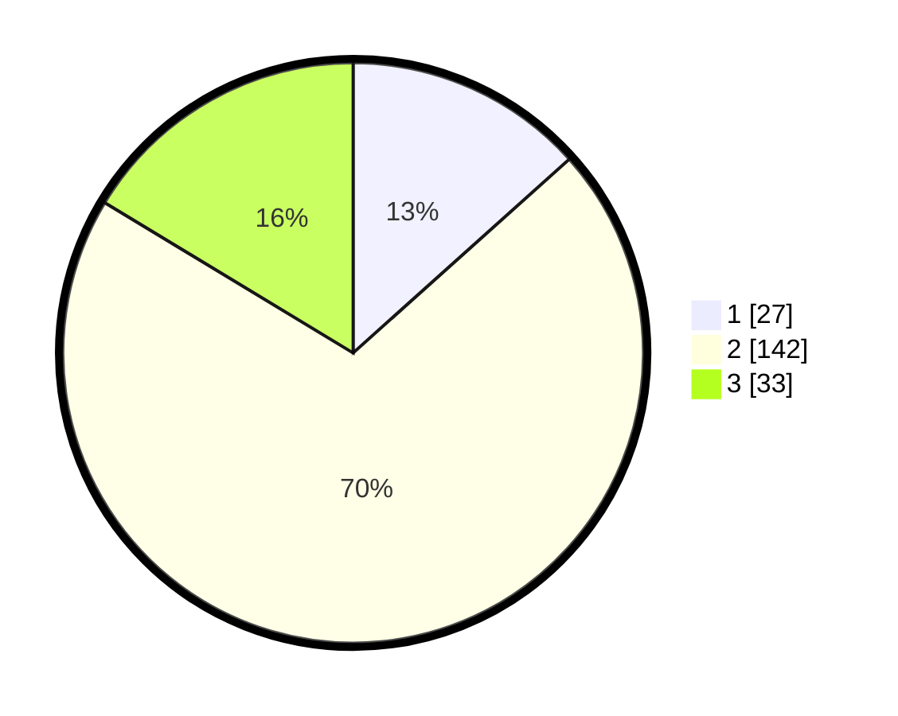

# Hasil

## Grafik

## Tabel

| No. | Nama Paslon    | Suara | Suara (raw) | Persentase |
|:--- |:-------------- | -----:| -----------:| ----------:|
| 1   | ANIES MUHAIMIN | 27    | [27][p-1]   | 13,37      |
| 2   | PRABOWO GIBRAN | 142   | [142][p-2]  | 70,30      |
| 3   | GANJAR MAHFUD  | 33    | [33][p-3]   | 16,34      |

[p-1]: https://github.com/gigit-pemilu/pemilu-2024/blob/main/pilpres/hitung-suara/sub/12-sumatera-utara/sub/01-tapanuli-tengah/sub/07-tapian-nauli/sub/1001-tapian-nauli-ii/sub/004-tps/sub/paslon-1.txt
[p-2]: https://github.com/gigit-pemilu/pemilu-2024/blob/main/pilpres/hitung-suara/sub/12-sumatera-utara/sub/01-tapanuli-tengah/sub/07-tapian-nauli/sub/1001-tapian-nauli-ii/sub/004-tps/sub/paslon-2.txt
[p-3]: https://github.com/gigit-pemilu/pemilu-2024/blob/main/pilpres/hitung-suara/sub/12-sumatera-utara/sub/01-tapanuli-tengah/sub/07-tapian-nauli/sub/1001-tapian-nauli-ii/sub/004-tps/sub/paslon-3.txt

## Foto C Plano

https://sirekap-obj-formc.kpu.go.id/6778/pemilu/ppwp/12/01/07/10/01/1201071001004-20240215-000513--1cc2f615-bdee-49d9-9fac-8187d10df7ca.jpg

https://sirekap-obj-formc.kpu.go.id/6778/pemilu/ppwp/12/01/07/10/01/1201071001004-20240215-000611--3a3b921c-06c6-4c7f-a23e-c68f5121294a.jpg

https://sirekap-obj-formc.kpu.go.id/6778/pemilu/ppwp/12/01/07/10/01/1201071001004-20240215-000656--a6c39b06-0f0b-4a8f-a64c-f5420a5029c8.jpg

## Metadata

| Key        | Value               |
| ---------- | ------------------- |
| Time Stamp | 2024-02-16 12:51:22 |

