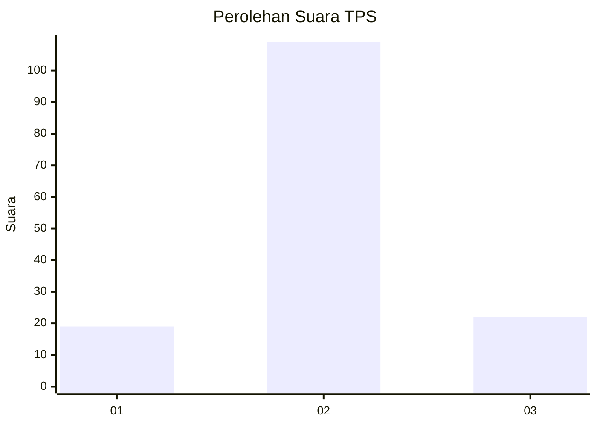
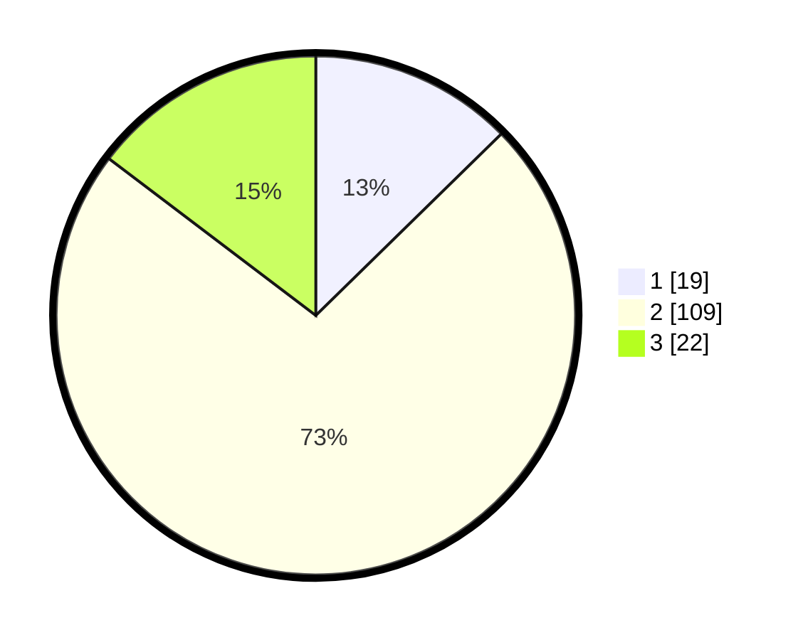

# Hasil

## Grafik

## Tabel

| No. | Nama Paslon    | Suara | Suara (raw) | Persentase |
|:--- |:-------------- | -----:| -----------:| ----------:|
| 1   | ANIES MUHAIMIN | 19    | [19][p-1]   | 12,67      |
| 2   | PRABOWO GIBRAN | 109   | [109][p-2]  | 72,67      |
| 3   | GANJAR MAHFUD  | 22    | [22][p-3]   | 14,67      |

[p-1]: https://github.com/gigit-pemilu/pemilu-2024/blob/main/pilpres/hitung-suara/sub/12-sumatera-utara/sub/01-tapanuli-tengah/sub/07-tapian-nauli/sub/1001-tapian-nauli-ii/sub/006-tps/sub/paslon-1.txt
[p-2]: https://github.com/gigit-pemilu/pemilu-2024/blob/main/pilpres/hitung-suara/sub/12-sumatera-utara/sub/01-tapanuli-tengah/sub/07-tapian-nauli/sub/1001-tapian-nauli-ii/sub/006-tps/sub/paslon-2.txt
[p-3]: https://github.com/gigit-pemilu/pemilu-2024/blob/main/pilpres/hitung-suara/sub/12-sumatera-utara/sub/01-tapanuli-tengah/sub/07-tapian-nauli/sub/1001-tapian-nauli-ii/sub/006-tps/sub/paslon-3.txt

## Foto C Plano

https://sirekap-obj-formc.kpu.go.id/456b/pemilu/ppwp/12/01/07/10/01/1201071001006-20240214-220624--758eadc7-0671-4271-b582-603d5356bbbf.jpg

https://sirekap-obj-formc.kpu.go.id/456b/pemilu/ppwp/12/01/07/10/01/1201071001006-20240214-221213--16fdc942-8058-48f7-8ffa-319e7f1963d0.jpg

https://sirekap-obj-formc.kpu.go.id/456b/pemilu/ppwp/12/01/07/10/01/1201071001006-20240214-222954--4f714b80-7dfc-4670-8e73-a340316bd87d.jpg

## Metadata

| Key        | Value               |
| ---------- | ------------------- |
| Time Stamp | 2024-02-16 01:00:27 |

