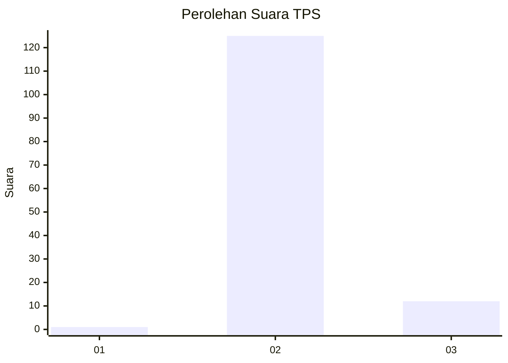
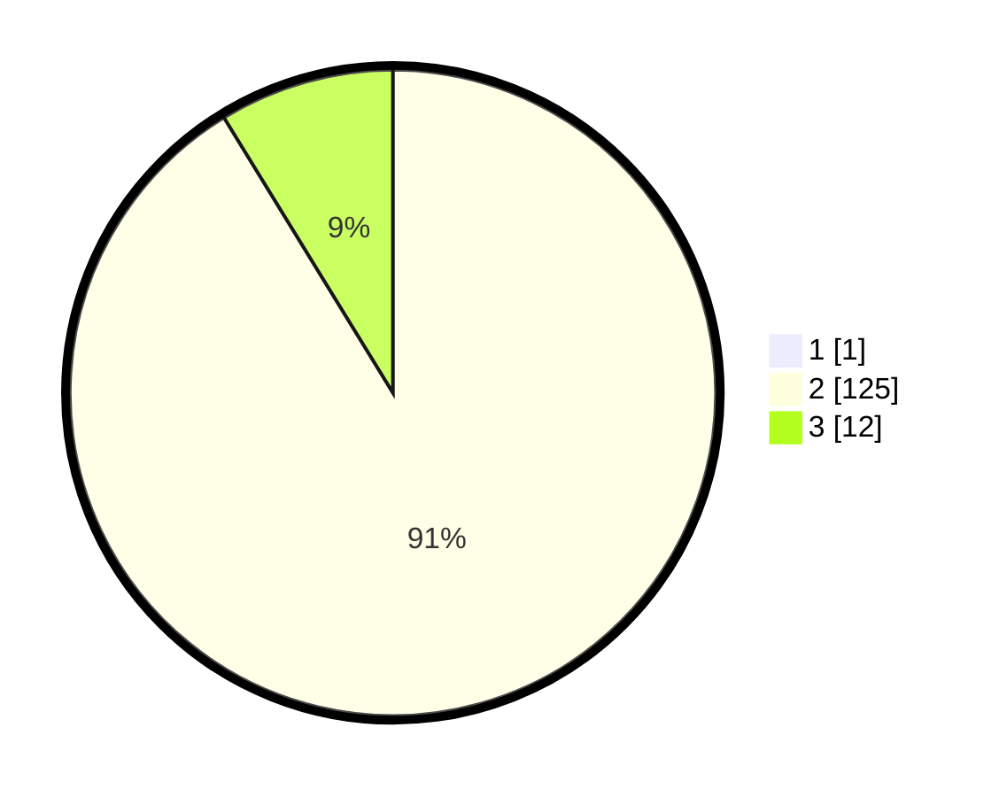

# Hasil

## Grafik

## Tabel

| No. | Nama Paslon    | Suara | Suara (raw) | Persentase |
|:--- |:-------------- | -----:| -----------:| ----------:|
| 1   | ANIES MUHAIMIN | 1     | [1][p-1]    | 0,72       |
| 2   | PRABOWO GIBRAN | 125   | [125][p-2]  | 90,58      |
| 3   | GANJAR MAHFUD  | 12    | [12][p-3]   | 8,70       |

[p-1]: https://github.com/gigit-pemilu/pemilu-2024-12-sumatera-utara/blob/main/pilpres/hitung-suara/sub/12-sumatera-utara/sub/01-tapanuli-tengah/sub/07-tapian-nauli/sub/2005-aloban-bair/sub/002-tps/sub/paslon-1.txt
[p-2]: https://github.com/gigit-pemilu/pemilu-2024-12-sumatera-utara/blob/main/pilpres/hitung-suara/sub/12-sumatera-utara/sub/01-tapanuli-tengah/sub/07-tapian-nauli/sub/2005-aloban-bair/sub/002-tps/sub/paslon-2.txt
[p-3]: https://github.com/gigit-pemilu/pemilu-2024-12-sumatera-utara/blob/main/pilpres/hitung-suara/sub/12-sumatera-utara/sub/01-tapanuli-tengah/sub/07-tapian-nauli/sub/2005-aloban-bair/sub/002-tps/sub/paslon-3.txt

## Foto C Plano

https://sirekap-obj-formc.kpu.go.id/9b09/pemilu/ppwp/12/01/07/20/05/1201072005002-20240215-142601--c5d16fbd-1f07-4795-84f9-2fecf292b663.jpg

https://sirekap-obj-formc.kpu.go.id/9b09/pemilu/ppwp/12/01/07/20/05/1201072005002-20240215-141742--3da57d91-1ed4-4d0c-b6f1-89c79f7febd5.jpg

https://sirekap-obj-formc.kpu.go.id/9b09/pemilu/ppwp/12/01/07/20/05/1201072005002-20240215-142952--cbaae4d1-4be6-4416-b52b-b4a12ea8c767.jpg

## Metadata

| Key        | Value               |
| ---------- | ------------------- |
| Time Stamp | 2024-02-16 01:00:27 |

