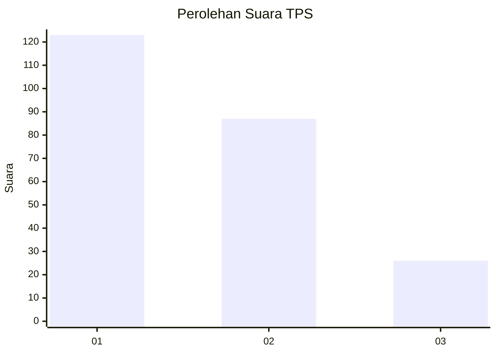
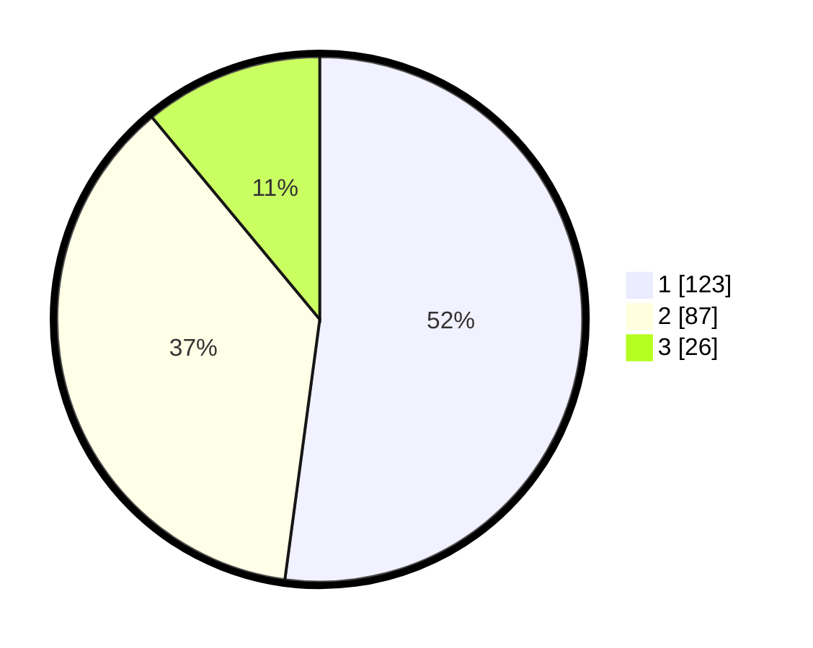

# Hasil

## Grafik

## Tabel

| No. | Nama Paslon    | Suara | Suara (raw) | Persentase |
|:--- |:-------------- | -----:| -----------:| ----------:|
| 1   | ANIES MUHAIMIN | 123   | [123][p-1]  | 52,12      |
| 2   | PRABOWO GIBRAN | 87    | [87][p-2]   | 36,86      |
| 3   | GANJAR MAHFUD  | 26    | [26][p-3]   | 11,02      |

[p-1]: https://github.com/gigit-pemilu/pemilu-2024/blob/main/pilpres/hitung-suara/sub/12-sumatera-utara/sub/01-tapanuli-tengah/sub/08-sibabangun/sub/2010-simanosor/sub/003-tps/sub/paslon-1.txt
[p-2]: https://github.com/gigit-pemilu/pemilu-2024/blob/main/pilpres/hitung-suara/sub/12-sumatera-utara/sub/01-tapanuli-tengah/sub/08-sibabangun/sub/2010-simanosor/sub/003-tps/sub/paslon-2.txt
[p-3]: https://github.com/gigit-pemilu/pemilu-2024/blob/main/pilpres/hitung-suara/sub/12-sumatera-utara/sub/01-tapanuli-tengah/sub/08-sibabangun/sub/2010-simanosor/sub/003-tps/sub/paslon-3.txt

## Foto C Plano

https://sirekap-obj-formc.kpu.go.id/8edd/pemilu/ppwp/12/01/08/20/10/1201082010003-20240215-003500--0a4e6a93-c5a1-401d-aa2f-dab8dbc3a812.jpg

https://sirekap-obj-formc.kpu.go.id/8edd/pemilu/ppwp/12/01/08/20/10/1201082010003-20240215-003622--e37b5cf8-b610-4777-938d-5f1f91a2ede0.jpg

https://sirekap-obj-formc.kpu.go.id/8edd/pemilu/ppwp/12/01/08/20/10/1201082010003-20240215-003726--730fceae-36f4-49fb-a535-450367c1781a.jpg

## Metadata

| Key        | Value               |
| ---------- | ------------------- |
| Time Stamp | 2024-02-17 11:30:03 |

