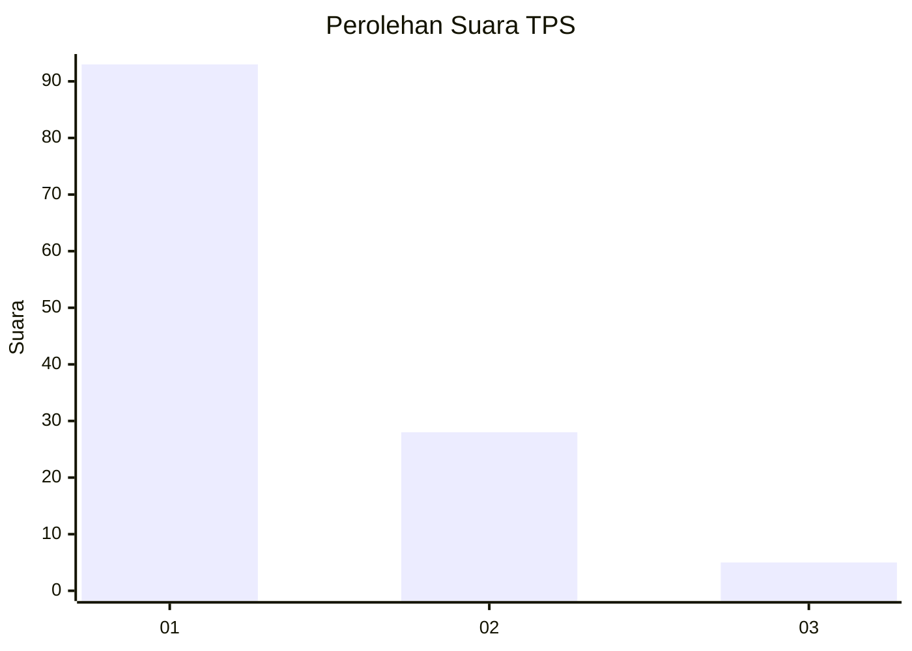
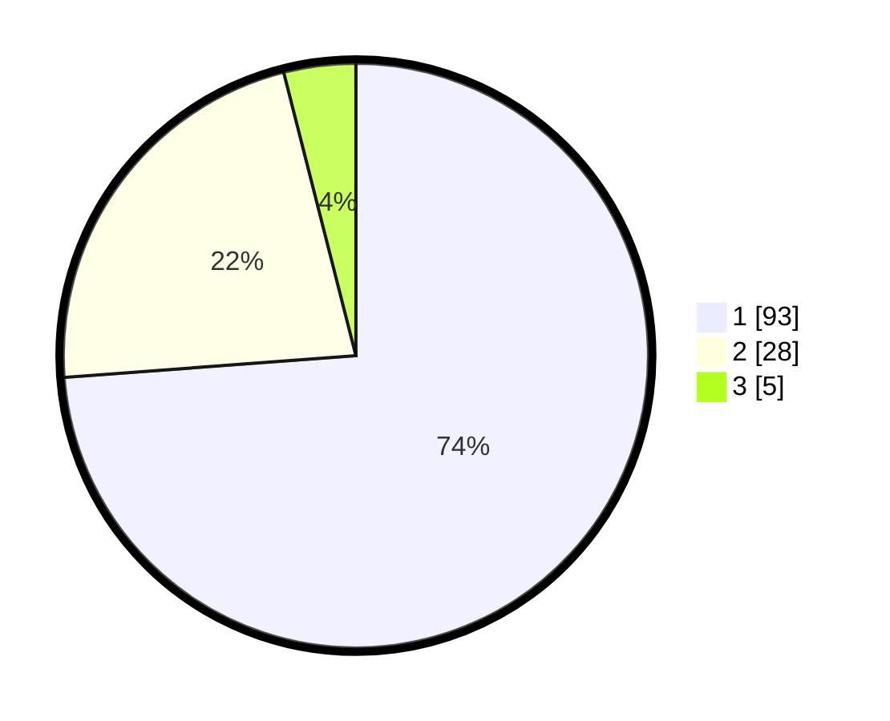

# Hasil

## Grafik

## Tabel

| No. | Nama Paslon    | Suara | Suara (raw) | Persentase |
|:--- |:-------------- | -----:| -----------:| ----------:|
| 1   | ANIES MUHAIMIN | 93    | [93][p-1]   | 73,81      |
| 2   | PRABOWO GIBRAN | 28    | [28][p-2]   | 22,22      |
| 3   | GANJAR MAHFUD  | 5     | [5][p-3]    | 3,97       |

[p-1]: https://github.com/gigit-pemilu/pemilu-2024-12-sumatera-utara/blob/main/pilpres/hitung-suara/sub/12-sumatera-utara/sub/01-tapanuli-tengah/sub/10-sorkam-barat/sub/1019-binasi/sub/003-tps/sub/paslon-1.txt
[p-2]: https://github.com/gigit-pemilu/pemilu-2024-12-sumatera-utara/blob/main/pilpres/hitung-suara/sub/12-sumatera-utara/sub/01-tapanuli-tengah/sub/10-sorkam-barat/sub/1019-binasi/sub/003-tps/sub/paslon-2.txt
[p-3]: https://github.com/gigit-pemilu/pemilu-2024-12-sumatera-utara/blob/main/pilpres/hitung-suara/sub/12-sumatera-utara/sub/01-tapanuli-tengah/sub/10-sorkam-barat/sub/1019-binasi/sub/003-tps/sub/paslon-3.txt

## Foto C Plano

https://sirekap-obj-formc.kpu.go.id/c66e/pemilu/ppwp/12/01/10/10/19/1201101019003-20240215-003535--212d07f2-1079-4ac8-a69e-dffca24bea31.jpg

https://sirekap-obj-formc.kpu.go.id/c66e/pemilu/ppwp/12/01/10/10/19/1201101019003-20240217-182822--784b89c0-72be-49b4-bf21-757720cb3582.jpg

https://sirekap-obj-formc.kpu.go.id/c66e/pemilu/ppwp/12/01/10/10/19/1201101019003-20240217-183154--a1bc3874-2462-46d4-8acd-d835ba027537.jpg

## Metadata

| Key        | Value               |
| ---------- | ------------------- |
| Time Stamp | 2024-02-17 19:00:04 |

