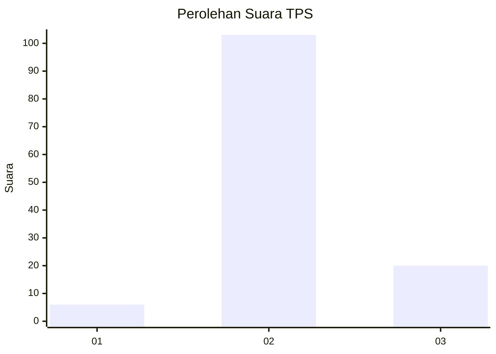
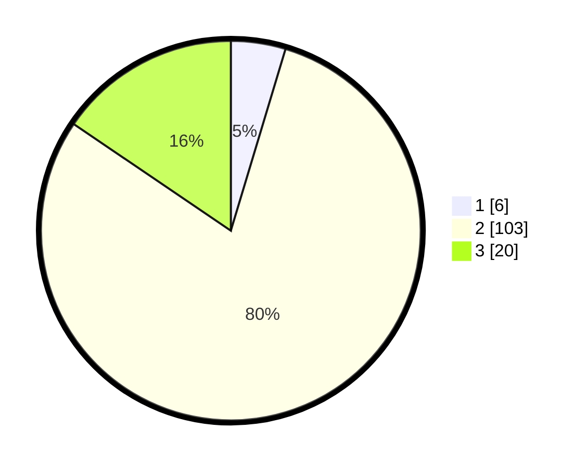

# Hasil

## Grafik

## Tabel

| No. | Nama Paslon    | Suara | Suara (raw) | Persentase |
|:--- |:-------------- | -----:| -----------:| ----------:|
| 1   | ANIES MUHAIMIN | 6     | [6][p-1]    | 4,65       |
| 2   | PRABOWO GIBRAN | 103   | [103][p-2]  | 79,84      |
| 3   | GANJAR MAHFUD  | 20    | [20][p-3]   | 15,50      |

[p-1]: https://github.com/gigit-pemilu/pemilu-2024/blob/main/pilpres/hitung-suara/sub/12-sumatera-utara/sub/01-tapanuli-tengah/sub/10-sorkam-barat/sub/2002-sipea-pea/sub/004-tps/sub/paslon-1.txt
[p-2]: https://github.com/gigit-pemilu/pemilu-2024/blob/main/pilpres/hitung-suara/sub/12-sumatera-utara/sub/01-tapanuli-tengah/sub/10-sorkam-barat/sub/2002-sipea-pea/sub/004-tps/sub/paslon-2.txt
[p-3]: https://github.com/gigit-pemilu/pemilu-2024/blob/main/pilpres/hitung-suara/sub/12-sumatera-utara/sub/01-tapanuli-tengah/sub/10-sorkam-barat/sub/2002-sipea-pea/sub/004-tps/sub/paslon-3.txt

## Foto C Plano

https://sirekap-obj-formc.kpu.go.id/48b2/pemilu/ppwp/12/01/10/20/02/1201102002004-20240215-052838--a10103eb-9469-4d6e-9c11-f78df9a23064.jpg

https://sirekap-obj-formc.kpu.go.id/48b2/pemilu/ppwp/12/01/10/20/02/1201102002004-20240215-052948--8f177e7c-afb6-4470-8b09-d105a146aff2.jpg

https://sirekap-obj-formc.kpu.go.id/48b2/pemilu/ppwp/12/01/10/20/02/1201102002004-20240215-053023--d9d07760-fc5b-4a33-9cba-79ecb0efedf9.jpg

## Metadata

| Key        | Value               |
| ---------- | ------------------- |
| Time Stamp | 2024-02-16 01:00:27 |

