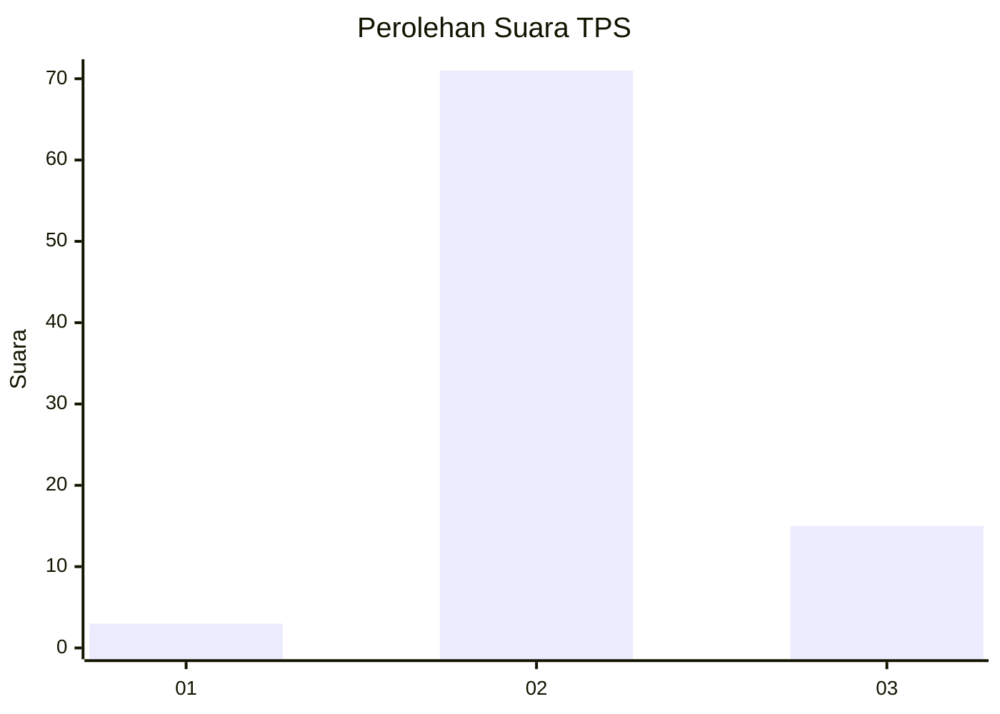
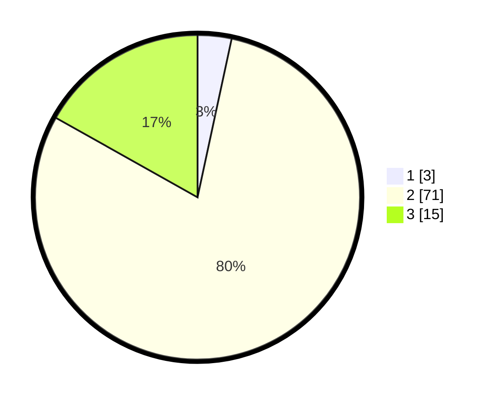

# Hasil

## Grafik

## Tabel

| No. | Nama Paslon    | Suara | Suara (raw) | Persentase |
|:--- |:-------------- | -----:| -----------:| ----------:|
| 1   | ANIES MUHAIMIN | 3     | [3][p-1]    | 3,37       |
| 2   | PRABOWO GIBRAN | 71    | [71][p-2]   | 79,78      |
| 3   | GANJAR MAHFUD  | 15    | [15][p-3]   | 16,85      |

[p-1]: https://github.com/gigit-pemilu/pemilu-2024-12-sumatera-utara/blob/main/pilpres/hitung-suara/sub/12-sumatera-utara/sub/01-tapanuli-tengah/sub/10-sorkam-barat/sub/2014-maduma/sub/002-tps/sub/paslon-1.txt
[p-2]: https://github.com/gigit-pemilu/pemilu-2024-12-sumatera-utara/blob/main/pilpres/hitung-suara/sub/12-sumatera-utara/sub/01-tapanuli-tengah/sub/10-sorkam-barat/sub/2014-maduma/sub/002-tps/sub/paslon-2.txt
[p-3]: https://github.com/gigit-pemilu/pemilu-2024-12-sumatera-utara/blob/main/pilpres/hitung-suara/sub/12-sumatera-utara/sub/01-tapanuli-tengah/sub/10-sorkam-barat/sub/2014-maduma/sub/002-tps/sub/paslon-3.txt

## Foto C Plano

https://sirekap-obj-formc.kpu.go.id/69eb/pemilu/ppwp/12/01/10/20/14/1201102014002-20240215-025706--70b7de5d-4813-484a-bc4d-3bb2ee57b48b.jpg

https://sirekap-obj-formc.kpu.go.id/69eb/pemilu/ppwp/12/01/10/20/14/1201102014002-20240215-025849--4f6cbe28-86e2-4521-bb43-98a3769bfe76.jpg

https://sirekap-obj-formc.kpu.go.id/69eb/pemilu/ppwp/12/01/10/20/14/1201102014002-20240215-030020--de35bf6e-c297-426d-b1eb-948eb63c2d27.jpg

## Metadata

| Key        | Value               |
| ---------- | ------------------- |
| Time Stamp | 2024-02-15 21:01:18 |

## DATA PEMILIH TETAP

Jumlah pemilih dalam DPT: **821**.
 * L: **70**.
 * P: **780**.

## DATA PENGGUNA HAK PILIH

Jumlah pengguna hak pilih dalam DPT: **82**.
 * L: **40**.
 * P: **47**.

Jumlah pengguna hak pilih dalam DPTb: **700**.
 * L: **272**.
 * P: **777**.

Jumlah pengguna hak pilih dalam DPK: **2**.
 * L: **2**.
 * P: **0**.

Jumlah pengguna hak pilih: **89**.
 * L: **42**.
 * P: **47**.

## JUMLAH SUARA SAH DAN TIDAK SAH

JUMLAH SELURUH SUARA SAH: **89**.

JUMLAH SUARA TIDAK SAH: **0**.

JUMLAH SELURUH SUARA SAH DAN SUARA TIDAK SAH: **89**.

