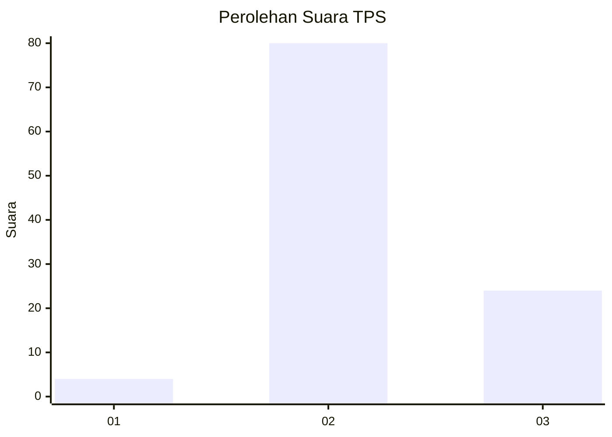
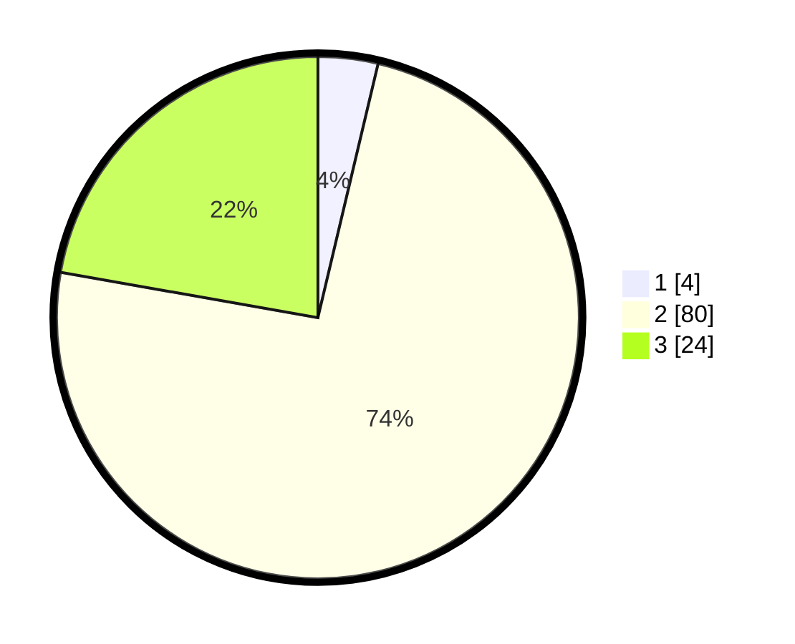

# Hasil

## Grafik

## Tabel

| No. | Nama Paslon    | Suara | Suara (raw) | Persentase |
|:--- |:-------------- | -----:| -----------:| ----------:|
| 1   | ANIES MUHAIMIN | 4     | [4][p-1]    | 3,70       |
| 2   | PRABOWO GIBRAN | 80    | [80][p-2]   | 74,07      |
| 3   | GANJAR MAHFUD  | 24    | [24][p-3]   | 22,22      |

[p-1]: https://github.com/gigit-pemilu/pemilu-2024-12-sumatera-utara/blob/main/pilpres/hitung-suara/sub/12-sumatera-utara/sub/01-tapanuli-tengah/sub/11-sirandorung/sub/1001-bajamas/sub/002-tps/sub/paslon-1.txt
[p-2]: https://github.com/gigit-pemilu/pemilu-2024-12-sumatera-utara/blob/main/pilpres/hitung-suara/sub/12-sumatera-utara/sub/01-tapanuli-tengah/sub/11-sirandorung/sub/1001-bajamas/sub/002-tps/sub/paslon-2.txt
[p-3]: https://github.com/gigit-pemilu/pemilu-2024-12-sumatera-utara/blob/main/pilpres/hitung-suara/sub/12-sumatera-utara/sub/01-tapanuli-tengah/sub/11-sirandorung/sub/1001-bajamas/sub/002-tps/sub/paslon-3.txt

## Foto C Plano

https://sirekap-obj-formc.kpu.go.id/b8ac/pemilu/ppwp/12/01/11/10/01/1201111001002-20240220-210635--4b16d3da-a5d7-4698-b753-bb3bb779ccf4.jpg

https://sirekap-obj-formc.kpu.go.id/b8ac/pemilu/ppwp/12/01/11/10/01/1201111001002-20240220-212852--a76a54c8-0f49-4f4b-b950-7c9c8db7dcb7.jpg

https://sirekap-obj-formc.kpu.go.id/b8ac/pemilu/ppwp/12/01/11/10/01/1201111001002-20240220-213820--ede4fe30-77e6-4dd9-a9a3-a3a468047429.jpg

## Metadata

| Key        | Value               |
| ---------- | ------------------- |
| Time Stamp | 2024-02-21 00:00:00 |

## DATA PEMILIH TETAP

Jumlah pemilih dalam DPT: **153**.
 * L: **63**.
 * P: **90**.

## DATA PENGGUNA HAK PILIH

Jumlah pengguna hak pilih dalam DPT: **86**.
 * L: **36**.
 * P: **50**.

Jumlah pengguna hak pilih dalam DPTb: **0**.
 * L: **0**.
 * P: **0**.

Jumlah pengguna hak pilih dalam DPK: **28**.
 * L: **12**.
 * P: **16**.

Jumlah pengguna hak pilih: **114**.
 * L: **48**.
 * P: **66**.

## JUMLAH SUARA SAH DAN TIDAK SAH

JUMLAH SELURUH SUARA SAH: **108**.

JUMLAH SUARA TIDAK SAH: **6**.

JUMLAH SELURUH SUARA SAH DAN SUARA TIDAK SAH: **114**.

