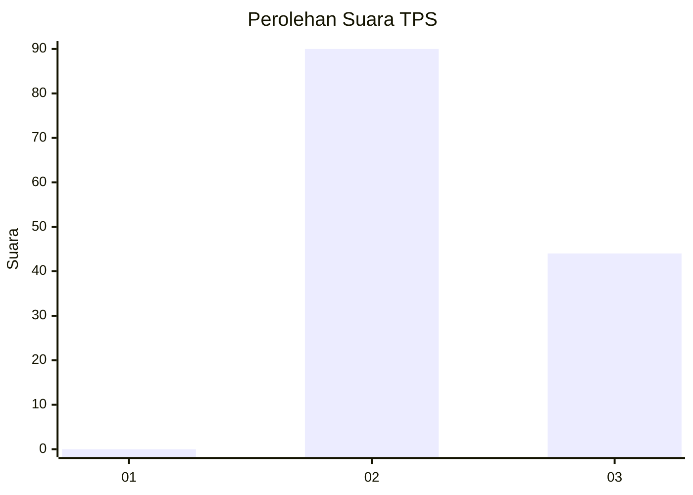
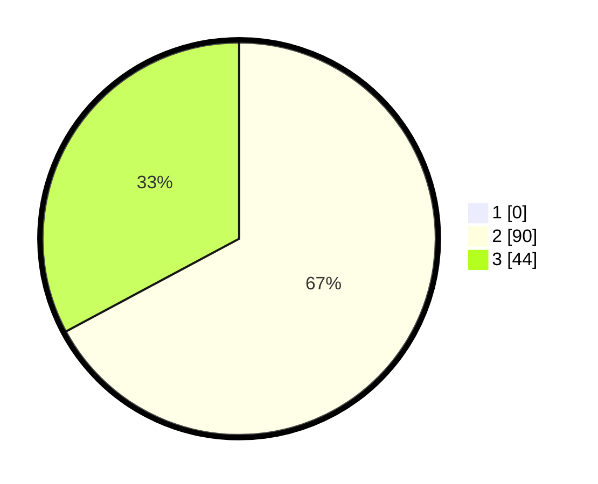

# Hasil

## Grafik

## Tabel

| No. | Nama Paslon    | Suara | Suara (raw) | Persentase |
|:--- |:-------------- | -----:| -----------:| ----------:|
| 1   | ANIES MUHAIMIN | 0     | [0][p-1]    | 0,00       |
| 2   | PRABOWO GIBRAN | 90    | [90][p-2]   | 67,16      |
| 3   | GANJAR MAHFUD  | 44    | [44][p-3]   | 32,84      |

[p-1]: https://github.com/gigit-pemilu/pemilu-2024-12-sumatera-utara/blob/main/pilpres/hitung-suara/sub/12-sumatera-utara/sub/01-tapanuli-tengah/sub/12-andam-dewi/sub/2004-sirami-ramian/sub/002-tps/sub/paslon-1.txt
[p-2]: https://github.com/gigit-pemilu/pemilu-2024-12-sumatera-utara/blob/main/pilpres/hitung-suara/sub/12-sumatera-utara/sub/01-tapanuli-tengah/sub/12-andam-dewi/sub/2004-sirami-ramian/sub/002-tps/sub/paslon-2.txt
[p-3]: https://github.com/gigit-pemilu/pemilu-2024-12-sumatera-utara/blob/main/pilpres/hitung-suara/sub/12-sumatera-utara/sub/01-tapanuli-tengah/sub/12-andam-dewi/sub/2004-sirami-ramian/sub/002-tps/sub/paslon-3.txt

## Foto C Plano

https://sirekap-obj-formc.kpu.go.id/0a25/pemilu/ppwp/12/01/12/20/04/1201122004002-20240214-235543--e65d90f1-84f3-4527-b3b3-b284124b39f4.jpg

https://sirekap-obj-formc.kpu.go.id/0a25/pemilu/ppwp/12/01/12/20/04/1201122004002-20240214-235627--f5d5cd9f-86e1-4e85-8d3c-21a0a69b95cb.jpg

https://sirekap-obj-formc.kpu.go.id/0a25/pemilu/ppwp/12/01/12/20/04/1201122004002-20240214-235722--b22fcfe0-238b-4f1f-b4f7-8cc3b92bf1a7.jpg

## Metadata

| Key        | Value               |
| ---------- | ------------------- |
| Time Stamp | 2024-02-16 00:00:26 |

