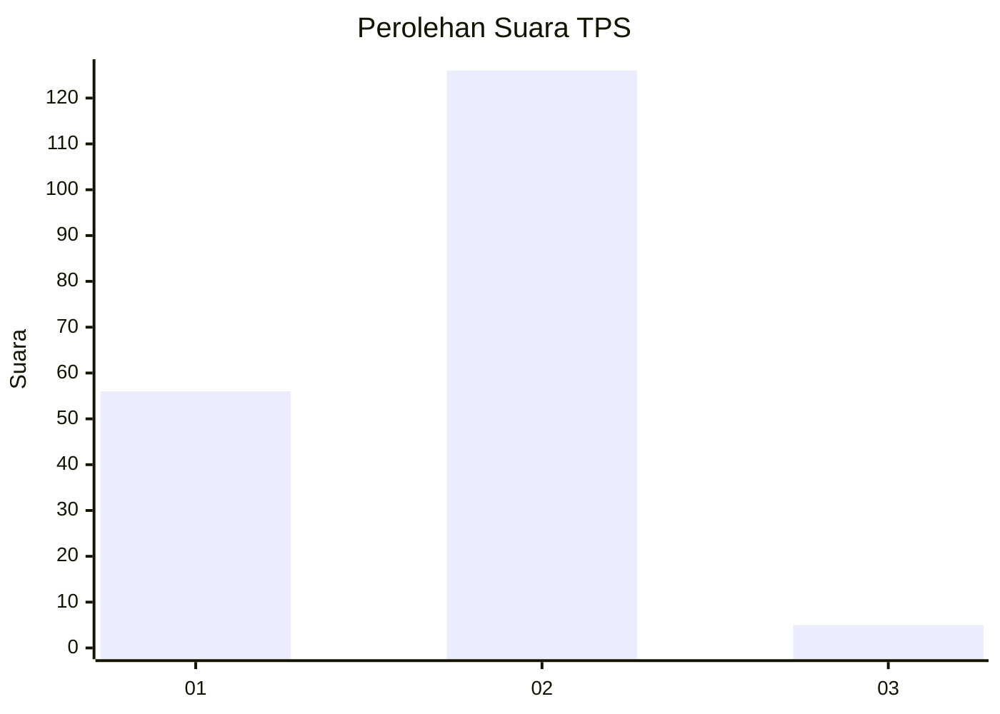
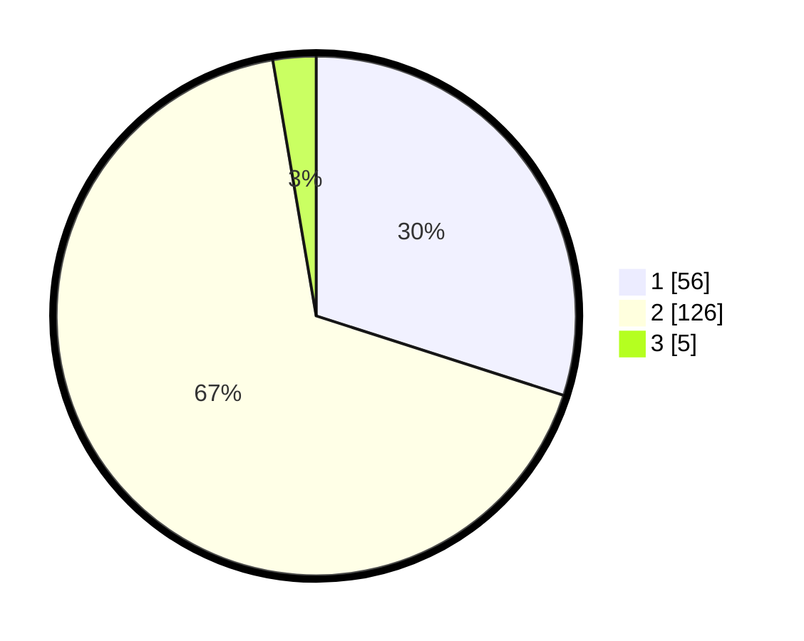

# Hasil

## Grafik

## Tabel

| No. | Nama Paslon    | Suara | Suara (raw) | Persentase |
|:--- |:-------------- | -----:| -----------:| ----------:|
| 1   | ANIES MUHAIMIN | 56    | [56][p-1]   | 29,95      |
| 2   | PRABOWO GIBRAN | 126   | [126][p-2]  | 67,38      |
| 3   | GANJAR MAHFUD  | 5     | [5][p-3]    | 2,67       |

[p-1]: https://github.com/gigit-pemilu/pemilu-2024-12-sumatera-utara/blob/main/pilpres/hitung-suara/sub/12-sumatera-utara/sub/01-tapanuli-tengah/sub/14-tukka/sub/1001-tukka/sub/009-tps/sub/paslon-1.txt
[p-2]: https://github.com/gigit-pemilu/pemilu-2024-12-sumatera-utara/blob/main/pilpres/hitung-suara/sub/12-sumatera-utara/sub/01-tapanuli-tengah/sub/14-tukka/sub/1001-tukka/sub/009-tps/sub/paslon-2.txt
[p-3]: https://github.com/gigit-pemilu/pemilu-2024-12-sumatera-utara/blob/main/pilpres/hitung-suara/sub/12-sumatera-utara/sub/01-tapanuli-tengah/sub/14-tukka/sub/1001-tukka/sub/009-tps/sub/paslon-3.txt

## Foto C Plano

https://sirekap-obj-formc.kpu.go.id/422b/pemilu/ppwp/12/01/14/10/01/1201141001009-20240215-091608--dabddba5-706c-4201-96ef-5586bd91cfbf.jpg

https://sirekap-obj-formc.kpu.go.id/422b/pemilu/ppwp/12/01/14/10/01/1201141001009-20240215-091810--4a66f463-13be-4a3d-99f6-cbffa12c3b75.jpg

https://sirekap-obj-formc.kpu.go.id/422b/pemilu/ppwp/12/01/14/10/01/1201141001009-20240215-092229--e6724724-20eb-414c-8c2c-75f7ff72782d.jpg

## Metadata

| Key        | Value               |
| ---------- | ------------------- |
| Time Stamp | 2024-02-16 00:30:27 |

