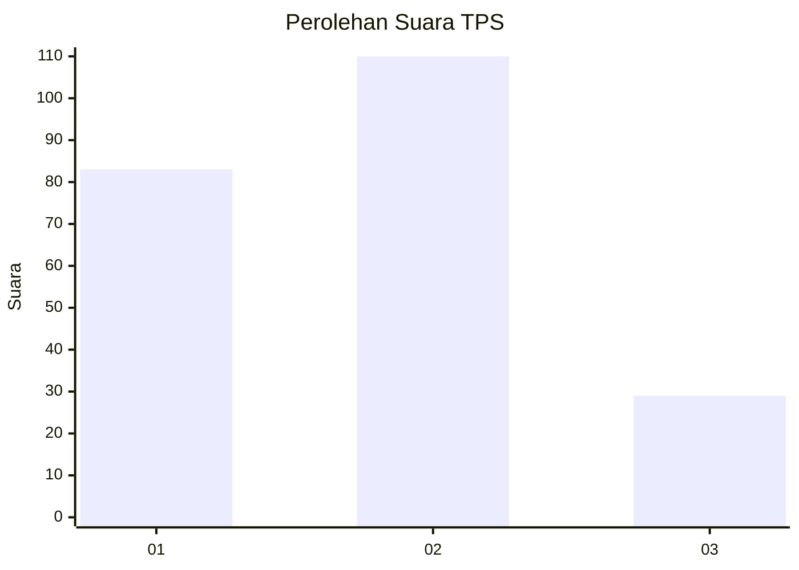
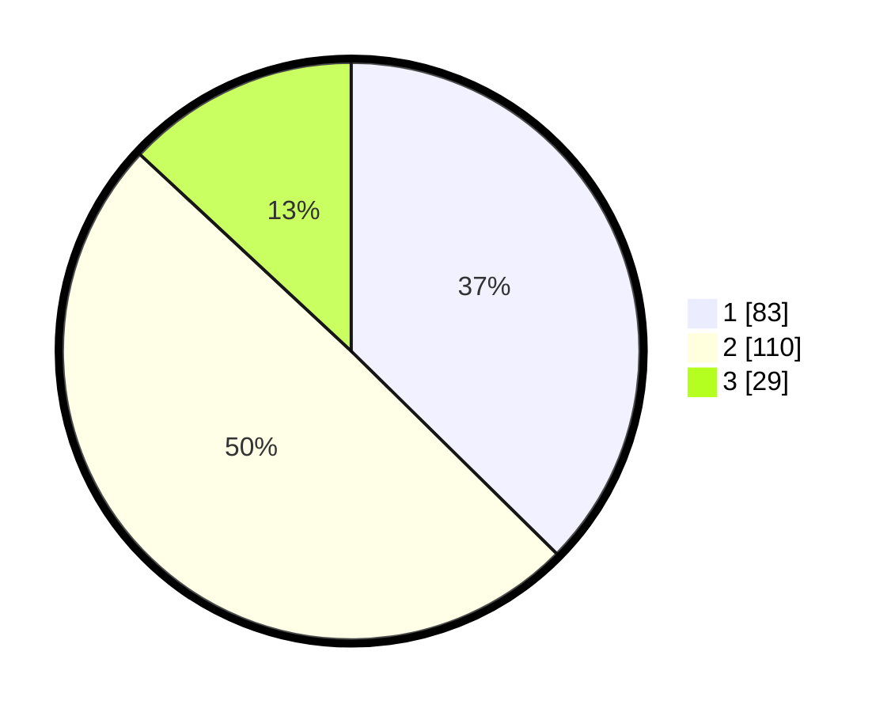

# Hasil

## Grafik

## Tabel

| No. | Nama Paslon    | Suara | Suara (raw) | Persentase |
|:--- |:-------------- | -----:| -----------:| ----------:|
| 1   | ANIES MUHAIMIN | 83    | [83][p-1]   | 37,39      |
| 2   | PRABOWO GIBRAN | 110   | [110][p-2]  | 49,55      |
| 3   | GANJAR MAHFUD  | 29    | [29][p-3]   | 13,06      |

[p-1]: https://github.com/gigit-pemilu/pemilu-2024-12-sumatera-utara/blob/main/pilpres/hitung-suara/sub/12-sumatera-utara/sub/01-tapanuli-tengah/sub/15-badiri/sub/1001-hutabalang/sub/003-tps/sub/paslon-1.txt
[p-2]: https://github.com/gigit-pemilu/pemilu-2024-12-sumatera-utara/blob/main/pilpres/hitung-suara/sub/12-sumatera-utara/sub/01-tapanuli-tengah/sub/15-badiri/sub/1001-hutabalang/sub/003-tps/sub/paslon-2.txt
[p-3]: https://github.com/gigit-pemilu/pemilu-2024-12-sumatera-utara/blob/main/pilpres/hitung-suara/sub/12-sumatera-utara/sub/01-tapanuli-tengah/sub/15-badiri/sub/1001-hutabalang/sub/003-tps/sub/paslon-3.txt

## Foto C Plano

https://sirekap-obj-formc.kpu.go.id/4d90/pemilu/ppwp/12/01/15/10/01/1201151001003-20240214-233233--b6d3440e-9b4e-4cd1-8c8d-ec58e8cb2da9.jpg

https://sirekap-obj-formc.kpu.go.id/4d90/pemilu/ppwp/12/01/15/10/01/1201151001003-20240215-044959--0f99d8d9-5c60-40d0-8695-fe0fa3948da9.jpg

https://sirekap-obj-formc.kpu.go.id/4d90/pemilu/ppwp/12/01/15/10/01/1201151001003-20240216-144720--8d06503e-fe82-43d4-95f8-86087ad484ba.jpg

## Metadata

| Key        | Value               |
| ---------- | ------------------- |
| Time Stamp | 2024-02-16 16:25:10 |

