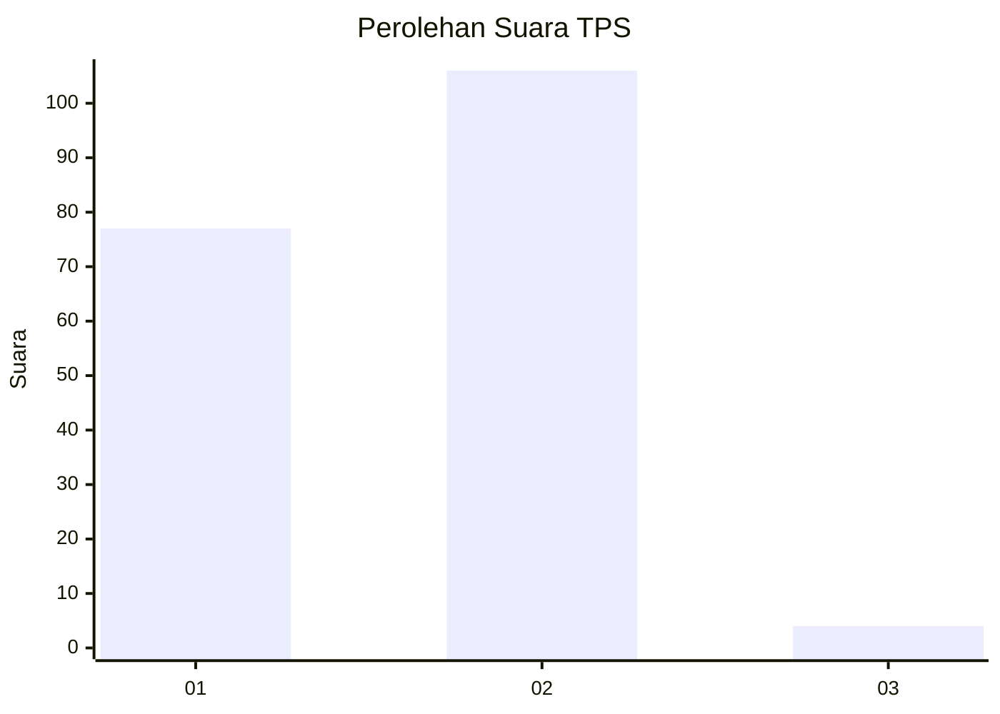
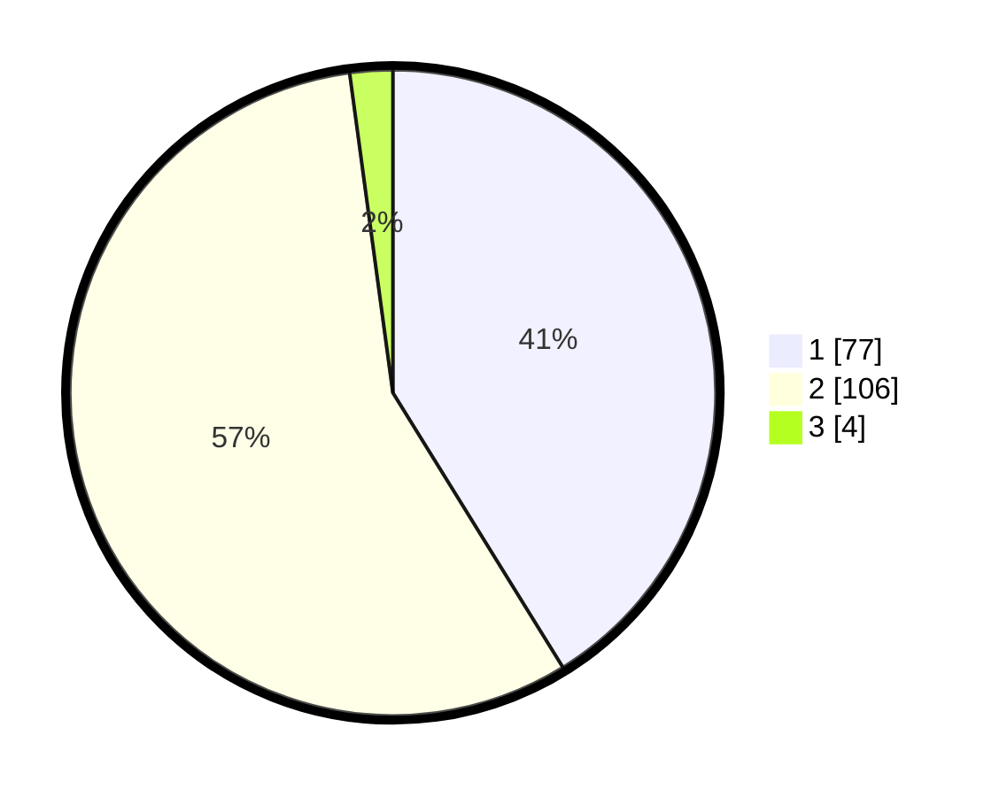

# Hasil

## Grafik

## Tabel

| No. | Nama Paslon    | Suara | Suara (raw) | Persentase |
|:--- |:-------------- | -----:| -----------:| ----------:|
| 1   | ANIES MUHAIMIN | 77    | [77][p-1]   | 41,18      |
| 2   | PRABOWO GIBRAN | 106   | [106][p-2]  | 56,68      |
| 3   | GANJAR MAHFUD  | 4     | [4][p-3]    | 2,14       |

[p-1]: https://github.com/gigit-pemilu/pemilu-2024/blob/main/pilpres/hitung-suara/sub/12-sumatera-utara/sub/01-tapanuli-tengah/sub/15-badiri/sub/1001-hutabalang/sub/004-tps/sub/paslon-1.txt
[p-2]: https://github.com/gigit-pemilu/pemilu-2024/blob/main/pilpres/hitung-suara/sub/12-sumatera-utara/sub/01-tapanuli-tengah/sub/15-badiri/sub/1001-hutabalang/sub/004-tps/sub/paslon-2.txt
[p-3]: https://github.com/gigit-pemilu/pemilu-2024/blob/main/pilpres/hitung-suara/sub/12-sumatera-utara/sub/01-tapanuli-tengah/sub/15-badiri/sub/1001-hutabalang/sub/004-tps/sub/paslon-3.txt

## Foto C Plano

https://sirekap-obj-formc.kpu.go.id/928a/pemilu/ppwp/12/01/15/10/01/1201151001004-20240214-212540--20df2375-b5b0-4b68-9125-f0836316f092.jpg

https://sirekap-obj-formc.kpu.go.id/928a/pemilu/ppwp/12/01/15/10/01/1201151001004-20240214-224505--931ee38f-f9d9-4d54-be02-12e7b89c9c7d.jpg

https://sirekap-obj-formc.kpu.go.id/928a/pemilu/ppwp/12/01/15/10/01/1201151001004-20240215-024947--2d29c8cb-89df-4b69-afe3-cd8ee470f960.jpg

## Metadata

| Key        | Value               |
| ---------- | ------------------- |
| Time Stamp | 2024-02-16 00:00:26 |

