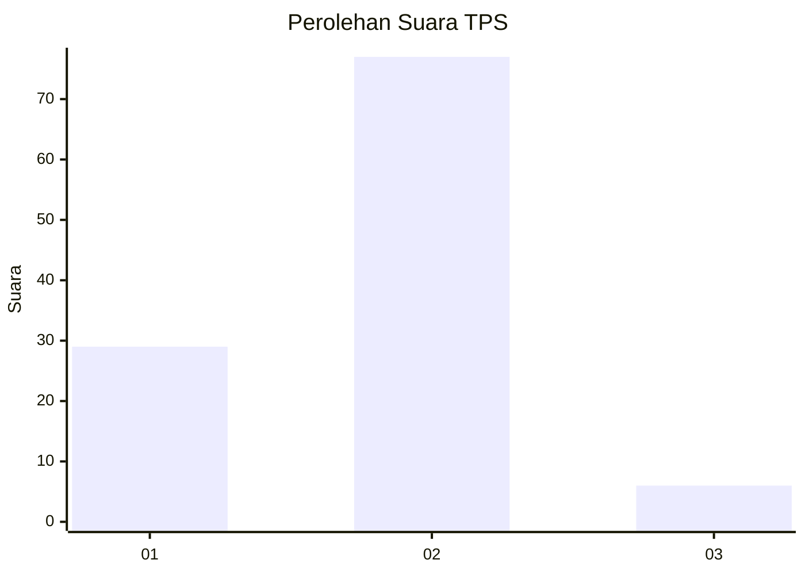
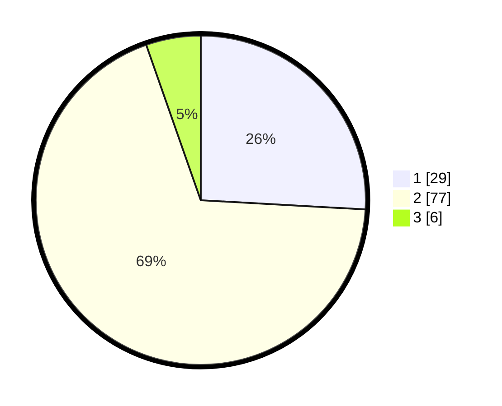

# Hasil

## Grafik

## Tabel

| No. | Nama Paslon    | Suara | Suara (raw) | Persentase |
|:--- |:-------------- | -----:| -----------:| ----------:|
| 1   | ANIES MUHAIMIN | 29    | [29][p-1]   | 25,89      |
| 2   | PRABOWO GIBRAN | 77    | [77][p-2]   | 68,75      |
| 3   | GANJAR MAHFUD  | 6     | [6][p-3]    | 5,36       |

[p-1]: https://github.com/gigit-pemilu/pemilu-2024-12-sumatera-utara/blob/main/pilpres/hitung-suara/sub/12-sumatera-utara/sub/01-tapanuli-tengah/sub/15-badiri/sub/1002-lopian/sub/008-tps/sub/paslon-1.txt
[p-2]: https://github.com/gigit-pemilu/pemilu-2024-12-sumatera-utara/blob/main/pilpres/hitung-suara/sub/12-sumatera-utara/sub/01-tapanuli-tengah/sub/15-badiri/sub/1002-lopian/sub/008-tps/sub/paslon-2.txt
[p-3]: https://github.com/gigit-pemilu/pemilu-2024-12-sumatera-utara/blob/main/pilpres/hitung-suara/sub/12-sumatera-utara/sub/01-tapanuli-tengah/sub/15-badiri/sub/1002-lopian/sub/008-tps/sub/paslon-3.txt

## Foto C Plano

https://sirekap-obj-formc.kpu.go.id/916b/pemilu/ppwp/12/01/15/10/02/1201151002008-20240214-221049--9e9ef210-8ee5-4b6b-b571-0eb18c604341.jpg

https://sirekap-obj-formc.kpu.go.id/916b/pemilu/ppwp/12/01/15/10/02/1201151002008-20240214-221200--4c1d19e6-14ec-4540-91b1-192bfecdf9e2.jpg

https://sirekap-obj-formc.kpu.go.id/916b/pemilu/ppwp/12/01/15/10/02/1201151002008-20240214-221317--791be3cc-e2c3-4dae-a8f7-fb1ee2b49adf.jpg

## Metadata

| Key        | Value               |
| ---------- | ------------------- |
| Time Stamp | 2024-02-15 22:40:13 |

