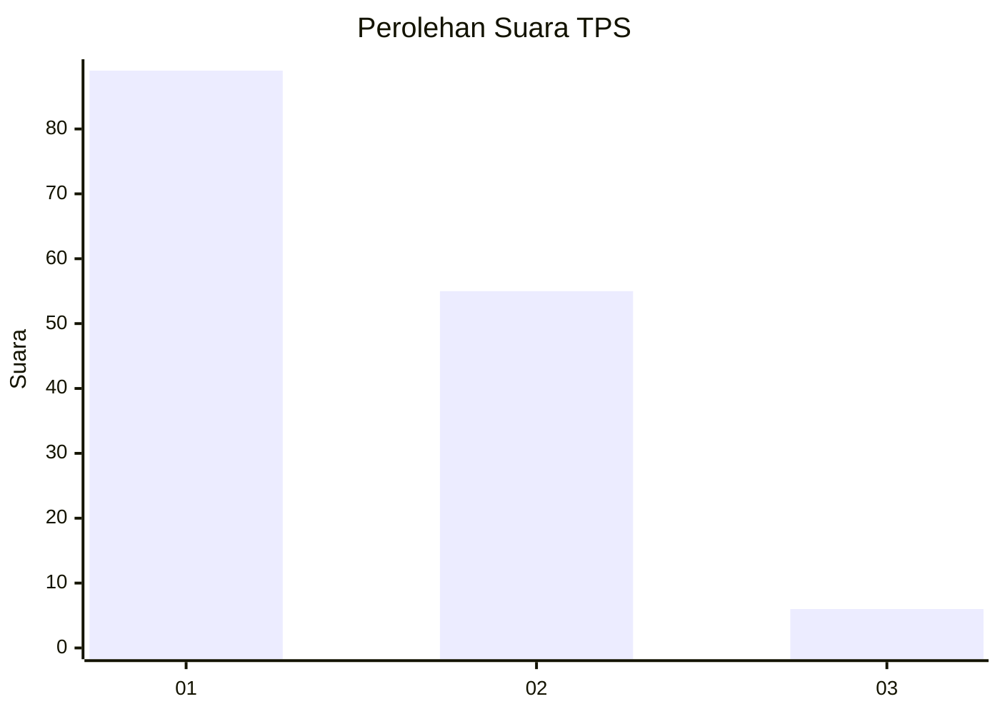
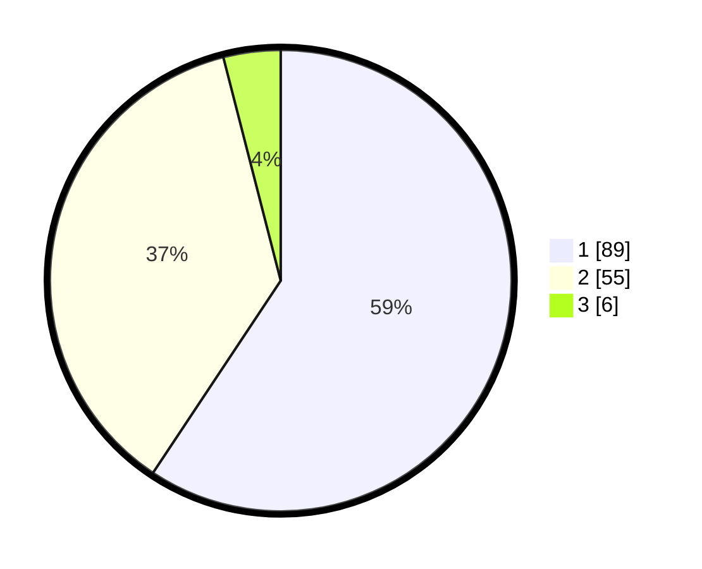

# Hasil

## Grafik

## Tabel

| No. | Nama Paslon    | Suara | Suara (raw) | Persentase |
|:--- |:-------------- | -----:| -----------:| ----------:|
| 1   | ANIES MUHAIMIN | 89    | [89][p-1]   | 59,33      |
| 2   | PRABOWO GIBRAN | 55    | [55][p-2]   | 36,67      |
| 3   | GANJAR MAHFUD  | 6     | [6][p-3]    | 4,00       |

[p-1]: https://github.com/gigit-pemilu/pemilu-2024/blob/main/pilpres/hitung-suara/sub/12-sumatera-utara/sub/01-tapanuli-tengah/sub/19-lumut/sub/1001-lumut/sub/002-tps/sub/paslon-1.txt
[p-2]: https://github.com/gigit-pemilu/pemilu-2024/blob/main/pilpres/hitung-suara/sub/12-sumatera-utara/sub/01-tapanuli-tengah/sub/19-lumut/sub/1001-lumut/sub/002-tps/sub/paslon-2.txt
[p-3]: https://github.com/gigit-pemilu/pemilu-2024/blob/main/pilpres/hitung-suara/sub/12-sumatera-utara/sub/01-tapanuli-tengah/sub/19-lumut/sub/1001-lumut/sub/002-tps/sub/paslon-3.txt

## Foto C Plano

https://sirekap-obj-formc.kpu.go.id/c415/pemilu/ppwp/12/01/19/10/01/1201191001002-20240215-121935--dd498cfa-4b65-42ab-aa65-9ee096bc8a5d.jpg

https://sirekap-obj-formc.kpu.go.id/c415/pemilu/ppwp/12/01/19/10/01/1201191001002-20240215-101301--2879af56-04df-4bf4-a458-4b346d9b62f2.jpg

https://sirekap-obj-formc.kpu.go.id/c415/pemilu/ppwp/12/01/19/10/01/1201191001002-20240215-101448--a22dcf68-d40e-402a-bfa5-0291ccb9c628.jpg

## Metadata

| Key        | Value               |
| ---------- | ------------------- |
| Time Stamp | 2024-02-15 21:01:18 |

