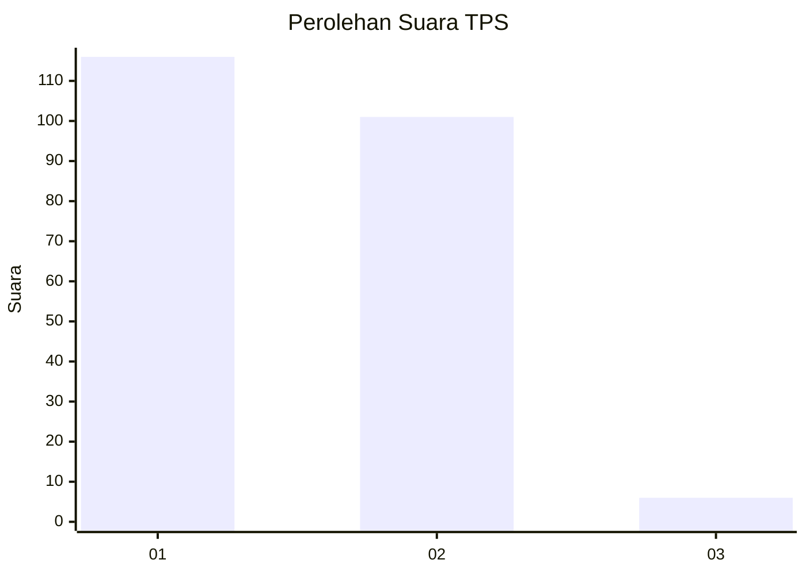
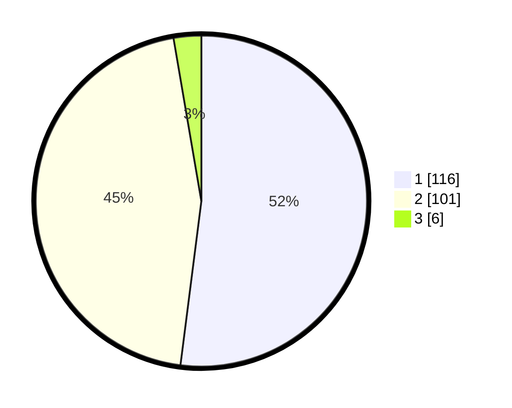

# Hasil

## Grafik

## Tabel

| No. | Nama Paslon    | Suara | Suara (raw) | Persentase |
|:--- |:-------------- | -----:| -----------:| ----------:|
| 1   | ANIES MUHAIMIN | 116   | [116][p-1]  | 52,02      |
| 2   | PRABOWO GIBRAN | 101   | [101][p-2]  | 45,29      |
| 3   | GANJAR MAHFUD  | 6     | [6][p-3]    | 2,69       |

[p-1]: https://github.com/gigit-pemilu/pemilu-2024/blob/main/pilpres/hitung-suara/sub/12-sumatera-utara/sub/01-tapanuli-tengah/sub/19-lumut/sub/1001-lumut/sub/006-tps/sub/paslon-1.txt
[p-2]: https://github.com/gigit-pemilu/pemilu-2024/blob/main/pilpres/hitung-suara/sub/12-sumatera-utara/sub/01-tapanuli-tengah/sub/19-lumut/sub/1001-lumut/sub/006-tps/sub/paslon-2.txt
[p-3]: https://github.com/gigit-pemilu/pemilu-2024/blob/main/pilpres/hitung-suara/sub/12-sumatera-utara/sub/01-tapanuli-tengah/sub/19-lumut/sub/1001-lumut/sub/006-tps/sub/paslon-3.txt

## Foto C Plano

https://sirekap-obj-formc.kpu.go.id/74b0/pemilu/ppwp/12/01/19/10/01/1201191001006-20240215-053605--57d82952-dcaa-42a2-9d31-61e582b7e407.jpg

https://sirekap-obj-formc.kpu.go.id/74b0/pemilu/ppwp/12/01/19/10/01/1201191001006-20240215-053732--4513ad42-3638-483e-85b5-7543c5a05abc.jpg

https://sirekap-obj-formc.kpu.go.id/74b0/pemilu/ppwp/12/01/19/10/01/1201191001006-20240215-053842--f3cedd24-3bd5-49c3-ad64-de756363d2bb.jpg

## Metadata

| Key        | Value               |
| ---------- | ------------------- |
| Time Stamp | 2024-02-15 21:01:18 |

