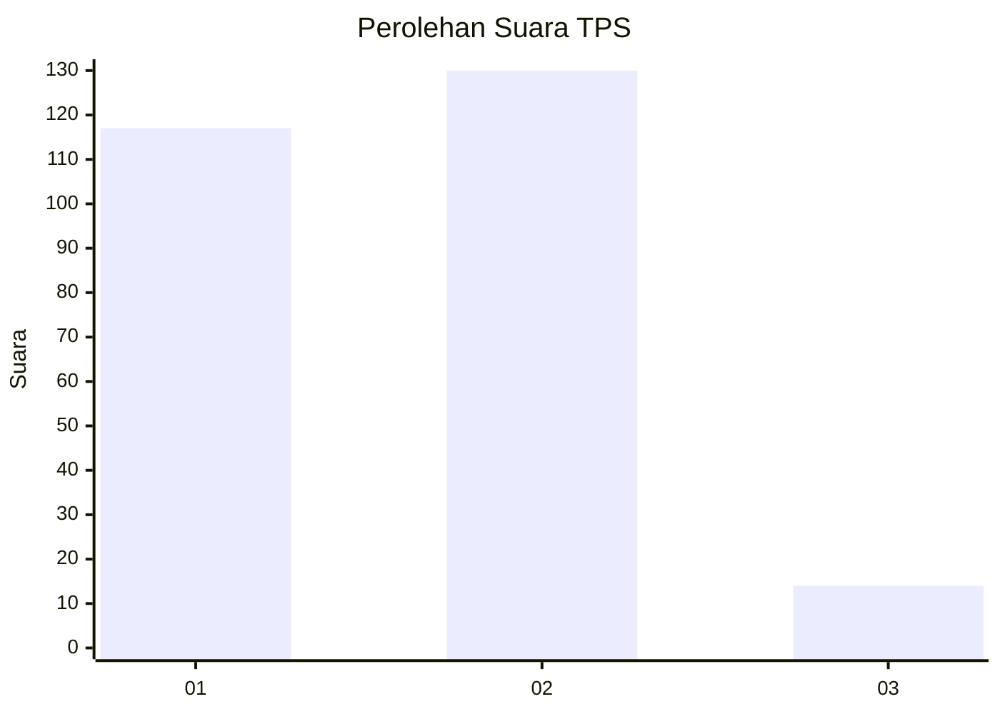
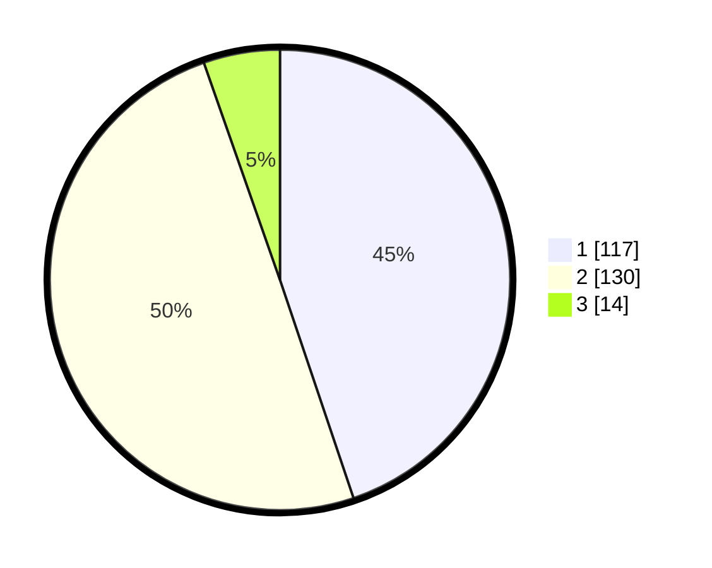

# Hasil

## Grafik

## Tabel

| No. | Nama Paslon    | Suara | Suara (raw) | Persentase |
|:--- |:-------------- | -----:| -----------:| ----------:|
| 1   | ANIES MUHAIMIN | 117   | [117][p-1]  | 44,83      |
| 2   | PRABOWO GIBRAN | 130   | [130][p-2]  | 49,81      |
| 3   | GANJAR MAHFUD  | 14    | [14][p-3]   | 5,36       |

[p-1]: https://github.com/gigit-pemilu/pemilu-2024-12-sumatera-utara/blob/main/pilpres/hitung-suara/sub/12-sumatera-utara/sub/01-tapanuli-tengah/sub/19-lumut/sub/2005-lumut-nauli/sub/001-tps/sub/paslon-1.txt
[p-2]: https://github.com/gigit-pemilu/pemilu-2024-12-sumatera-utara/blob/main/pilpres/hitung-suara/sub/12-sumatera-utara/sub/01-tapanuli-tengah/sub/19-lumut/sub/2005-lumut-nauli/sub/001-tps/sub/paslon-2.txt
[p-3]: https://github.com/gigit-pemilu/pemilu-2024-12-sumatera-utara/blob/main/pilpres/hitung-suara/sub/12-sumatera-utara/sub/01-tapanuli-tengah/sub/19-lumut/sub/2005-lumut-nauli/sub/001-tps/sub/paslon-3.txt

## Foto C Plano

https://sirekap-obj-formc.kpu.go.id/21dd/pemilu/ppwp/12/01/19/20/05/1201192005001-20240215-092038--530ef1e6-a254-422e-9b47-f8b433655596.jpg

https://sirekap-obj-formc.kpu.go.id/21dd/pemilu/ppwp/12/01/19/20/05/1201192005001-20240215-092108--73706262-545b-4b9e-ad70-8f16b6e0c136.jpg

https://sirekap-obj-formc.kpu.go.id/21dd/pemilu/ppwp/12/01/19/20/05/1201192005001-20240215-092129--f6a329b8-7fbe-41ea-85f9-5e05751635d3.jpg

## Metadata

| Key        | Value               |
| ---------- | ------------------- |
| Time Stamp | 2024-02-15 23:29:50 |

