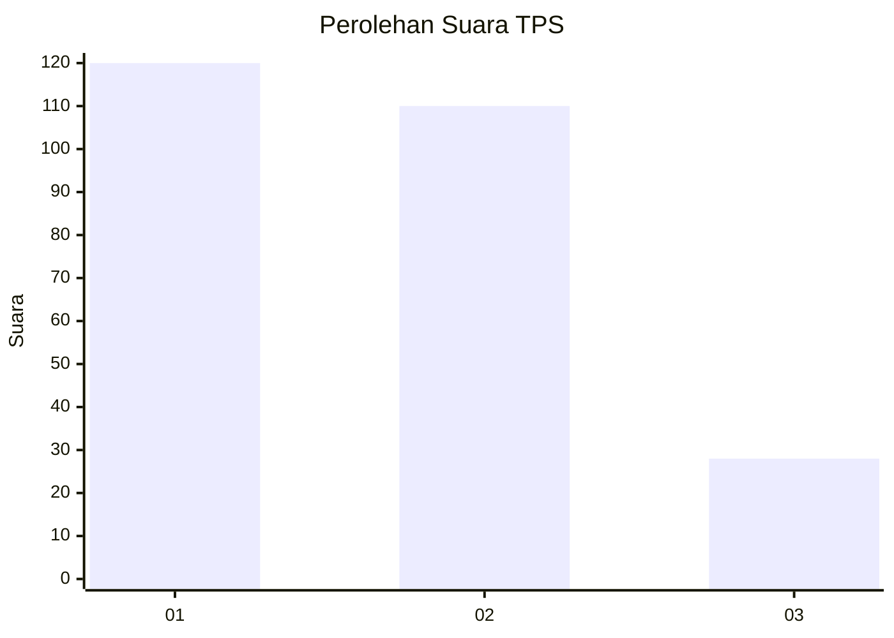
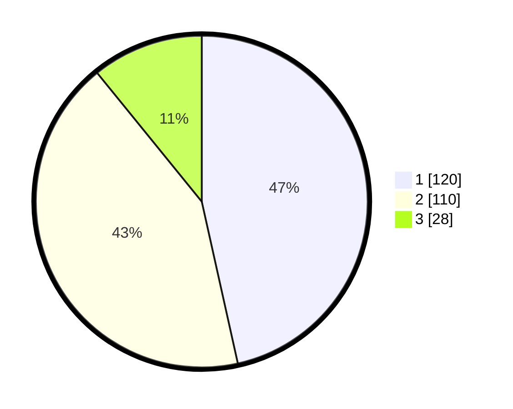

# Hasil

## Grafik

## Tabel

| No. | Nama Paslon    | Suara | Suara (raw) | Persentase |
|:--- |:-------------- | -----:| -----------:| ----------:|
| 1   | ANIES MUHAIMIN | 120   | [120][p-1]  | 46,51      |
| 2   | PRABOWO GIBRAN | 110   | [110][p-2]  | 42,64      |
| 3   | GANJAR MAHFUD  | 28    | [28][p-3]   | 10,85      |

[p-1]: https://github.com/gigit-pemilu/pemilu-2024/blob/main/pilpres/hitung-suara/sub/12-sumatera-utara/sub/01-tapanuli-tengah/sub/19-lumut/sub/2005-lumut-nauli/sub/002-tps/sub/paslon-1.txt
[p-2]: https://github.com/gigit-pemilu/pemilu-2024/blob/main/pilpres/hitung-suara/sub/12-sumatera-utara/sub/01-tapanuli-tengah/sub/19-lumut/sub/2005-lumut-nauli/sub/002-tps/sub/paslon-2.txt
[p-3]: https://github.com/gigit-pemilu/pemilu-2024/blob/main/pilpres/hitung-suara/sub/12-sumatera-utara/sub/01-tapanuli-tengah/sub/19-lumut/sub/2005-lumut-nauli/sub/002-tps/sub/paslon-3.txt

## Foto C Plano

https://sirekap-obj-formc.kpu.go.id/1abd/pemilu/ppwp/12/01/19/20/05/1201192005002-20240214-205822--360425eb-1751-455a-9137-b7e3a10dce9f.jpg

https://sirekap-obj-formc.kpu.go.id/1abd/pemilu/ppwp/12/01/19/20/05/1201192005002-20240214-210022--659615a2-9747-4487-bdbf-c070d08da3fa.jpg

https://sirekap-obj-formc.kpu.go.id/1abd/pemilu/ppwp/12/01/19/20/05/1201192005002-20240214-210219--e8859ca6-b462-421d-81e8-7c236b739d31.jpg

## Metadata

| Key        | Value               |
| ---------- | ------------------- |
| Time Stamp | 2024-02-15 21:30:27 |

