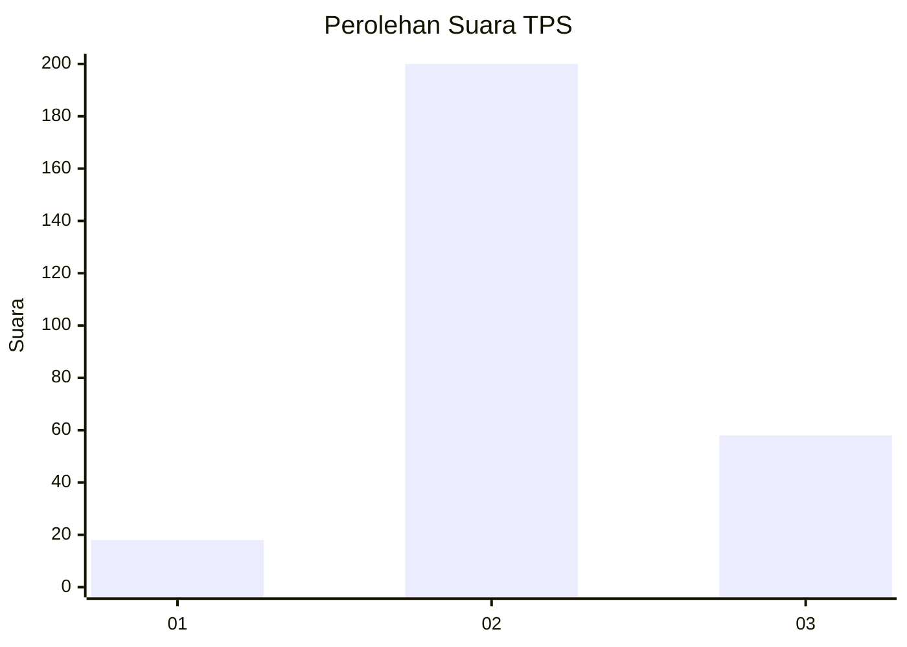

# Hasil

## Grafik

## Tabel

| No. | Nama Paslon    | Suara | Suara (raw) | Persentase |
|:--- |:-------------- | -----:| -----------:| ----------:|
| 1   | ANIES MUHAIMIN | 18    | [18][p-1]   | 6,52       |
| 2   | PRABOWO GIBRAN | 200   | [200][p-2]  | 72,46      |
| 3   | GANJAR MAHFUD  | 58    | [58][p-3]   | 21,01      |

[p-1]: https://github.com/gigit-pemilu/pemilu-2024/blob/main/pilpres/hitung-suara/sub/12-sumatera-utara/sub/01-tapanuli-tengah/sub/19-lumut/sub/2006-lumut-maju/sub/001-tps/sub/paslon-1.txt
[p-2]: https://github.com/gigit-pemilu/pemilu-2024/blob/main/pilpres/hitung-suara/sub/12-sumatera-utara/sub/01-tapanuli-tengah/sub/19-lumut/sub/2006-lumut-maju/sub/001-tps/sub/paslon-2.txt
[p-3]: https://github.com/gigit-pemilu/pemilu-2024/blob/main/pilpres/hitung-suara/sub/12-sumatera-utara/sub/01-tapanuli-tengah/sub/19-lumut/sub/2006-lumut-maju/sub/001-tps/sub/paslon-3.txt

## Foto C Plano

https://sirekap-obj-formc.kpu.go.id/8ea1/pemilu/ppwp/12/01/19/20/06/1201192006001-20240215-011654--80fb002b-1024-46e2-8779-a757f5852d04.jpg

https://sirekap-obj-formc.kpu.go.id/8ea1/pemilu/ppwp/12/01/19/20/06/1201192006001-20240215-011706--745dc38c-90a1-41b3-a9d9-538d1ec894e7.jpg

https://sirekap-obj-formc.kpu.go.id/8ea1/pemilu/ppwp/12/01/19/20/06/1201192006001-20240215-011709--92276a2a-230d-4177-af51-841dfc79ba6b.jpg

## Metadata

| Key        | Value               |
| ---------- | ------------------- |
| Time Stamp | 2024-02-16 00:00:26 |

