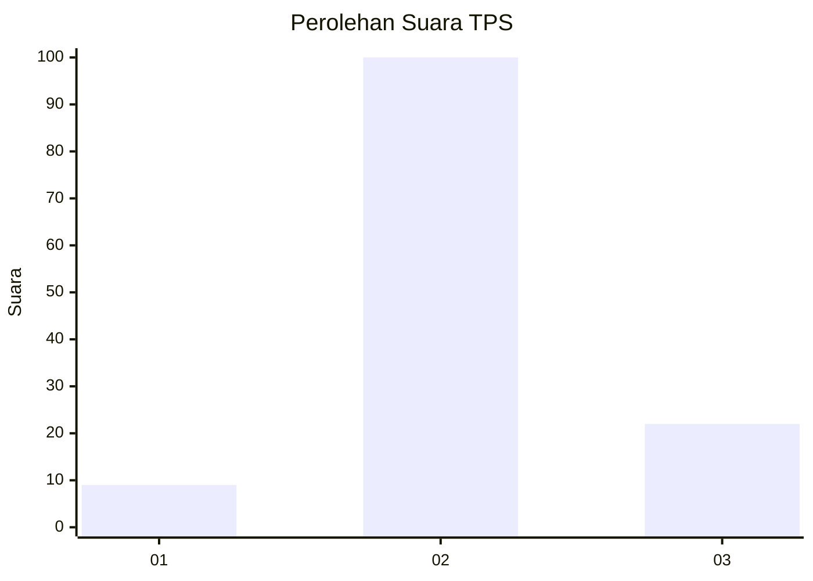

# Hasil

## Grafik

## Tabel

| No. | Nama Paslon    | Suara | Suara (raw) | Persentase |
|:--- |:-------------- | -----:| -----------:| ----------:|
| 1   | ANIES MUHAIMIN | 9     | [9][p-1]    | 6,87       |
| 2   | PRABOWO GIBRAN | 100   | [100][p-2]  | 76,34      |
| 3   | GANJAR MAHFUD  | 22    | [22][p-3]   | 16,79      |

[p-1]: https://github.com/gigit-pemilu/pemilu-2024-12-sumatera-utara/blob/main/pilpres/hitung-suara/sub/12-sumatera-utara/sub/01-tapanuli-tengah/sub/20-sarudik/sub/1004-pasir-bidang/sub/009-tps/sub/paslon-1.txt
[p-2]: https://github.com/gigit-pemilu/pemilu-2024-12-sumatera-utara/blob/main/pilpres/hitung-suara/sub/12-sumatera-utara/sub/01-tapanuli-tengah/sub/20-sarudik/sub/1004-pasir-bidang/sub/009-tps/sub/paslon-2.txt
[p-3]: https://github.com/gigit-pemilu/pemilu-2024-12-sumatera-utara/blob/main/pilpres/hitung-suara/sub/12-sumatera-utara/sub/01-tapanuli-tengah/sub/20-sarudik/sub/1004-pasir-bidang/sub/009-tps/sub/paslon-3.txt

## Foto C Plano

https://sirekap-obj-formc.kpu.go.id/01bd/pemilu/ppwp/12/01/20/10/04/1201201004009-20240214-225240--383680a2-921b-4f7e-ae83-0fe7f14fa6c2.jpg

https://sirekap-obj-formc.kpu.go.id/01bd/pemilu/ppwp/12/01/20/10/04/1201201004009-20240214-195518--493d74dd-4e99-40c0-897a-7697384104a5.jpg

https://sirekap-obj-formc.kpu.go.id/01bd/pemilu/ppwp/12/01/20/10/04/1201201004009-20240214-195521--f086e60c-553e-471a-a3d6-b4c0ca29cc5e.jpg

## Metadata

| Key        | Value               |
| ---------- | ------------------- |
| Time Stamp | 2024-02-15 21:01:18 |

