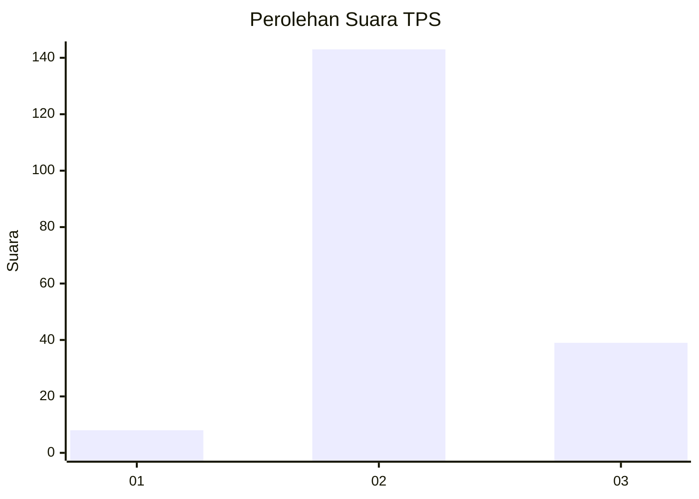

# Hasil

## Grafik

## Tabel

| No. | Nama Paslon    | Suara | Suara (raw) | Persentase |
|:--- |:-------------- | -----:| -----------:| ----------:|
| 1   | ANIES MUHAIMIN | 8     | [8][p-1]    | 4,21       |
| 2   | PRABOWO GIBRAN | 143   | [143][p-2]  | 75,26      |
| 3   | GANJAR MAHFUD  | 39    | [39][p-3]   | 20,53      |

[p-1]: https://github.com/gigit-pemilu/pemilu-2024/blob/main/pilpres/hitung-suara/sub/12-sumatera-utara/sub/02-tapanuli-utara/sub/01-tarutung/sub/1004-hutatoruan-vii/sub/001-tps/sub/paslon-1.txt
[p-2]: https://github.com/gigit-pemilu/pemilu-2024/blob/main/pilpres/hitung-suara/sub/12-sumatera-utara/sub/02-tapanuli-utara/sub/01-tarutung/sub/1004-hutatoruan-vii/sub/001-tps/sub/paslon-2.txt
[p-3]: https://github.com/gigit-pemilu/pemilu-2024/blob/main/pilpres/hitung-suara/sub/12-sumatera-utara/sub/02-tapanuli-utara/sub/01-tarutung/sub/1004-hutatoruan-vii/sub/001-tps/sub/paslon-3.txt

## Foto C Plano

https://sirekap-obj-formc.kpu.go.id/ceb1/pemilu/ppwp/12/02/01/10/04/1202011004001-20240214-213049--1bb01f27-f124-41b4-a690-94046aaf6bab.jpg

https://sirekap-obj-formc.kpu.go.id/ceb1/pemilu/ppwp/12/02/01/10/04/1202011004001-20240214-213218--19f97ef3-3adc-4ddc-b6d1-e4348cd7a194.jpg

## Metadata

| Key        | Value               |
| ---------- | ------------------- |
| Time Stamp | 2024-02-15 23:30:25 |

