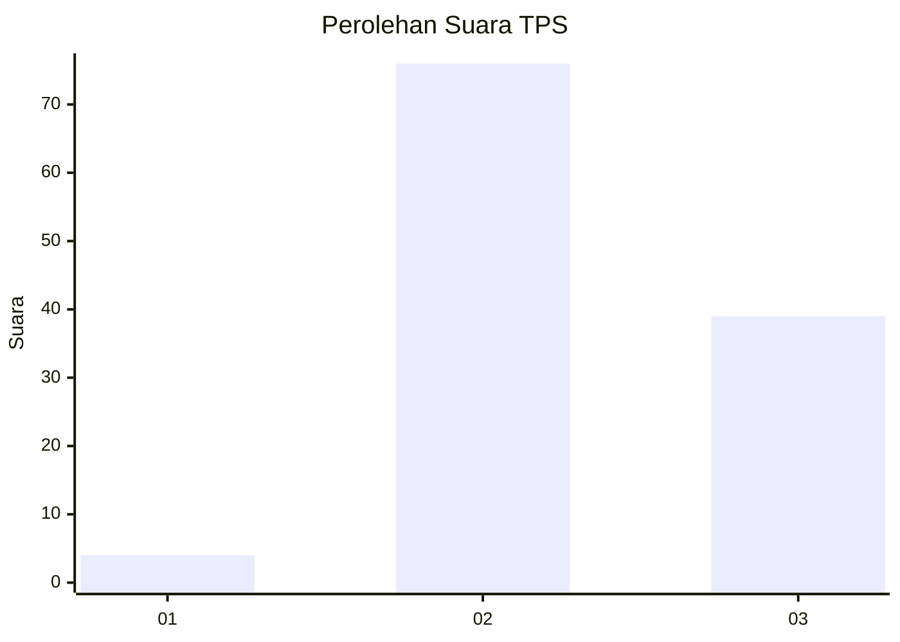
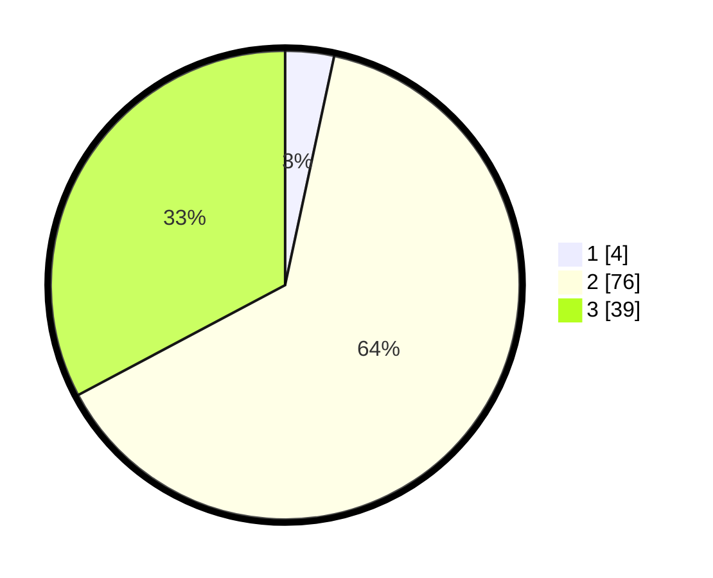

# Hasil

## Grafik

## Tabel

| No. | Nama Paslon    | Suara | Suara (raw) | Persentase |
|:--- |:-------------- | -----:| -----------:| ----------:|
| 1   | ANIES MUHAIMIN | 4     | [4][p-1]    | 3,36       |
| 2   | PRABOWO GIBRAN | 76    | [76][p-2]   | 63,87      |
| 3   | GANJAR MAHFUD  | 39    | [39][p-3]   | 32,77      |

[p-1]: https://github.com/gigit-pemilu/pemilu-2024/blob/main/pilpres/hitung-suara/sub/12-sumatera-utara/sub/02-tapanuli-utara/sub/01-tarutung/sub/1006-hutatoruan-x/sub/014-tps/sub/paslon-1.txt
[p-2]: https://github.com/gigit-pemilu/pemilu-2024/blob/main/pilpres/hitung-suara/sub/12-sumatera-utara/sub/02-tapanuli-utara/sub/01-tarutung/sub/1006-hutatoruan-x/sub/014-tps/sub/paslon-2.txt
[p-3]: https://github.com/gigit-pemilu/pemilu-2024/blob/main/pilpres/hitung-suara/sub/12-sumatera-utara/sub/02-tapanuli-utara/sub/01-tarutung/sub/1006-hutatoruan-x/sub/014-tps/sub/paslon-3.txt

## Foto C Plano

https://sirekap-obj-formc.kpu.go.id/bf54/pemilu/ppwp/12/02/01/10/06/1202011006014-20240215-004826--f450fecd-8dd6-4b2a-93f0-3995e4d9c709.jpg

https://sirekap-obj-formc.kpu.go.id/bf54/pemilu/ppwp/12/02/01/10/06/1202011006014-20240215-004935--9863eef0-dda2-42bb-bd9c-d8aeabd66743.jpg

https://sirekap-obj-formc.kpu.go.id/bf54/pemilu/ppwp/12/02/01/10/06/1202011006014-20240215-005041--239acf49-e6e1-4c44-b85e-462e3da1448d.jpg

## Metadata

| Key        | Value               |
| ---------- | ------------------- |
| Time Stamp | 2024-02-15 23:30:25 |

