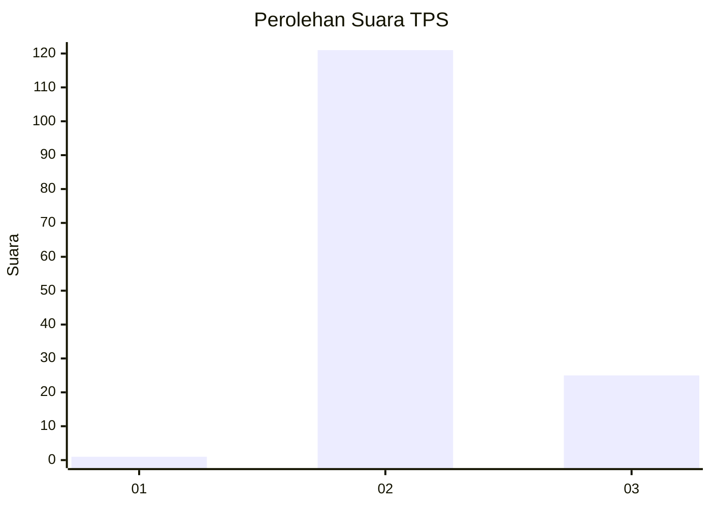
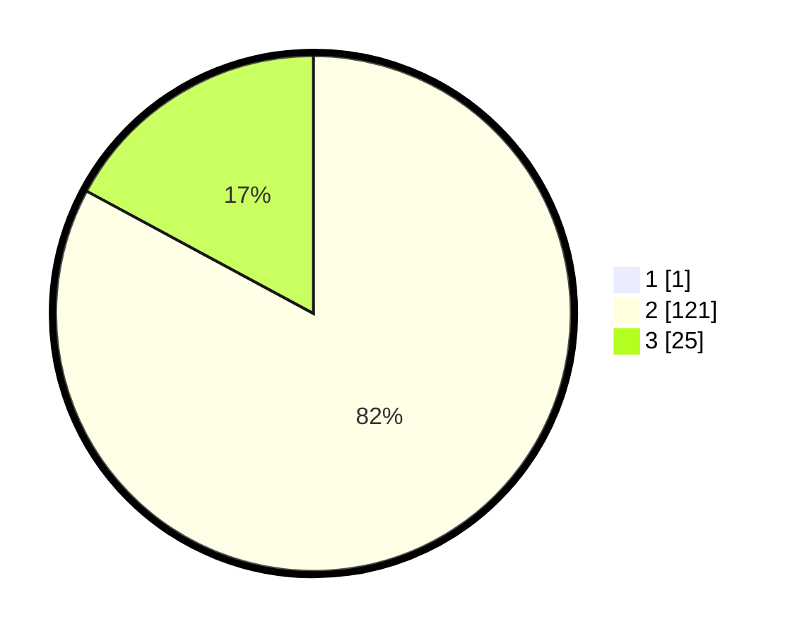

# Hasil

## Grafik

## Tabel

| No. | Nama Paslon    | Suara | Suara (raw) | Persentase |
|:--- |:-------------- | -----:| -----------:| ----------:|
| 1   | ANIES MUHAIMIN | 1     | [1][p-1]    | 0,68       |
| 2   | PRABOWO GIBRAN | 121   | [121][p-2]  | 82,31      |
| 3   | GANJAR MAHFUD  | 25    | [25][p-3]   | 17,01      |

[p-1]: https://github.com/gigit-pemilu/pemilu-2024/blob/main/pilpres/hitung-suara/sub/12-sumatera-utara/sub/02-tapanuli-utara/sub/01-tarutung/sub/2017-parbubu-pea/sub/002-tps/sub/paslon-1.txt
[p-2]: https://github.com/gigit-pemilu/pemilu-2024/blob/main/pilpres/hitung-suara/sub/12-sumatera-utara/sub/02-tapanuli-utara/sub/01-tarutung/sub/2017-parbubu-pea/sub/002-tps/sub/paslon-2.txt
[p-3]: https://github.com/gigit-pemilu/pemilu-2024/blob/main/pilpres/hitung-suara/sub/12-sumatera-utara/sub/02-tapanuli-utara/sub/01-tarutung/sub/2017-parbubu-pea/sub/002-tps/sub/paslon-3.txt

## Foto C Plano

https://sirekap-obj-formc.kpu.go.id/188a/pemilu/ppwp/12/02/01/20/17/1202012017002-20240214-213134--0eff59de-8c86-47b7-8fe1-17788e8b9f0e.jpg

https://sirekap-obj-formc.kpu.go.id/188a/pemilu/ppwp/12/02/01/20/17/1202012017002-20240214-213702--5bf0e3db-bfbf-4d3e-868f-96c0842aa5b4.jpg

https://sirekap-obj-formc.kpu.go.id/188a/pemilu/ppwp/12/02/01/20/17/1202012017002-20240214-213741--02b243c7-b040-4819-8d5f-b8950638fb46.jpg

## Metadata

| Key        | Value               |
| ---------- | ------------------- |
| Time Stamp | 2024-02-15 23:29:50 |

