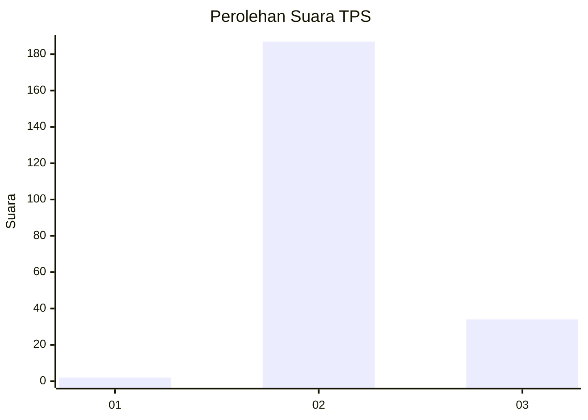
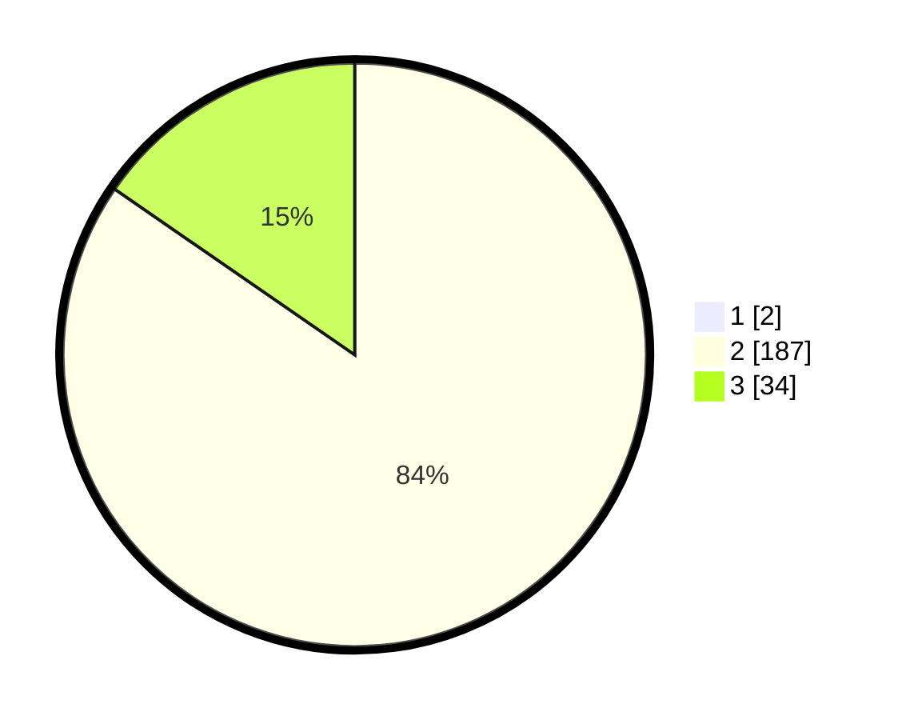

# Hasil

## Grafik

## Tabel

| No. | Nama Paslon    | Suara | Suara (raw) | Persentase |
|:--- |:-------------- | -----:| -----------:| ----------:|
| 1   | ANIES MUHAIMIN | 2     | [2][p-1]    | 0,90       |
| 2   | PRABOWO GIBRAN | 187   | [187][p-2]  | 83,86      |
| 3   | GANJAR MAHFUD  | 34    | [34][p-3]   | 15,25      |

[p-1]: https://github.com/gigit-pemilu/pemilu-2024/blob/main/pilpres/hitung-suara/sub/12-sumatera-utara/sub/02-tapanuli-utara/sub/01-tarutung/sub/2029-partali-julu/sub/001-tps/sub/paslon-1.txt
[p-2]: https://github.com/gigit-pemilu/pemilu-2024/blob/main/pilpres/hitung-suara/sub/12-sumatera-utara/sub/02-tapanuli-utara/sub/01-tarutung/sub/2029-partali-julu/sub/001-tps/sub/paslon-2.txt
[p-3]: https://github.com/gigit-pemilu/pemilu-2024/blob/main/pilpres/hitung-suara/sub/12-sumatera-utara/sub/02-tapanuli-utara/sub/01-tarutung/sub/2029-partali-julu/sub/001-tps/sub/paslon-3.txt

## Foto C Plano

https://sirekap-obj-formc.kpu.go.id/278f/pemilu/ppwp/12/02/01/20/29/1202012029001-20240215-020647--83ca4cbe-8113-4f1f-9cb9-cabd9cb890b7.jpg

https://sirekap-obj-formc.kpu.go.id/278f/pemilu/ppwp/12/02/01/20/29/1202012029001-20240215-020825--59e0f1fc-bc4d-4da7-adde-bebd8fc95e3b.jpg

https://sirekap-obj-formc.kpu.go.id/278f/pemilu/ppwp/12/02/01/20/29/1202012029001-20240215-020953--17afb1d5-bb98-4fed-bcc0-72969c973044.jpg

## Metadata

| Key        | Value               |
| ---------- | ------------------- |
| Time Stamp | 2024-02-15 23:29:50 |

