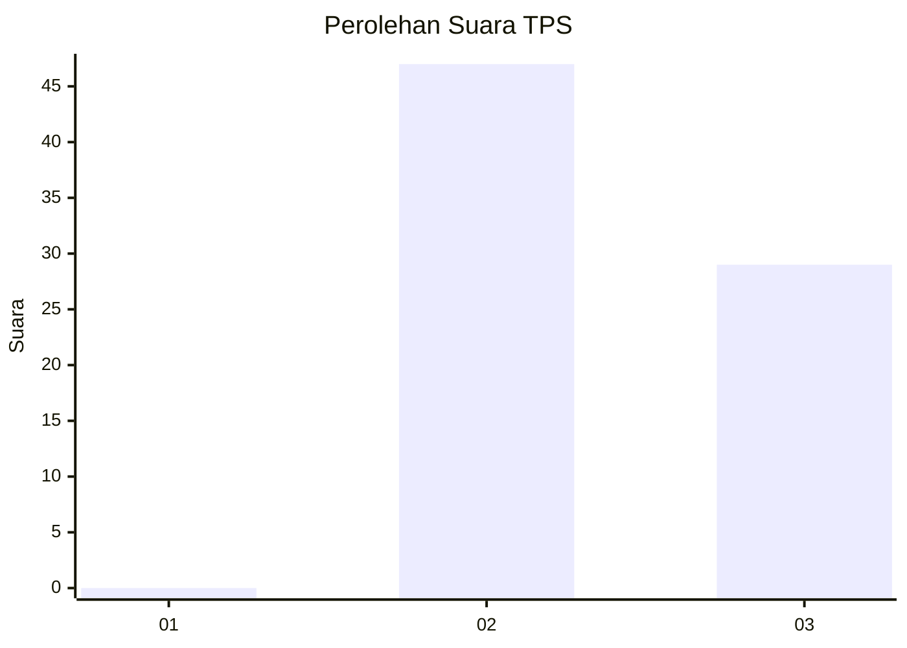
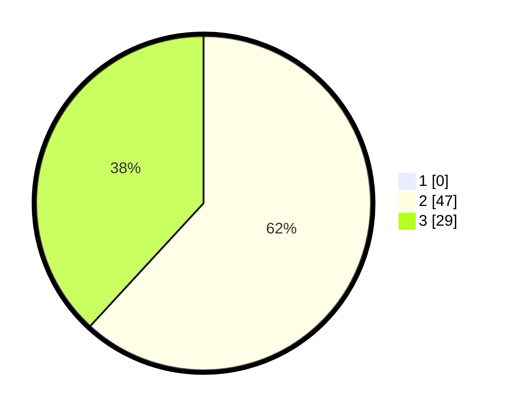

# Hasil

## Grafik

## Tabel

| No. | Nama Paslon    | Suara | Suara (raw) | Persentase |
|:--- |:-------------- | -----:| -----------:| ----------:|
| 1   | ANIES MUHAIMIN | 0     | [0][p-1]    | 0,00       |
| 2   | PRABOWO GIBRAN | 47    | [47][p-2]   | 61,84      |
| 3   | GANJAR MAHFUD  | 29    | [29][p-3]   | 38,16      |

[p-1]: https://github.com/gigit-pemilu/pemilu-2024/blob/main/pilpres/hitung-suara/sub/12-sumatera-utara/sub/02-tapanuli-utara/sub/03-adian-koting/sub/2004-siantar-naipospos/sub/003-tps/sub/paslon-1.txt
[p-2]: https://github.com/gigit-pemilu/pemilu-2024/blob/main/pilpres/hitung-suara/sub/12-sumatera-utara/sub/02-tapanuli-utara/sub/03-adian-koting/sub/2004-siantar-naipospos/sub/003-tps/sub/paslon-2.txt
[p-3]: https://github.com/gigit-pemilu/pemilu-2024/blob/main/pilpres/hitung-suara/sub/12-sumatera-utara/sub/02-tapanuli-utara/sub/03-adian-koting/sub/2004-siantar-naipospos/sub/003-tps/sub/paslon-3.txt

## Foto C Plano

https://sirekap-obj-formc.kpu.go.id/89cc/pemilu/ppwp/12/02/03/20/04/1202032004003-20240216-143946--446d9831-c794-483a-bd39-6d613bbdafd3.jpg

https://sirekap-obj-formc.kpu.go.id/89cc/pemilu/ppwp/12/02/03/20/04/1202032004003-20240215-144612--a73e4d63-e0b4-45ee-b507-db7bf0c356da.jpg

https://sirekap-obj-formc.kpu.go.id/89cc/pemilu/ppwp/12/02/03/20/04/1202032004003-20240215-145029--8c52a5b8-ecb5-4a43-9766-61214613be63.jpg

## Metadata

| Key        | Value               |
| ---------- | ------------------- |
| Time Stamp | 2024-02-16 16:25:10 |

