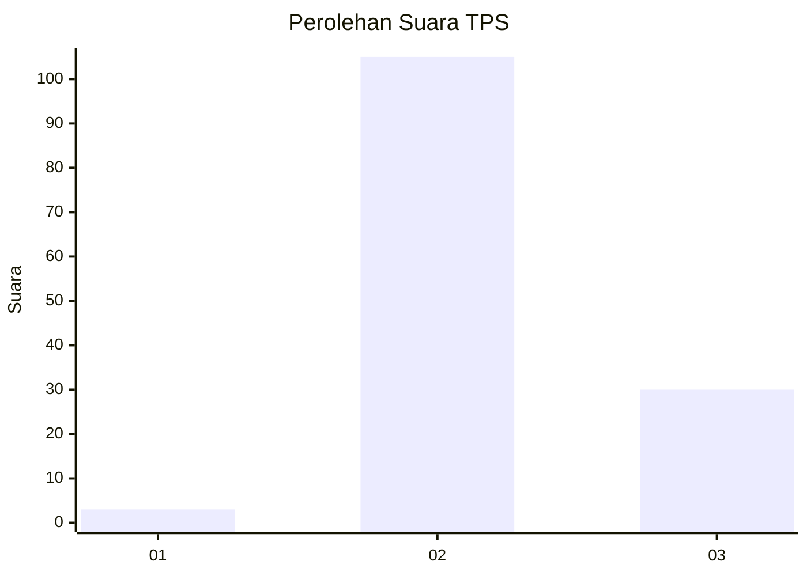

# Hasil

## Grafik

## Tabel

| No. | Nama Paslon    | Suara | Suara (raw) | Persentase |
|:--- |:-------------- | -----:| -----------:| ----------:|
| 1   | ANIES MUHAIMIN | 3     | [3][p-1]    | 2,17       |
| 2   | PRABOWO GIBRAN | 105   | [105][p-2]  | 76,09      |
| 3   | GANJAR MAHFUD  | 30    | [30][p-3]   | 21,74      |

[p-1]: https://github.com/gigit-pemilu/pemilu-2024/blob/main/pilpres/hitung-suara/sub/12-sumatera-utara/sub/02-tapanuli-utara/sub/03-adian-koting/sub/2014-pangaran-lambung-ii/sub/001-tps/sub/paslon-1.txt
[p-2]: https://github.com/gigit-pemilu/pemilu-2024/blob/main/pilpres/hitung-suara/sub/12-sumatera-utara/sub/02-tapanuli-utara/sub/03-adian-koting/sub/2014-pangaran-lambung-ii/sub/001-tps/sub/paslon-2.txt
[p-3]: https://github.com/gigit-pemilu/pemilu-2024/blob/main/pilpres/hitung-suara/sub/12-sumatera-utara/sub/02-tapanuli-utara/sub/03-adian-koting/sub/2014-pangaran-lambung-ii/sub/001-tps/sub/paslon-3.txt

## Foto C Plano

https://sirekap-obj-formc.kpu.go.id/d5ab/pemilu/ppwp/12/02/03/20/14/1202032014001-20240215-005611--9b77424c-65b5-40cb-8aff-aa7c3fdd1b7f.jpg

https://sirekap-obj-formc.kpu.go.id/d5ab/pemilu/ppwp/12/02/03/20/14/1202032014001-20240215-005630--c5ec195f-ec1b-4f51-a58d-93caafc2484e.jpg

https://sirekap-obj-formc.kpu.go.id/d5ab/pemilu/ppwp/12/02/03/20/14/1202032014001-20240215-005651--6cf5c3c6-ac20-4a30-9927-b0229fc46c90.jpg

## Metadata

| Key        | Value               |
| ---------- | ------------------- |
| Time Stamp | 2024-02-16 01:00:27 |

