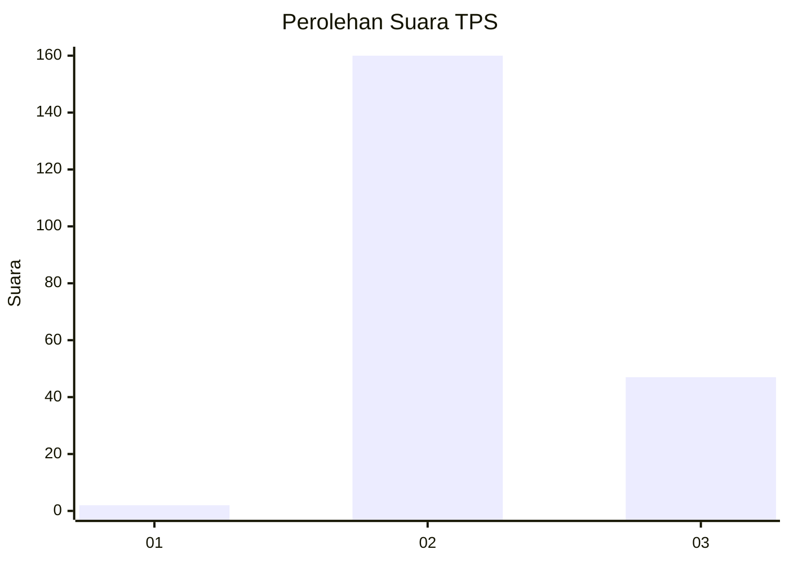
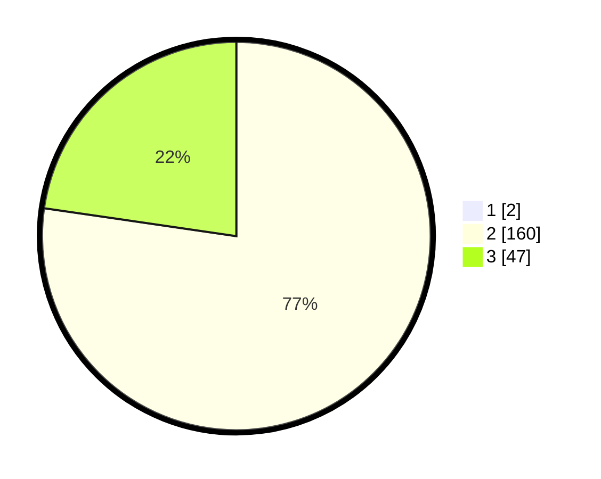

# Hasil

## Grafik

## Tabel

| No. | Nama Paslon    | Suara | Suara (raw) | Persentase |
|:--- |:-------------- | -----:| -----------:| ----------:|
| 1   | ANIES MUHAIMIN | 2     | [2][p-1]    | 0,96       |
| 2   | PRABOWO GIBRAN | 160   | [160][p-2]  | 76,56      |
| 3   | GANJAR MAHFUD  | 47    | [47][p-3]   | 22,49      |

[p-1]: https://github.com/gigit-pemilu/pemilu-2024/blob/main/pilpres/hitung-suara/sub/12-sumatera-utara/sub/02-tapanuli-utara/sub/04-sipoholon/sub/1001-situmeang-habinsaran/sub/001-tps/sub/paslon-1.txt
[p-2]: https://github.com/gigit-pemilu/pemilu-2024/blob/main/pilpres/hitung-suara/sub/12-sumatera-utara/sub/02-tapanuli-utara/sub/04-sipoholon/sub/1001-situmeang-habinsaran/sub/001-tps/sub/paslon-2.txt
[p-3]: https://github.com/gigit-pemilu/pemilu-2024/blob/main/pilpres/hitung-suara/sub/12-sumatera-utara/sub/02-tapanuli-utara/sub/04-sipoholon/sub/1001-situmeang-habinsaran/sub/001-tps/sub/paslon-3.txt

## Foto C Plano

https://sirekap-obj-formc.kpu.go.id/e8af/pemilu/ppwp/12/02/04/10/01/1202041001001-20240214-212925--024963df-6825-4e24-8c77-ef9c967a5d9b.jpg

https://sirekap-obj-formc.kpu.go.id/e8af/pemilu/ppwp/12/02/04/10/01/1202041001001-20240214-214143--86a5e83c-752b-4820-b623-23868e092fcc.jpg

https://sirekap-obj-formc.kpu.go.id/e8af/pemilu/ppwp/12/02/04/10/01/1202041001001-20240214-214005--b3a2f407-f920-4dd3-a4a5-0df7b017110e.jpg

## Metadata

| Key        | Value               |
| ---------- | ------------------- |
| Time Stamp | 2024-02-15 23:29:50 |

