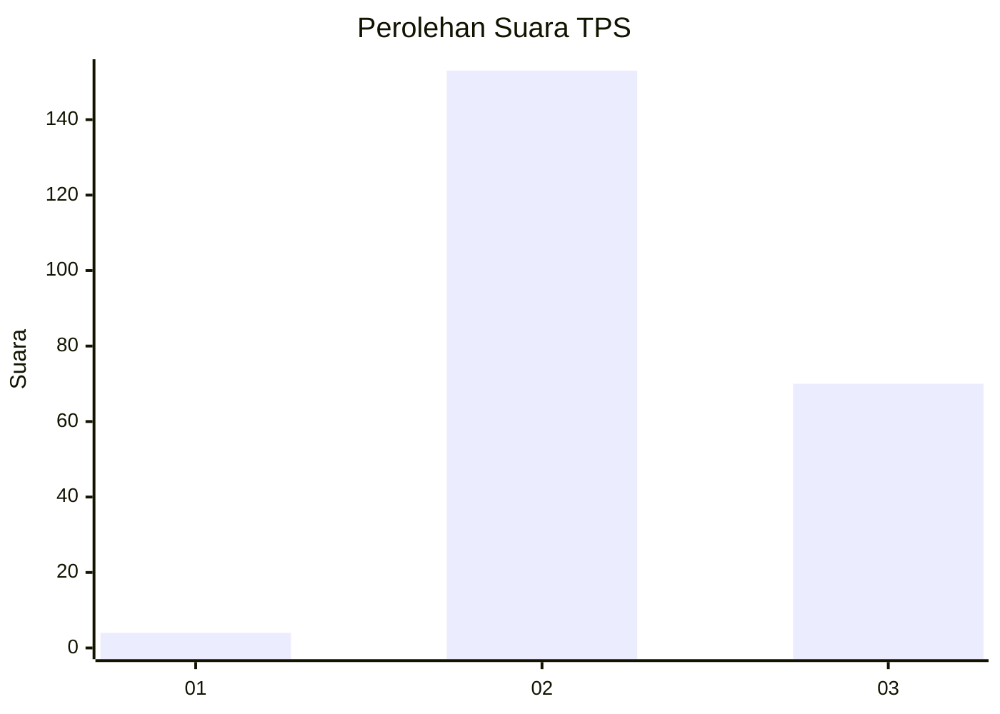
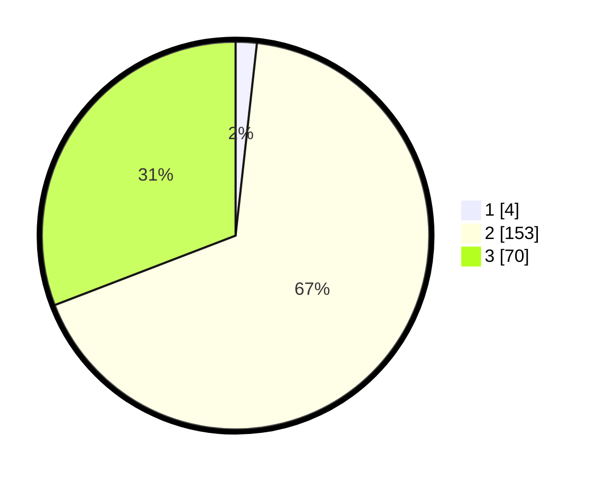

# Hasil

## Grafik

## Tabel

| No. | Nama Paslon    | Suara | Suara (raw) | Persentase |
|:--- |:-------------- | -----:| -----------:| ----------:|
| 1   | ANIES MUHAIMIN | 4     | [4][p-1]    | 1,76       |
| 2   | PRABOWO GIBRAN | 153   | [153][p-2]  | 67,40      |
| 3   | GANJAR MAHFUD  | 70    | [70][p-3]   | 30,84      |

[p-1]: https://github.com/gigit-pemilu/pemilu-2024/blob/main/pilpres/hitung-suara/sub/12-sumatera-utara/sub/02-tapanuli-utara/sub/04-sipoholon/sub/1001-situmeang-habinsaran/sub/004-tps/sub/paslon-1.txt
[p-2]: https://github.com/gigit-pemilu/pemilu-2024/blob/main/pilpres/hitung-suara/sub/12-sumatera-utara/sub/02-tapanuli-utara/sub/04-sipoholon/sub/1001-situmeang-habinsaran/sub/004-tps/sub/paslon-2.txt
[p-3]: https://github.com/gigit-pemilu/pemilu-2024/blob/main/pilpres/hitung-suara/sub/12-sumatera-utara/sub/02-tapanuli-utara/sub/04-sipoholon/sub/1001-situmeang-habinsaran/sub/004-tps/sub/paslon-3.txt

## Foto C Plano

https://sirekap-obj-formc.kpu.go.id/8583/pemilu/ppwp/12/02/04/10/01/1202041001004-20240215-005211--ef556efb-82f2-4c02-bc60-bfdab2d74d69.jpg

https://sirekap-obj-formc.kpu.go.id/8583/pemilu/ppwp/12/02/04/10/01/1202041001004-20240215-053548--6a89c844-19e7-42ab-b820-acd5252fbd28.jpg

https://sirekap-obj-formc.kpu.go.id/8583/pemilu/ppwp/12/02/04/10/01/1202041001004-20240215-005447--1d039c07-5d28-42d9-bb56-9b44270974ea.jpg

## Metadata

| Key        | Value               |
| ---------- | ------------------- |
| Time Stamp | 2024-02-16 00:30:27 |

