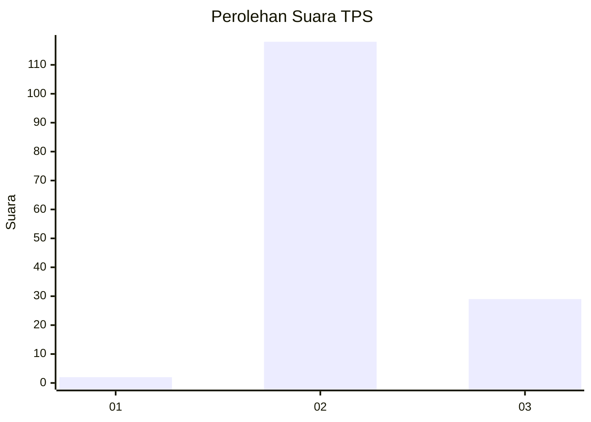

# Hasil

## Grafik

## Tabel

| No. | Nama Paslon    | Suara | Suara (raw) | Persentase |
|:--- |:-------------- | -----:| -----------:| ----------:|
| 1   | ANIES MUHAIMIN | 2     | [2][p-1]    | 1,34       |
| 2   | PRABOWO GIBRAN | 118   | [118][p-2]  | 79,19      |
| 3   | GANJAR MAHFUD  | 29    | [29][p-3]   | 19,46      |

[p-1]: https://github.com/gigit-pemilu/pemilu-2024-12-sumatera-utara/blob/main/pilpres/hitung-suara/sub/12-sumatera-utara/sub/02-tapanuli-utara/sub/04-sipoholon/sub/2003-simanungkalit/sub/007-tps/sub/paslon-1.txt
[p-2]: https://github.com/gigit-pemilu/pemilu-2024-12-sumatera-utara/blob/main/pilpres/hitung-suara/sub/12-sumatera-utara/sub/02-tapanuli-utara/sub/04-sipoholon/sub/2003-simanungkalit/sub/007-tps/sub/paslon-2.txt
[p-3]: https://github.com/gigit-pemilu/pemilu-2024-12-sumatera-utara/blob/main/pilpres/hitung-suara/sub/12-sumatera-utara/sub/02-tapanuli-utara/sub/04-sipoholon/sub/2003-simanungkalit/sub/007-tps/sub/paslon-3.txt

## Foto C Plano

https://sirekap-obj-formc.kpu.go.id/f48d/pemilu/ppwp/12/02/04/20/03/1202042003007-20240214-141759--e703539c-cd1b-482d-868a-c9c5d2a4defb.jpg

https://sirekap-obj-formc.kpu.go.id/f48d/pemilu/ppwp/12/02/04/20/03/1202042003007-20240214-141922--d978f509-b5ec-4942-99da-4dfd1174424a.jpg

https://sirekap-obj-formc.kpu.go.id/f48d/pemilu/ppwp/12/02/04/20/03/1202042003007-20240214-214128--4c62ee99-7412-463e-ac98-4dc843b2546f.jpg

## Metadata

| Key        | Value               |
| ---------- | ------------------- |
| Time Stamp | 2024-02-15 09:00:24 |

