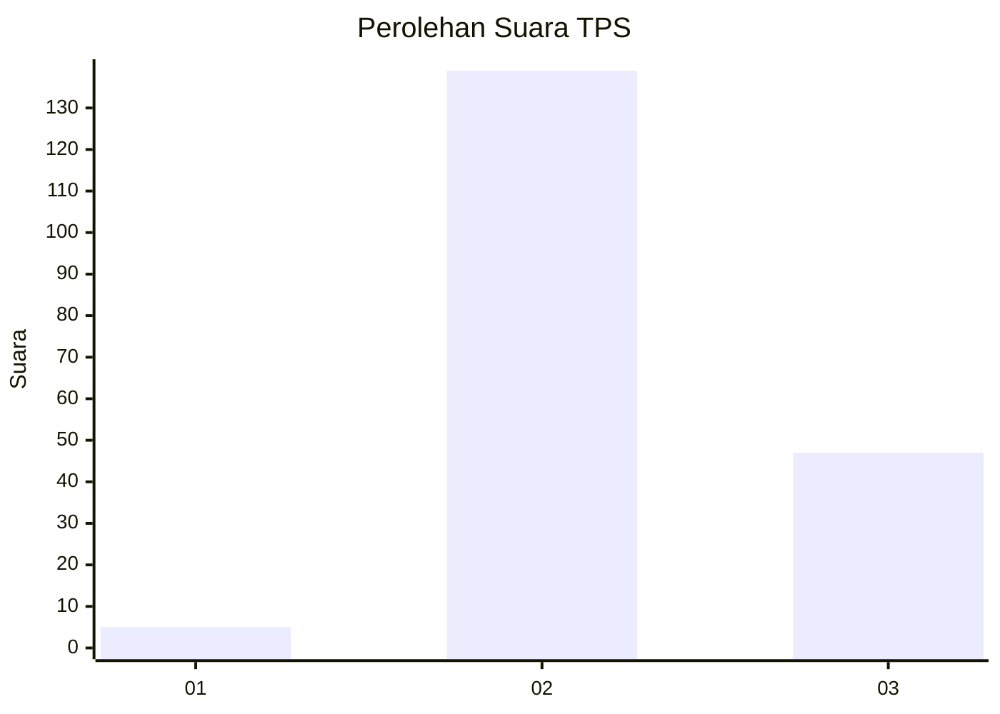
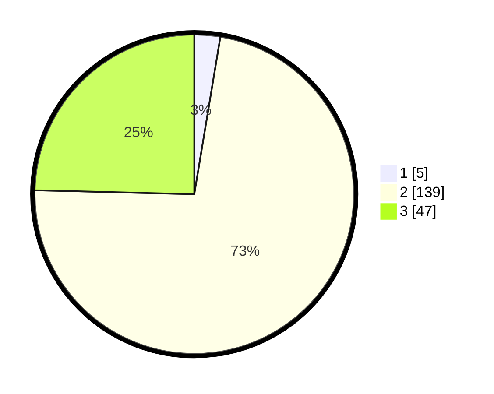

# Hasil

## Grafik

## Tabel

| No. | Nama Paslon    | Suara | Suara (raw) | Persentase |
|:--- |:-------------- | -----:| -----------:| ----------:|
| 1   | ANIES MUHAIMIN | 5     | [5][p-1]    | 2,62       |
| 2   | PRABOWO GIBRAN | 139   | [139][p-2]  | 72,77      |
| 3   | GANJAR MAHFUD  | 47    | [47][p-3]   | 24,61      |

[p-1]: https://github.com/gigit-pemilu/pemilu-2024/blob/main/pilpres/hitung-suara/sub/12-sumatera-utara/sub/02-tapanuli-utara/sub/04-sipoholon/sub/2012-hutaraja-hasundutan/sub/003-tps/sub/paslon-1.txt
[p-2]: https://github.com/gigit-pemilu/pemilu-2024/blob/main/pilpres/hitung-suara/sub/12-sumatera-utara/sub/02-tapanuli-utara/sub/04-sipoholon/sub/2012-hutaraja-hasundutan/sub/003-tps/sub/paslon-2.txt
[p-3]: https://github.com/gigit-pemilu/pemilu-2024/blob/main/pilpres/hitung-suara/sub/12-sumatera-utara/sub/02-tapanuli-utara/sub/04-sipoholon/sub/2012-hutaraja-hasundutan/sub/003-tps/sub/paslon-3.txt

## Foto C Plano

https://sirekap-obj-formc.kpu.go.id/3cac/pemilu/ppwp/12/02/04/20/12/1202042012003-20240220-150608--26cb18ad-4200-45b1-8ebb-958f09150a1e.jpg

https://sirekap-obj-formc.kpu.go.id/3cac/pemilu/ppwp/12/02/04/20/12/1202042012003-20240220-150756--6a857dfa-45e9-423a-aa1b-81132fc61c69.jpg

https://sirekap-obj-formc.kpu.go.id/3cac/pemilu/ppwp/12/02/04/20/12/1202042012003-20240220-150925--c03e80a8-8252-4465-89c4-8df07c63b704.jpg

## Metadata

| Key        | Value               |
| ---------- | ------------------- |
| Time Stamp | 2024-02-24 22:31:28 |

